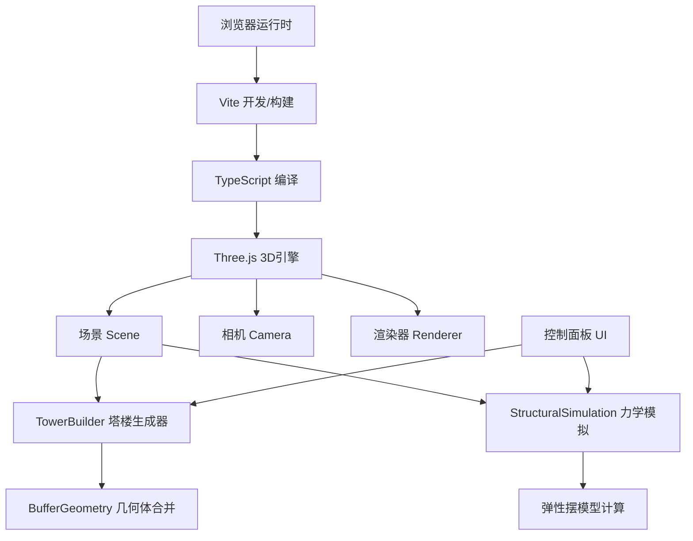

## 1. 架构设计



## 2. 技术描述

- **前端框架**：原生 TypeScript (无React/Vue，保持轻量)
- **3D引擎**：Three.js (官方推荐版本)
- **构建工具**：Vite
- **UI组件库**：Tweakpane (参数控制面板)
- **类型定义**：@types/three
- **初始化方式**：Vite vanilla-ts 模板

## 3. 路由定义

本项目为单页面应用(SPA)，无多路由需求。

| 路由 | 用途 |
|------|------|
| / | 主页面（3D场景 + 控制面板） |

## 4. API定义

无后端服务，纯前端应用。内部TypeScript类型定义如下：

```typescript
interface FloorParams {
  height: number;      // 1-5 单位
  widthRatio: number;  // 0.6-1.2
  rotation: number;    // 0-45 度
}

type TowerStyle = 'classic' | 'spiral';

interface TowerConfig {
  floorCount: number;        // 3-6
  floors: FloorParams[];
  style: TowerStyle;
}

interface WindConfig {
  amplitude: number;    // 2-4 度
  frequency: number;    // 0.5 Hz
  damping: number;      // 0.3
  duration: number;     // 5 秒
}
```

## 5. 数据模型

本项目无持久化数据存储，参数状态通过内存管理，响应式更新3D场景。

### 5.1 核心类定义

```typescript
class TowerBuilder {
  constructor(config: TowerConfig);
  build(): THREE.Group;
  rebuild(config: TowerConfig): void;
  playGrowAnimation(onComplete?: () => void): void;
}

class StructuralSimulation {
  constructor(towerGroup: THREE.Group);
  applyWindLoad(config: WindConfig): void;
  update(deltaTime: number): number;  // 返回当前位移(毫米)
  isActive(): boolean;
}
```

## 6. 文件结构

```
auto143/
├── package.json              # 依赖与脚本
├── index.html                # 入口HTML
├── vite.config.js            # Vite配置
├── tsconfig.json             # TypeScript配置
└── src/
    ├── main.ts               # 入口：场景/相机/渲染器/UI初始化
    ├── TowerBuilder.ts       # 参数化塔楼生成器
    └── StructuralSimulation.ts  # 力学模拟类
```
