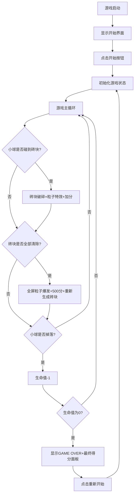

## 1. 产品概述
一款微型交互式2D像素风霓虹弹球消砖块游戏，采用赛博朋克式霓虹视觉风格。玩家通过鼠标或键盘控制底部挡板反弹小球，击碎上方彩色霓虹砖块获得分数，砖块碎裂时产生华丽的粒子特效。

- 目标用户：休闲游戏玩家、复古游戏爱好者
- 核心价值：提供爽快的打击反馈和绚丽的视觉体验，短时间内即可获得游戏乐趣

## 2. 核心功能

### 2.1 功能模块
1. **游戏主界面**：800×600像素Canvas画布，包含深空渐变背景、底部霓虹光点、砖块矩阵、小球、挡板
2. **开始界面**：半透明遮罩、霓虹标题、开始按钮
3. **游戏系统**：小球物理运动、碰撞检测、砖块销毁、粒子特效
4. **计分与生命系统**：实时分数显示、生命值管理、轮次清空奖励
5. **结束界面**：GAME OVER提示、最终得分面板、重新开始按钮

### 2.2 功能详情
| 功能模块 | 子功能 | 描述 |
|---------|--------|------|
| 游戏主界面 | 背景渲染 | 深空紫到深蓝垂直渐变，20个缓慢上升的霓虹光点 |
| 游戏主界面 | 砖块矩阵 | 7行砖块，渐变色彩虹排列，带发光描边 |
| 游戏主界面 | 小球 | 白色带青色外发光，物理反弹运动 |
| 游戏主界面 | 挡板 | 渐变色彩带，跟随鼠标/键盘移动，碰撞时白色闪烁 |
| 游戏系统 | 碰撞检测 | AABB算法检测小球与砖块、挡板、边界的碰撞 |
| 游戏系统 | 粒子特效 | 砖块破碎粒子、轮次清空全屏粒子爆发 |
| 计分系统 | 得分 | 每个砖块+10分，每轮清空额外+500分 |
| 生命系统 | 生命值 | 初始3条，掉落小球-1，为0时游戏结束 |
| 状态管理 | 开始/暂停/结束 | 状态切换与界面显示 |
| UI界面 | FPS显示 | 右上角实时帧率，每0.5秒更新 |

## 3. 核心流程
玩家进入游戏 → 显示开始界面 → 点击开始按钮 → 游戏开始（挡板控制小球反弹击碎砖块） → 砖块全部清除 → 触发全屏特效，重新生成砖块（进入下一轮） → 小球掉落生命值减1 → 生命值为0 → 显示GAME OVER和最终得分面板 → 点击重新开始 → 重置游戏

## 4. 用户界面设计
### 4.1 设计风格
- **主色调**：深空紫#1A0A2E → 深蓝#0F0C29（背景）
- **霓虹色彩**：红#FF3366、橙#FF9933、黄#FFD700、绿#33FF99、蓝#3399FF、紫#9933FF
- **点缀色**：青#00D4FF、淡紫#9F7AEA
- **视觉风格**：赛博朋克霓虹风格，深色太空背景，高饱和发光元素
- **按钮风格**：圆角12px，渐变背景，悬停放大1.1倍（0.2秒过渡）
- **字体**：无衬线字体，标题32px加粗，正文16px，FPS 12px

### 4.2 页面设计
| 界面 | 元素 | UI细节 |
|------|------|--------|
| 开始界面 | 标题"NEON BREAKOUT" | 32px加粗，#00D4FF，外发光6px同色 |
| 开始界面 | 开始按钮 | 圆角12px，渐变#00D4FF→#9F7AEA，白色文字18px，悬停放大1.1倍 |
| 开始界面 | 背景遮罩 | 半透明黑色（透明度0.7） |
| 游戏界面 | 分数生命值 | 左上角16px白色文字，分数#FFD700，生命值#FF6B6B |
| 游戏界面 | FPS显示 | 右上角12px #666666，每0.5秒更新 |
| 游戏界面 | 挡板 | 100×12px，渐变#00D4FF→#9F7AEA，外发光2px#00D4FF |
| 游戏界面 | 小球 | 半径6px白色，外发光2px#00D4FF |
| 游戏界面 | 砖块 | 50×20px，6色渐变，2px发光描边，间距2px |
| 结束界面 | GAME OVER | 底部24px #FF3366，每0.3秒闪烁 |
| 结束界面 | 得分面板 | 半透明黑色，圆角16px，300×200px，得分40px加粗#00D4FF |

### 4.3 响应式设计
- 画布固定800×600像素
- 整体在页面中水平垂直居中显示
