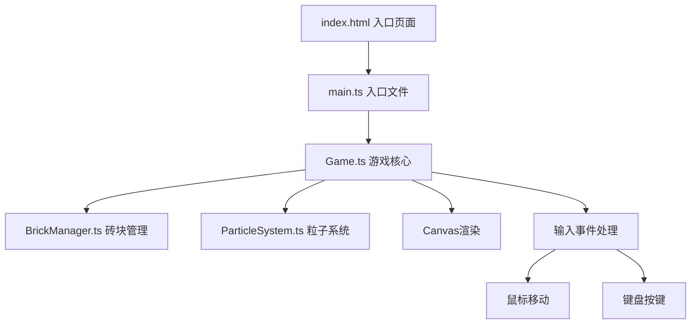

## 1. 架构设计
纯前端Canvas游戏架构，无后端服务。



## 2. 技术栈说明
- **前端框架**：原生HTML5 Canvas 2D API
- **语言**：TypeScript（严格模式）
- **构建工具**：Vite 5.x
- **依赖**：typescript、vite

## 3. 文件结构
```
auto145/
├── package.json           # 项目依赖和脚本配置
├── index.html             # 入口HTML页面
├── vite.config.js         # Vite构建配置
├── tsconfig.json          # TypeScript配置
└── src/
    ├── main.ts            # 入口文件，初始化游戏循环
    ├── Game.ts            # 游戏核心逻辑类
    ├── BrickManager.ts    # 砖块管理器
    └── ParticleSystem.ts  # 粒子系统（含对象池）
```

## 4. 核心类设计

### 4.1 Game类
- **职责**：游戏主循环、状态管理、碰撞检测、输入处理、渲染调度
- **核心属性**：
  - `canvas: HTMLCanvasElement`
  - `ctx: CanvasRenderingContext2D`
  - `paddle: Paddle`（挡板对象）
  - `ball: Ball`（小球对象）
  - `score: number`（分数）
  - `lives: number`（生命值）
  - `gameState: 'menu' | 'playing' | 'gameover'`
  - `brickManager: BrickManager`
  - `particleSystem: ParticleSystem`
- **核心方法**：
  - `init()` - 初始化游戏
  - `update(dt: number)` - 状态更新
  - `render()` - 渲染画面
  - `handleInput()` - 处理输入
  - `checkCollisions()` - 碰撞检测
  - `reset()` - 重置游戏

### 4.2 BrickManager类
- **职责**：砖块生成、排列、销毁动画管理
- **核心属性**：
  - `bricks: Brick[]`（砖块数组）
  - `rows: number[]`（每行砖块数：[12,12,12,10,10,8,8]）
  - `colorGradients: string[][]`（颜色渐变配置）
- **核心方法**：
  - `generateBricks(randomize: boolean)` - 生成砖块
  - `update(dt: number)` - 更新销毁动画
  - `render(ctx)` - 渲染砖块
  - `destroyBrick(brick: Brick)` - 销毁砖块
  - `isAllCleared(): boolean` - 检查是否全部清除

### 4.3 ParticleSystem类
- **职责**：粒子对象池、粒子更新与渲染
- **核心属性**：
  - `pool: Particle[]`（对象池）
  - `activeParticles: Particle[]`
  - `MAX_PARTICLES: number = 200`
- **核心方法**：
  - `emit(x, y, count, options)` - 发射粒子
  - `burst(x, y, count, options)` - 全屏爆发粒子
  - `update(dt: number)` - 更新粒子状态
  - `render(ctx)` - 渲染粒子
  - `getParticle(): Particle` - 从对象池获取粒子
  - `returnParticle(p: Particle)` - 回收粒子到对象池

## 5. 关键技术方案

### 5.1 游戏循环
- 使用 `requestAnimationFrame` 实现60FPS游戏循环
- 采用固定时间步长（delta time）确保物理运动一致性
- 帧时间累积器处理帧率波动

### 5.2 碰撞检测
- **AABB算法**：小球与砖块、挡板的碰撞检测
- **砖块行优先遍历**：只检测小球附近行的砖块优化性能
- 碰撞检测总耗时控制在0.5ms以内

### 5.3 性能优化
- **粒子对象池**：预分配200个粒子对象，避免频繁GC
- **分层渲染**：背景静态元素缓存到离屏Canvas
- **空间分区**：砖块按行组织，减少碰撞检测遍历量

### 5.4 视觉效果
- Canvas `shadowBlur` + `shadowColor` 实现霓虹发光
- 线性渐变实现挡板和砖块的色彩过渡
- 粒子透明度插值实现消散效果
- 砖块缩放动画（0.15秒缩放到0）

## 6. 物理参数
| 参数 | 值 | 说明 |
|------|----|------|
| 小球初始速度 | 420 px/s | 初始运动速度 |
| 小球初始角度 | -45° | 向右上方 |
| 挡板碰撞角度范围 | ±60° | 偏离中心越远角度越大 |
| 挡板移动速度 | 8 px/帧 | 键盘控制 |
| 砖块销毁动画时长 | 0.15 s | 缩放到0 |
| 粒子生命周期 | 0.6 s / 1.5 s | 普通粒子/全屏爆发 |
| 粒子速度 | 100-200 / 200-400 px/s | 普通/爆发 |
