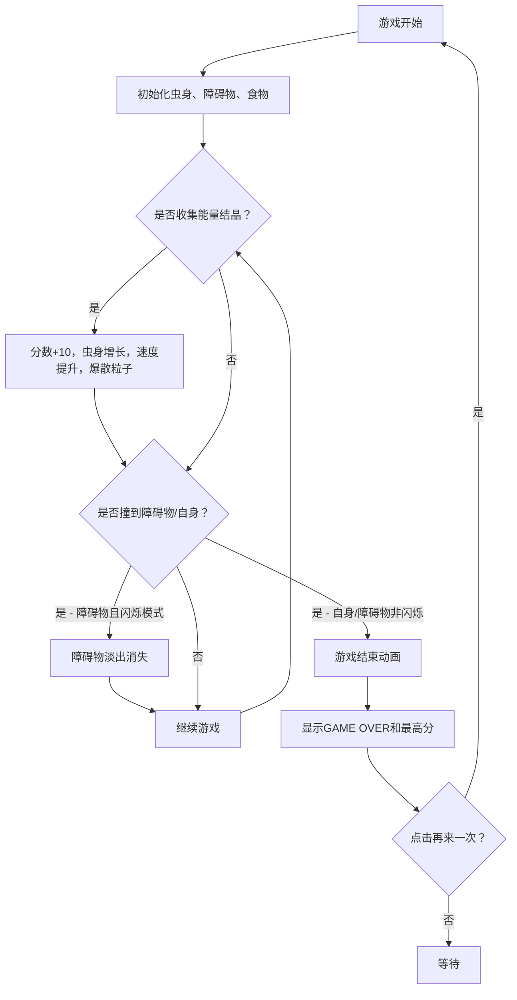

## 1. 产品概述

微型交互式2D像素风霓虹蛇形贪吃虫游戏，玩家控制由发光圆点组成的贪吃虫在霓虹网格上穿梭觅食，收集能量结晶使虫身增长，躲避障碍物和自身身体。

- 目标用户：休闲游戏爱好者，喜欢霓虹赛博朋克风格视觉效果的玩家
- 产品价值：提供快速上手、视觉冲击力强、有渐进难度的休闲游戏体验

## 2. 核心功能

### 2.1 功能模块
1. **游戏主界面**：800x600像素Canvas画布、霓虹网格背景、游戏UI信息展示
2. **虫身控制系统**：方向键移动、Shift闪烁冲刺模式
3. **食物系统**：随机生成能量结晶、吃食物增长身体、提升游戏速度
4. **障碍物系统**：随机生成霓虹橙色方块障碍物、碰撞检测
5. **粒子特效系统**：吃食物爆散光点、尾部残留渐隐光点、游戏结束碎裂粒子
6. **游戏状态管理**：开始、进行中、游戏结束、重新开始
7. **计分系统**：分数统计、虫身长度显示、历史最高分（localStorage存储）

### 2.2 页面详情
| 页面名称 | 模块名称 | 功能描述 |
|---------|---------|---------|
| 游戏主页面 | Canvas游戏区 | 800x600游戏画布，包含网格、虫身、食物、障碍物、粒子特效 |
| 游戏主页面 | UI覆盖层 | 右上角分数和长度显示、游戏结束面板、操作提示 |
| 游戏主页面 | 游戏结束面板 | 显示历史最高分、再来一次按钮 |

## 3. 核心流程

玩家通过方向键控制虫头移动，收集能量结晶增加分数和虫身长度，游戏速度逐渐提升。按住Shift进入闪烁冲刺模式（1.5秒，冷却5秒），可撞穿一个障碍物。撞到障碍物（非闪烁模式）或自身身体触发游戏结束动画，显示历史最高分和重新开始按钮。

## 4. 用户界面设计

### 4.1 设计风格
- 主色调：深紫黑#1A0A2E背景，霓虹色系（红#FF6B6B、黄#FFE66D、青#4ECDC4、橙#FF6B35、金#FFD93D）
- 字体：Courier New，复古像素风格
- 视觉效果：发光模糊、透明度渐变、缩放闪烁动画
- 布局：居中布局，画布外深色磨砂玻璃边框

### 4.2 页面设计概述
| 页面名称 | 模块名称 | UI元素 |
|---------|---------|---------|
| 游戏主页面 | Canvas游戏区 | 深紫黑背景、暗青色网格线、发光虫身、能量结晶、霓虹橙色障碍物 |
| 游戏主页面 | 分数显示 | 右上角金色24px分数、薄荷绿18px虫身长度 |
| 游戏主页面 | 操作提示 | 画布下方三行淡灰色提示文字 |
| 游戏主页面 | 游戏结束面板 | 红色霓虹GAME OVER文字、最高分显示、红色圆角再来一次按钮 |

### 4.3 响应性
桌面端设计，固定800x600画布尺寸，整体布局居中显示。
