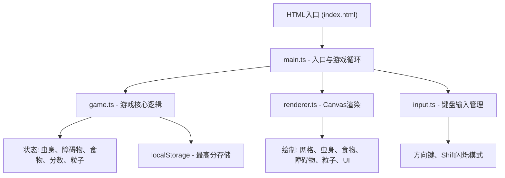

## 1. 架构设计



## 2. 技术描述

- 前端：TypeScript + HTML5 Canvas + Vite
- 构建工具：Vite 5.x
- 包管理：npm
- 无后端服务，纯前端实现
- 数据存储：localStorage（历史最高分）

## 3. 文件结构

```
项目根目录/
├── package.json          # 项目依赖和脚本
├── index.html            # 入口HTML页面
├── vite.config.js        # Vite构建配置
├── tsconfig.json         # TypeScript配置
└── src/
    ├── main.ts           # 游戏入口，主循环，状态管理
    ├── game.ts           # 游戏逻辑：碰撞检测、食物生成、计分等
    ├── renderer.ts       # Canvas渲染：所有视觉元素绘制
    └── input.ts          # 键盘输入管理
```

## 4. 核心数据模型

### 4.1 类型定义

```typescript
interface Position {
  x: number;
  y: number;
}

interface SnakeSegment {
  position: Position;
  color: string;
}

interface Obstacle {
  position: Position;
  size: number;
  opacity: number;
  fading: boolean;
}

interface Food {
  position: Position;
}

interface Particle {
  position: Position;
  velocity: Position;
  color: string;
  radius: number;
  life: number;
  maxLife: number;
}

interface TrailPoint {
  position: Position;
  color: string;
  life: number;
  maxLife: number;
}

type Direction = 'up' | 'down' | 'left' | 'right';
type GameState = 'ready' | 'playing' | 'gameover';
```

## 5. 性能优化

- 固定60FPS游戏循环，使用requestAnimationFrame
- 粒子数量峰值限制在500个以内，超过时自动清理过期粒子
- 使用离屏绘制优化网格背景
- 避免在渲染循环中创建新对象，复用对象池
