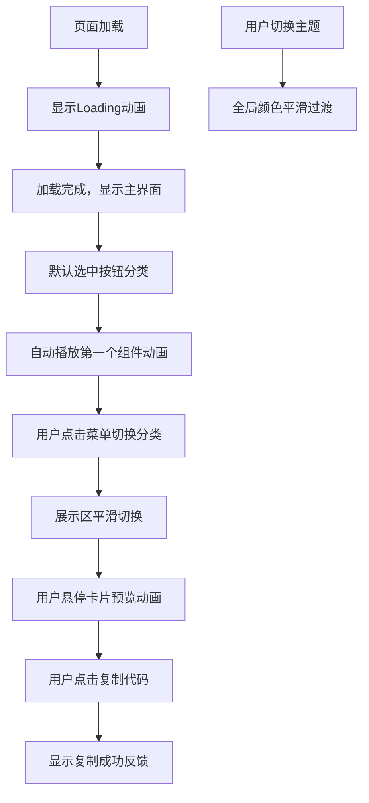

## 1. 产品概述
CSS微交互库展示与代码生成应用，为前端开发者和设计师提供可交互的CSS动画效果预览与代码复制工具。
- 核心目标：收集和展示按钮、卡片、导航栏等组件的悬停、点击和加载动画效果，让用户快速挑选并复制可用的CSS代码
- 目标用户：前端开发者、UI设计师、产品经理

## 2. 核心功能

### 2.1 功能模块
1. **菜单面板**：左侧分类导航，支持按钮、卡片、导航三大分类切换
2. **组件展示区**：右侧网格布局展示组件卡片，实时预览交互效果
3. **代码展示与复制**：每个卡片显示CSS代码，支持一键复制到剪贴板
4. **主题切换**：深色/浅色主题平滑切换
5. **Loading动画**：页面加载时的过渡动画

### 2.2 页面详情
| 页面名称 | 模块名称 | 功能描述 |
|-----------|-------------|---------------------|
| 主页面 | 菜单面板 | 分类列表展示、点击切换选中状态、高亮当前分类 |
| 主页面 | 组件展示区 | 3列响应式网格布局、平滑过渡动画、组件卡片悬停上移效果 |
| 主页面 | 组件卡片 | 可交互元素演示、CSS代码格式化展示、复制按钮、复制成功反馈 |
| 主页面 | 主题切换 | 顶部切换按钮、全局颜色平滑过渡 |
| 主页面 | Loading动画 | 初始加载进度提示、页面资源就绪后自动消失 |

## 3. 核心流程
用户进入页面后显示Loading动画，加载完成后默认展示"按钮"分类的第一个组件并自动播放一次动画。用户点击左侧菜单切换分类，右侧展示区平滑过渡显示对应组件。用户悬停在组件卡片上查看动画效果，点击"复制代码"按钮将CSS代码复制到剪贴板并获得视觉反馈。用户可随时切换深色/浅色主题。

## 4. 用户界面设计

### 4.1 设计风格
- 主色调：高饱和蓝色 #3182CE（选中状态）
- 深色模式：背景 #1A1B2F，卡片 #2D3748，菜单 #2D3748
- 浅色模式：背景 #F7FAFC，卡片 #FFFFFF，菜单 #E2E8F0
- 圆角：卡片12px，菜单项10px
- 阴影：0 4px 12px rgba(0,0,0,0.1)，悬停时加深并上移3px
- 字体：等宽字体用于代码展示，现代无衬线字体用于界面文字

### 4.2 页面设计概述
| 页面名称 | 模块名称 | UI元素 |
|-----------|-------------|-------------|
| 主页面 | 菜单面板 | 固定宽度240px、分类列表、选中高亮、圆角菜单项 |
| 主页面 | 组件展示区 | 3列响应式网格、卡片间距、分类切换过渡动画(0.3s opacity+transform) |
| 主页面 | 组件卡片 | 居中交互元素、等宽字体代码块、右下角复制按钮、绿色复制反馈 |
| 主页面 | 主题切换 | 右上角切换按钮、全局0.4s颜色过渡、CSS custom properties管理 |

### 4.3 响应式
桌面端优先，3列网格布局；中等屏幕自动调整为2列；小屏幕调整为1列。菜单在小屏幕可考虑折叠，但核心场景为桌面端使用。
