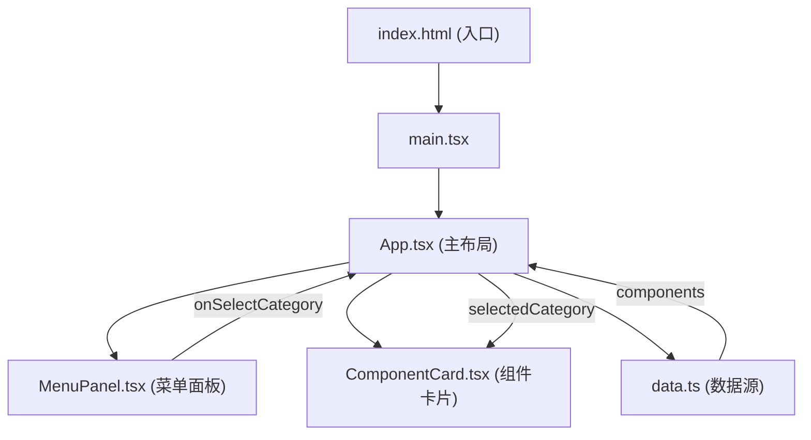

## 1. 架构设计



## 2. 技术描述

* 前端：React 18 + TypeScript + Vite

* 构建工具：Vite 5 + @vitejs/plugin-react

* 样式方案：原生CSS + CSS Custom Properties（主题管理）

* 状态管理：React useState（组件内部状态）

* 图标：lucide-react（主题切换等按钮图标）

* 后端：无（纯前端应用）

* 数据：本地mock数据（data.ts）

## 3. 文件结构与职责

```
src/
├── App.tsx           # 主布局组件，管理状态和数据流
├── data.ts           # 组件库数据源定义
├── ComponentCard.tsx # 单个组件卡片（交互演示+代码展示+复制）
├── MenuPanel.tsx     # 左侧分类菜单面板
├── main.tsx          # React入口
└── index.css         # 全局样式和CSS变量
```

**调用关系与数据流向：**

1. `data.ts` → 导出 `components` 数组和 `categories` 分类列表
2. `App.tsx` → 导入数据源，管理 `selectedCategory`、`theme`、`copiedId` 状态
3. `App.tsx` → 将 `categories` 和 `selectedCategory` 传递给 `MenuPanel`
4. `MenuPanel` → 通过 `onSelect` 回调通知 `App.tsx` 更新选中分类
5. `App.tsx` → 根据 `selectedCategory` 过滤数据，传递给多个 `ComponentCard`
6. `ComponentCard` → 接收单个组件数据，渲染交互元素和代码，通过 `onCopy` 回调通知复制状态

## 4. 性能优化策略

* CSS动画全部使用 `transform` 和 `opacity`，避免触发重排重绘

* 组件卡片使用 `will-change` 提示浏览器优化

* 代码复制使用异步 Clipboard API，50ms内完成

* 30个卡片滚动时通过 `contain: layout paint` 隔离渲染区域

* 主题切换使用CSS变量，避免大规模DOM操作

## 5. 数据模型

### 5.1 Component 接口

```typescript
interface ComponentItem {
  id: string;
  name: string;
  category: 'button' | 'card' | 'navigation';
  description: string;
  css: string;
  htmlType: 'button' | 'div' | 'nav';
}
```

### 5.
