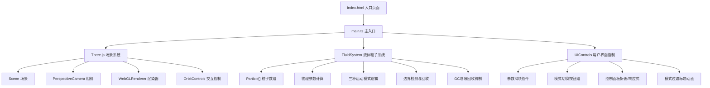

## 1. 架构设计



## 2. 技术描述

- **前端框架**：原生 TypeScript + Three.js（不使用React/Vue，按用户要求）
- **构建工具**：Vite 5.x
- **核心依赖**：
  - `three` - 3D渲染引擎
  - `@types/three` - Three.js TypeScript类型定义
  - `typescript` - TypeScript编译器（严格模式）
- **CSS**：原生CSS（玻璃态效果、自定义滑块、响应式布局）
- **无后端**：纯前端项目，无需服务端

## 3. 文件结构

| 文件路径 | 用途 |
|----------|------|
| `/package.json` | 项目依赖与脚本配置 |
| `/index.html` | 入口HTML页面，全屏容器 |
| `/vite.config.js` | Vite构建配置 |
| `/tsconfig.json` | TypeScript严格模式配置 |
| `/src/main.ts` | 主入口：初始化场景、相机、渲染器、OrbitControls，启动动画循环 |
| `/src/fluidSystem.ts` | 流体粒子系统管理：粒子数组、物理更新、三种模式、边界处理、GC回收 |
| `/src/uiControls.ts` | UI控制面板：DOM元素创建、滑块/按钮绑定、折叠、响应式布局 |

## 4. 核心数据模型

### 4.1 粒子数据结构
```typescript
interface Particle {
  position: THREE.Vector3;      // 当前位置
  velocity: THREE.Vector3;      // 当前速度
  targetPosition: THREE.Vector3; // 目标位置（模式切换时插值用）
  originalPosition: THREE.Vector3; // 初始位置
}
```

### 4.2 流体参数
```typescript
interface FluidParams {
  viscosity: number;       // 粘度 0.1-1.0，默认0.5
  turbulence: number;      // 湍流强度 0-5，默认2.0
  sprayAngleX: number;     // 喷射方向X轴角度 -90°~90°
  sprayAngleY: number;     // 喷射方向Y轴角度 -90°~90°
  mode: FluidMode;         // 当前流体模式
}

type FluidMode = 'vortex' | 'spray' | 'diffusion';
```

### 4.3 模式过渡状态
```typescript
interface TransitionState {
  active: boolean;
  startTime: number;
  duration: number; // 1500ms
  fromPositions: THREE.Vector3[];
  toMode: FluidMode;
}
```

## 5. 关键算法

### 5.1 颜色插值（速度→颜色）
- 速度范围：0-5 单位/秒
- 颜色映射：v=0 → #0077B6（蓝），v=5 → #E63946（红）
- 使用 `THREE.Color.lerp()` 线性插值

### 5.2 粒子大小计算
- 半径范围：0.05-0.15 单位
- 公式：`radius = 0.05 + (speed / 5) * 0.10`

### 5.3 初始球形分布
```
phi = acos(2 * random - 1)
theta = 2 * PI * random
r = 2 * cbrt(random)  // 直径4 → 半径2，立方根保证均匀分布
x = r * sin(phi) * cos(theta)
y = r * sin(phi) * sin(theta)
z = r * cos(phi)
```

### 5.4 三种运动模式
- **涡流模式**：绕Z轴旋转 + 向中心Z轴吸引 + 随机湍流扰动
- **喷射模式**：沿指定方向高速运动 + 锥形扩散角 + 湍流
- **扩散模式**：从中心向外缓慢径向扩散 + 随机扰动

### 5.5 平滑缓动函数
使用 easeInOutCubic：`t < 0.5 ? 4t³ : 1 - (-2t+2)³/2`

### 5.6 边界处理与GC
- 边界球：半径8单位
- 超出时拉回中心附近（随机偏移≤1单位），速度重置
- 粒子数>500时，每30秒执行一次批量GC回收
