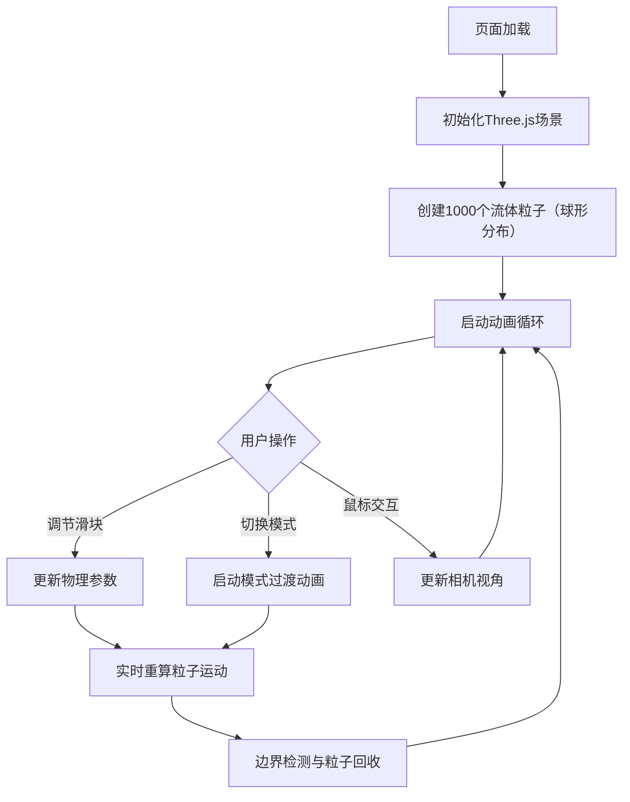

## 1. 产品概述

流体力学3D模拟器是一款面向3D可视化学习者的交互式演示工具，用于研究流体粒子系统的运动模式。通过实时调节物理参数和切换流体模式，用户可以直观观察涡流、喷射、扩散等流体现象，获得沉浸式的学习体验。

- **目标用户**：3D可视化学习者、计算机图形学研究者、物理模拟爱好者
- **核心价值**：提供轻量级、高性能、可交互的流体粒子系统演示平台

## 2. 核心功能

### 2.1 用户角色
| 角色 | 注册方式 | 核心权限 |
|------|----------|----------|
| 普通用户 | 无需注册，直接使用 | 调节参数、切换模式、交互浏览3D场景 |

### 2.2 功能模块
1. **3D渲染场景**：全屏粒子流体渲染、视角交互控制
2. **流体粒子系统**：1000个粒子物理模拟、三种运动模式、边界处理、性能优化
3. **参数控制面板**：粘度/湍流/喷射方向滑块、模式切换按钮组、响应式布局

### 2.3 页面详情
| 页面名称 | 模块名称 | 功能描述 |
|----------|----------|----------|
| 主页面 | 3D渲染场景 | 全屏Three.js渲染，鼠标拖拽旋转、滚轮缩放、右键平移 |
| 主页面 | 粒子系统 | 1000个粒子，颜色随速度蓝→红渐变，大小随速度变化，球形初始分布 |
| 主页面 | 参数控制面板 | 三个滑块（粘度0.1-1.0、湍流0-5、喷射方向XY轴各±90°），三种模式切换按钮 |
| 主页面 | 模式过渡动画 | 模式切换时1.5秒平滑插值过渡，显示模式名称大标题2秒后淡出 |
| 主页面 | 响应式布局 | 桌面端左侧控制面板，移动端（<768px）底部抽屉式布局 |

## 3. 核心流程

用户打开页面 → 3D场景初始化并渲染1000个粒子 → 用户通过滑块调节参数或切换模式 → 流体系统实时更新粒子运动 → 用户通过鼠标交互调整视角 → 超出边界的粒子被回收并重新生成

## 4. 用户界面设计

### 4.1 设计风格
- **主色调**：深蓝 #0A0A2E → 紫黑 #1A0A3E 渐变背景
- **强调色**：青色 #00B4D8（高亮、滑块、发光效果）
- **辅助色**：粒子颜色从蓝 #0077B6 渐变到红 #E63946
- **按钮样式**：圆角矩形，选中时发光高亮，未选中暗灰
- **字体**：无衬线科技感字体，标题带青色发光效果
- **布局风格**：沉浸式全屏3D场景，浮动半透明控制面板

### 4.2 页面设计概述
| 页面名称 | 模块名称 | UI元素 |
|----------|----------|--------|
| 主页面 | 3D背景 | 深蓝→紫黑径向渐变，全屏覆盖 |
| 主页面 | 控制面板 | 半透明玻璃态（#0D0D2B, 0.85透明度, 12px圆角, 毛玻璃效果），1px #4A4A6E边框 |
| 主页面 | 滑块控件 | 轨道高4px #2A2A4E，圆点直径16px #00B4D8，悬停外发光4px |
| 主页面 | 模式按钮 | 120×36px，选中#00B4D8发光，未选中#3A3A5C暗灰，点击缩放0.95 |
| 主页面 | 页面标题 | 右上角白色20px字体，text-shadow: 0 0 10px #00B4D8，可点击折叠面板 |
| 主页面 | 过渡标题 | 模式切换时居中显示白色半透明大标题，2秒后淡出 |

### 4.3 响应式设计
- **桌面端（≥768px）**：左上角浮动控制面板，竖向排列滑块和按钮
- **移动端（<768px）**：底部抽屉式控制面板（高200px），横向排列滑块
- **交互适配**：所有交互元素0.2s过渡效果，触摸设备优化

### 4.4 3D场景指引
- **环境**：深色渐变背景，无额外HDRI，营造深邃科技感
- **光照**：基础环境光保证粒子可见，粒子颜色自发光
- **相机**：PerspectiveCamera，初始距离适中，OrbitControls支持旋转/缩放/平移
- **粒子**：Points材质，圆形精灵，大小随速度变化，颜色随速度插值
- **动画**：60 FPS目标帧率，粒子位置每帧更新，模式切换1.5s缓动过渡
- **性能**：>500粒子时启用30秒周期GC，确保粒子总数稳定1000
