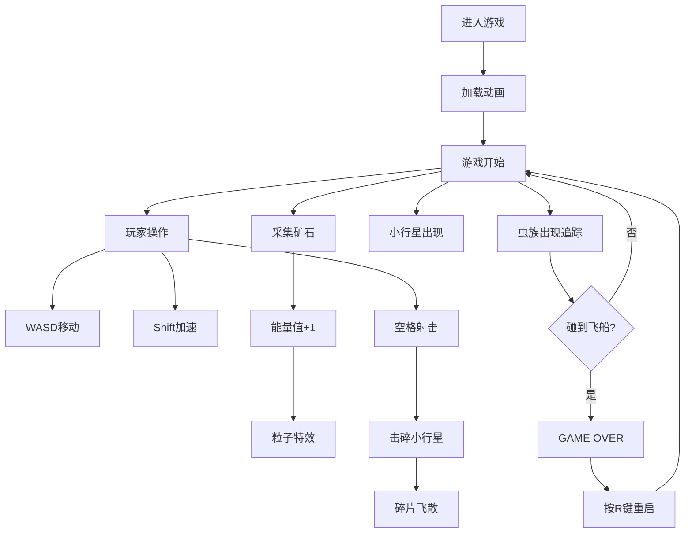

## 1. 产品概述

霓虹太空矿工是一款微型交互式2D像素风游戏，玩家驾驶采矿飞船在深空中采集能量矿石、击碎小行星、躲避太空虫族攻击。游戏面向休闲玩家，提供快节奏的街机式体验。

## 2. 核心功能

### 2.1 功能模块

1. **主游戏场景**：深空背景、闪烁星星、星云区域、飞船、矿石、小行星、虫族、子弹
2. **飞船控制**：WASD移动、Shift加速、空格发射子弹
3. **采集系统**：三种颜色矿石（红蓝绿）、触碰采集、粒子爆散特效
4. **战斗系统**：子弹射击、小行星碎裂、虫族追踪
5. **UI显示**：能量值图标、游戏计时、GAME OVER提示
6. **游戏状态**：进行中、游戏结束、重启

### 2.2 页面详情

| 页面名称 | 模块名称 | 功能描述 |
|---------|---------|---------|
| 游戏主页面 | 加载动画 | 旋转星云加载动画 |
| 游戏主页面 | 游戏画布 | 800x600像素Canvas，全屏适配 |
| 游戏主页面 | HUD界面 | 右上角三色能量值、左下角计时、顶部GAME OVER |

## 3. 核心流程

玩家进入游戏 → 看到加载动画 → 游戏开始，飞船在画面中央 → WASD控制移动，Shift加速，空格射击 → 采集矿石增加能量值 → 击碎小行星 → 躲避虫族追踪 → 被虫族碰到 → 游戏结束 → 按R键重启

## 4. 用户界面设计

### 4.1 设计风格
- **主色调**：深空蓝渐变背景 #0A0F2E → #1A1A3A
- **霓虹色**：青蓝 #00D4FF、红色 #FF6B6B、蓝色 #4FC3F7、绿色 #81C784、黄色 #FFD700
- **字体**：Press Start 2P 像素风字体，白色 #FFFFFF 带黑色 2px 描边
- **视觉效果**：发光线条、呼吸光效、粒子爆散、正弦波动动画

### 4.2 页面设计概述

| 页面名称 | 模块名称 | UI元素 |
|---------|---------|--------|
| 游戏主页面 | 加载动画 | 旋转星云，半透明紫 #8B5CF6 和品红 #EC4899 渐变 |
| 游戏主页面 | 深空背景 | 渐变背景、随机闪烁星星、星云区域 |
| 游戏主页面 | 飞船 | 青蓝色主体、推进器火焰动画（橙黄渐变） |
| 游戏主页面 | 矿石 | 30x30px，三色可选，缓慢旋转15°/s，呼吸光效0.7-1.0 |
| 游戏主页面 | 小行星 | 40-80px灰色 #6B7280 不规则圆角多边形 |
| 游戏主页面 | 虫族 | 50x60px红色 #E53935，带触角，正弦波动 |
| 游戏主页面 | 子弹 | 黄色发光圆点，半径3px，外发光 #FFD700 |
| 游戏主页面 | HUD能量值 | 右上角彩色圆点+数字 |
| 游戏主页面 | HUD计时 | 左下角秒数 |
| 游戏主页面 | GAME OVER | 顶部中央红色 #FF0000 48px，冲击波动画 |

### 4.3 响应式
- 游戏画布全屏适配浏览器窗口
- 游戏逻辑区域固定 800x600 像素，自动居中缩放

## 5. 性能要求
- 渲染帧率稳定 60FPS
- 粒子数量峰值不超过 500 个
- 实体总数（矿石、小行星、虫族、子弹）不超过 80 个
