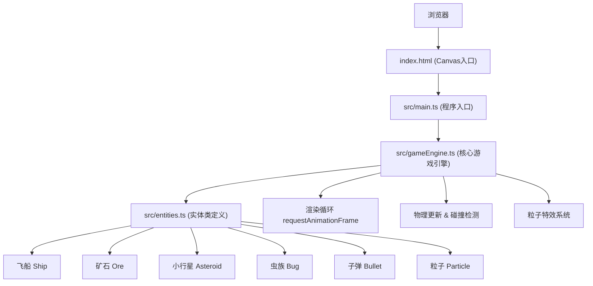

## 1. 架构设计



## 2. 技术描述

- **前端**：TypeScript + HTML5 Canvas + Vite
- **构建工具**：Vite@5 (mode: development)
- **语言规范**：TypeScript 严格模式，DOM + ES2015 类型
- **字体**：Google Fonts - Press Start 2P

## 3. 文件结构

```
project/
├── package.json
├── index.html
├── vite.config.js
├── tsconfig.json
└── src/
    ├── main.ts          # 程序入口：Canvas初始化、游戏循环、事件监听
    ├── gameEngine.ts    # 核心引擎：场景渲染、物理更新、碰撞检测、粒子系统
    └── entities.ts      # 实体类：Ship、Ore、Asteroid、Bug、Bullet、Particle
```

## 4. 核心数据结构

### 4.1 实体接口

```typescript
interface Entity {
  x: number;
  y: number;
  width: number;
  height: number;
  active: boolean;
  update(deltaTime: number): void;
  draw(ctx: CanvasRenderingContext2D): void;
}
```

### 4.2 游戏状态

```typescript
interface GameState {
  running: boolean;
  gameOver: boolean;
  time: number;
  energies: { red: number; blue: number; green: number };
  entities: {
    ship: Ship;
    ores: Ore[];
    asteroids: Asteroid[];
    bugs: Bug[];
    bullets: Bullet[];
    particles: Particle[];
  };
}
```

### 4.3 输入状态

```typescript
interface InputState {
  up: boolean;     // W
  down: boolean;   // S
  left: boolean;   // A
  right: boolean;  // D
  boost: boolean;  // Shift
  shoot: boolean;  // Space
}
```

## 5. 性能优化策略

1. **对象池**：粒子和子弹使用对象池复用，减少GC开销
2. **实体上限**：矿石≤30，小行星≤20，虫族≤10，子弹≤20，总计≤80
3. **粒子上限**：峰值≤500，超出后停止生成新粒子
4. **离屏剔除**：超出画布范围的实体立即标记为非活跃
5. **增量渲染**：使用 requestAnimationFrame，deltaTime 驱动动画
