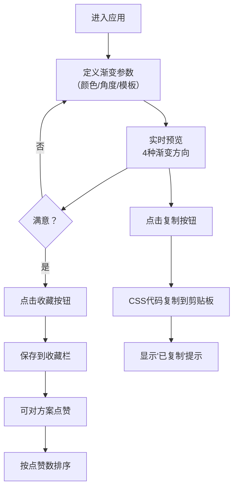

## 1. 产品概述
渐变色配色方案生成器是一款面向设计师的专业工具，帮助用户快速创建、预览和收藏CSS渐变色方案，解决设计师在选择渐变配色时难以直观对比多种方向、颜色组合和应用效果的问题。

- 目标用户：UI/UX设计师、前端开发者、视觉创作者
- 核心价值：提供实时多方向渐变预览、一键复制CSS代码、收藏管理和社区投票功能，提升配色设计效率

## 2. 核心功能

### 2.1 用户角色
本产品无复杂用户角色区分，所有访问者均为普通用户。

### 2.2 功能模块
1. **渐变控制面板**：颜色选择器（起始色、终止色）、角度滑块、预设模板选择、收藏按钮、投票区
2. **渐变预览区**：4种渐变方向（水平、垂直、对角线、径向）实时预览卡片
3. **收藏管理区**：横向滚动收藏列表、最多12个方案、点赞排序
4. **复制功能**：一键复制CSS代码、复制成功提示

### 2.3 页面详情
| 页面名称 | 模块名称 | 功能描述 |
|---------|---------|----------|
| 主页面 | 渐变控制面板 | 两个颜色选择器选择起始和终止颜色；0-360度角度滑块（步长5度）；3个预设配色模板；爱心收藏按钮；迷你投票点赞区 |
| 主页面 | 渐变预览区 | 4张160x120px预览卡片展示水平、垂直、对角线、径向渐变；圆角12px；悬停放大1.05倍带柔和阴影；每张卡片右上角28x28px圆形复制按钮 |
| 主页面 | 收藏管理区 | 横向滚动容器展示收藏的渐变色方案；每张卡片显示缩小版渐变预览和标签；最多12个方案，超出时弹窗提醒；按点赞数降序排列 |

## 3. 核心流程
用户进入应用 → 通过颜色选择器或预设模板定义渐变色 → 右侧实时预览4种渐变方向效果 → 点击复制按钮获取CSS代码 → 满意后点击爱心收藏 → 可对喜欢的方案点赞 → 收藏栏按点赞数排序展示

## 4. 用户界面设计

### 4.1 设计风格
- **主色调**：浅灰白背景#F8FAFC，纯白控制面板#FFFFFF，边框#E2E8F0
- **强调色**：蓝色#3182CE（选中态）、粉色#F472B6（收藏态）、黄色#F59E0B（点赞态）、浅蓝#EBF8FF（选中背景）
- **辅助色**：灰色#CBD5E0（默认图标）、深灰#4A5568（悬停按钮）、雾白#F2F4F7（复制按钮背景）
- **按钮风格**：圆形复制按钮（28x28px）、圆形收藏/点赞图标按钮、平滑过渡动画0.2秒
- **字体**：Google Fonts Inter
- **布局**：左侧控制面板280px固定宽度，右侧预览与收藏区域自适应
- **图标风格**：简洁线条图标（爱心、拇指、复制）

### 4.2 页面设计概述
| 页面名称 | 模块名称 | UI元素 |
|---------|---------|--------|
| 主页面 | 渐变控制面板 | 左右布局；颜色选择器带标签；角度滑块带渐变轨道；模板卡片高亮选中态；投票区实时显示点赞数 |
| 主页面 | 渐变预览区 | 网格布局4张卡片；悬停缩放+阴影动画；右上角圆形复制按钮；复制后1.5秒提示 |
| 主页面 | 收藏管理区 | 横向滚动容器；自定义8px宽薄滚动条；卡片悬停效果；超出12个方案时弹窗提醒 |

### 4.3 响应式设计
- 桌面端（≥768px）：左右分栏布局，左侧280px控制面板
- 移动端（<768px）：控制面板折叠为汉堡菜单，点击展开；预览区域全宽展示
- 触摸优化：按钮最小触控区域48px，滚动流畅

### 4.4 性能要求
- 所有交互响应延迟 < 100ms
- 收藏栏滚动无卡顿
- 颜色渲染和卡片生成 < 50ms
