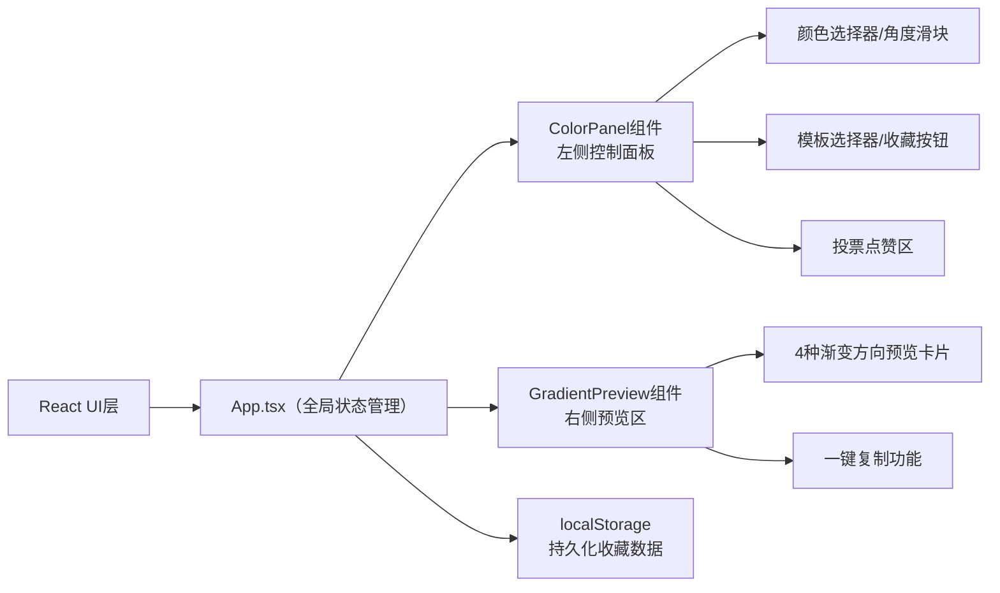

## 1. 架构设计



## 2. 技术描述
- **前端框架**：React@18 + TypeScript
- **构建工具**：Vite@5 + @vitejs/plugin-react
- **状态管理**：React useState/useCallback（轻量场景，无需额外状态库）
- **样式方案**：原生CSS + CSS Modules（简洁轻量，无额外依赖）
- **数据持久化**：localStorage存储收藏列表和投票数据
- **后端服务**：无（纯前端应用）

## 3. 目录结构
```
├── package.json          # 项目依赖和脚本
├── index.html            # 入口HTML
├── vite.config.js        # Vite配置
├── tsconfig.json         # TypeScript配置
└── src/
    ├── main.tsx          # React入口
    ├── App.tsx           # 根组件，全局状态管理
    ├── components/
    │   ├── ColorPanel.tsx      # 左侧控制面板
    │   └── GradientPreview.tsx # 右侧预览区
    └── styles/
        └── global.css    # 全局样式
```

## 4. 数据类型定义

```typescript
// 渐变配色方案
interface GradientScheme {
  id: string;
  startColor: string;
  endColor: string;
  angle: number;
  likes: number;
  createdAt: number;
  label?: string;
}

// 预设模板
interface PresetTemplate {
  id: string;
  name: string;
  startColor: string;
  endColor: string;
  angle: number;
}

// 应用全局状态
interface AppState {
  startColor: string;
  endColor: string;
  angle: number;
  favorites: GradientScheme[];
  selectedTemplateId: string | null;
  likedIds: Set<string>;
}
```

## 5. 核心功能实现要点

### 5.1 渐变生成
- 水平渐变：`linear-gradient(90deg, start, end)`
- 垂直渐变：`linear-gradient(180deg, start, end)`
- 对角线渐变：`linear-gradient(135deg, start, end)`
- 径向渐变：`radial-gradient(circle, start, end)`
- 自定义角度：`linear-gradient({angle}deg, start, end)`

### 5.2 复制功能
- 使用 `navigator.clipboard.writeText()` API
- 复制格式：`background: linear-gradient({angle}deg, {startColor}, {endColor});`
- 显示"已复制"提示1.5秒后自动消失

### 5.3 收藏功能
- 最多存储12个方案
- 超出时显示弹窗提示
- 使用localStorage持久化
- 按点赞数降序排列

### 5.4 动画效果
- CSS `transition` 实现0.2秒平滑过渡
- `transform: scale(1.05)` 实现悬停放大
- `box-shadow` 过渡实现柔和阴影效果
- 心形填充动画使用CSS keyframes

### 5.5 响应式布局
- CSS媒体查询 `@media (max-width: 768px)`
- 移动端汉堡菜单使用React state控制展开/收起
