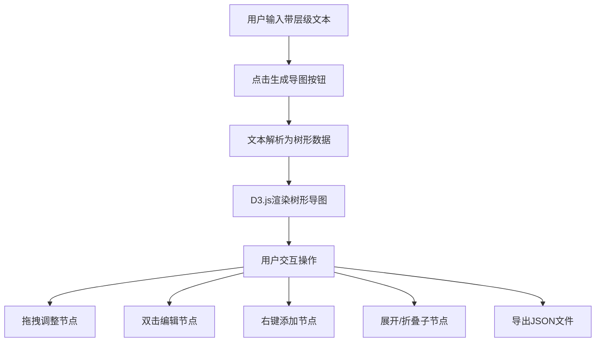

## 1. 产品概述

交互式文字转思维导图应用，用户通过输入带层级标记的文本，自动解析并生成可视化的树形思维导图。适用于会议记录整理、学习笔记梳理、项目规划分解等日常工作场景，帮助用户快速将碎片化文字信息转化为结构化知识图谱。

## 2. 核心功能

### 2.1 用户角色
| 角色 | 注册方式 | 核心权限 |
|------|----------|----------|
| 普通用户 | 无需注册，直接使用 | 文本输入、导图生成、节点编辑、导出下载 |

### 2.2 功能模块
1. **文本解析模块**：解析多行文本的层级关系（缩进、-、*标记），转换为树形数据结构
2. **导图渲染模块**：使用D3.js渲染可交互的树形布局，支持贝塞尔曲线连线、节点拖拽
3. **节点编辑模块**：支持双击修改节点文本、右键菜单添加兄弟/子节点、点击展开/折叠
4. **导出模块**：将当前导图结构导出为JSON文件下载

### 2.3 页面详情
| 页面名称 | 模块名称 | 功能描述 |
|----------|----------|----------|
| 主页面 | 文本输入区 | 多行文本输入框、生成导图按钮 |
| 主页面 | 导图展示区 | D3.js树形布局渲染、节点交互、右键菜单 |
| 主页面 | 导出功能 | JSON格式导出下载按钮 |

## 3. 核心流程

用户在左侧输入区域粘贴或输入带有层级标记的文本，点击"生成导图"按钮后，系统解析文本并在右侧渲染思维导图。用户可通过拖拽调整节点位置、双击编辑节点内容、右键添加新节点、点击箭头展开/折叠子节点，完成编辑后点击导出按钮下载JSON文件。

## 4. 用户界面设计

### 4.1 设计风格
- **主色调**：蓝绿色 #2b8a7b，辅助色 #e0f5f0，悬停色 #1f6b5e
- **按钮风格**：圆角矩形，主色背景白色文字，悬停加深
- **字体**：系统字体 -apple-system, BlinkMacSystemFont, "Segoe UI", sans-serif，字号14px
- **布局风格**：左右分栏布局，输入区30%、导图区70%，移动端上下排列
- **节点样式**：圆角矩形（圆角8px），浅灰边框 #d0d0d0，选中/悬停时边框变为主色

### 4.2 页面设计概述
| 页面名称 | 模块名称 | UI元素 |
|----------|----------|--------|
| 主页面 | 文本输入区 | textarea（高400px，圆角8px，浅米色#f9f6f0背景），生成按钮，分隔线#e0e0e0 |
| 主页面 | 导图展示区 | 白色背景#ffffff，浅灰色网格线（间距20px），SVG画布，贝塞尔曲线连线 |
| 主页面 | 节点交互 | 展开/折叠箭头（0.3秒ease-out旋转动画），内联编辑输入框，右键菜单 |

### 4.3 响应式设计
- 桌面端（≥768px）：左右两栏布局，输入区30%，导图区70%
- 移动端（<768px）：上下排列，输入区在上，导图区在下，各占50%视口高度
- 触摸优化：增大节点点击区域，支持触屏拖拽

## 5. 性能指标
- 文本解析：500行文本解析响应时间 < 200ms
- 渲染性能：100个节点时帧率 ≥ 50fps
- 拖拽交互：节点拖拽过程无明显掉帧，连线实时跟随平滑更新
