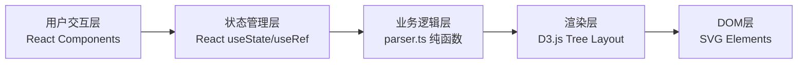
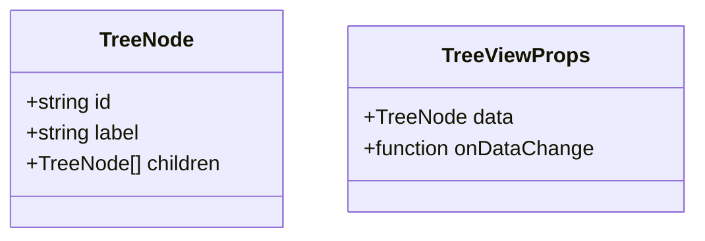

## 1. 架构设计



## 2. 技术选型说明

- **前端框架**：React 18 + TypeScript 5
- **构建工具**：Vite 5 + @vitejs/plugin-react
- **可视化库**：D3.js 7 + @types/d3
- **无后端、无数据库**：纯前端单页应用，数据存储于浏览器内存

## 3. 文件结构

```
auto18/
├── package.json
├── index.html
├── vite.config.js
├── tsconfig.json
└── src/
    ├── main.tsx          # React入口文件
    ├── App.tsx           # 主应用组件
    ├── parser.ts         # 文本解析纯函数
    ├── TreeView.tsx      # D3.js树形导图组件
    └── types.ts          # TypeScript类型定义
```

## 4. 核心模块设计

### 4.1 文本解析模块 (parser.ts)
- 输入：多行文本字符串
- 输出：嵌套树形节点 `{ id: string, label: string, children: TreeNode[] }`
- 层级识别规则：
  - 行首的 `-` 或 `*` 标记表示列表项
  - 每2个空格缩进表示一级子层级
  - 支持最多5级嵌套
- 算法：栈结构逐行解析，时间复杂度 O(n)

### 4.2 树形渲染组件 (TreeView.tsx)
- 使用D3.js `tree()` 布局计算节点坐标
- 使用 `d3.linkHorizontal()` 生成贝塞尔曲线
- 拖拽实现：`d3.drag()` 行为绑定到节点
- 展开/折叠：维护 collapsed 节点 id 集合
- 动画：`d3.transition().duration(300).ease(d3.easeQuadOut)`

### 4.3 节点编辑功能
- 双击节点：切换为 `<input>` 内联编辑，Enter确认，Esc取消
- 右键菜单：自定义ContextMenu组件，选项：添加兄弟节点、添加子节点
- 节点选中状态：useState维护 selectedNodeId

## 5. 数据模型

### 5.1 数据模型定义



### 5.2 TypeScript类型定义

```typescript
interface TreeNode {
  id: string;
  label: string;
  children: TreeNode[];
}

interface ParserResult {
  root: TreeNode;
  nodeCount: number;
}
```
