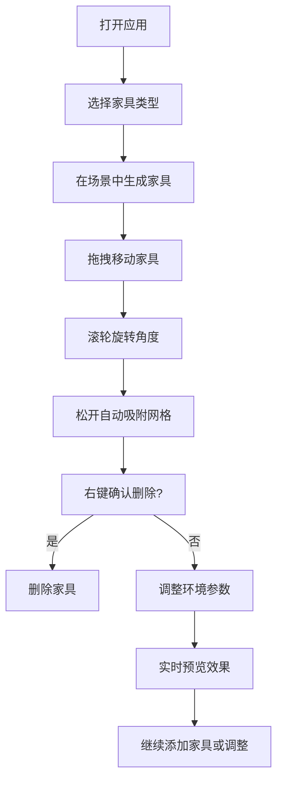

## 1. 产品概述

3D交互式室内家具布局模拟器，让用户能在3D房间中自由放置、旋转和移动家具模型，调整房屋结构，实时预览室内设计效果。

- 目标用户：室内设计爱好者、装修前方案探索者
- 产品价值：提供直观的3D可视化工具，降低室内设计门槛

## 2. 核心功能

### 2.1 功能模块

1. **家具工具栏**：6种基础家具（桌子、椅子、沙发、床、书柜、灯具），点击生成实例
2. **家具交互**：拖拽移动、滚轮旋转、右键删除、选中高亮
3. **环境定制**：墙壁颜色、地板材质、灯光亮度调节
4. **3D场景**：4x4米房间，辅助网格，实时渲染

### 2.2 页面详情

| 页面名称 | 模块名称 | 功能描述 |
|-----------|-------------|---------------------|
| 主界面 | 左侧家具工具栏 | 竖排图标+标签，选中高亮，点击生成家具 |
| 主界面 | 中间3D场景 | 3D房间场景，家具放置、拖拽、旋转、删除交互 |
| 主界面 | 右侧环境定制面板 | 分组折叠式，墙壁颜色/地板材质/灯光亮度 |
| 主界面 | 家具信息面板 | 显示选中家具名称和位置坐标 |

## 3. 核心流程

用户打开应用 → 从左侧工具栏选择家具 → 家具在场景中生成 → 拖拽移动到目标位置 → 滚轮旋转角度 → 右键删除或继续添加 → 调整环境（颜色/材质/灯光）→ 实时预览效果

## 4. 用户界面设计

### 4.1 设计风格

- 主色调：北欧风，白灰为主
- 辅助色：淡木色、莫兰迪蓝绿
- 字体：现代无衬线字体
- 布局：左中右三栏布局
- 交互反馈：平滑过渡动画、悬停高亮、选中状态

### 4.2 页面设计概览

| 页面名称 | 模块名称 | UI元素 |
|-----------|-------------|-------------|
| 主界面 | 家具工具栏 | 竖排卡片、图标+文字标签、选中高亮边框 |
| 主界面 | 3D场景 | 全屏3D视口、浅灰色网格线、斜上方45度俯视 |
| 主界面 | 环境定制面板 | 分组折叠式、颜色预设方块、材质选择器、亮度滑块 |
| 主界面 | 家具信息 | 半透明蓝色悬停高亮、橙色选中边框、角度指示器、底部阴影 |

### 4.3 响应式设计

- 桌面端：左中右三栏布局，≥480px以上屏幕适配
- 触控优化：鼠标拖拽、滚轮旋转、右键菜单

### 4.4 3D场景设计

- 环境：4x4米矩形房间，浅灰色辅助网格线
- 光照：环境光+方向光，支持亮度调节
- 相机：斜上方45度俯视，OrbitControls控制
- 交互：拖拽移动（XZ平面）、滚轮旋转（Y轴45度增量）、右键删除
- 动画：墙壁颜色渐变过渡（0.5秒）、家具平滑移动（插值因子0.15）、网格吸附（0.25米半格）
