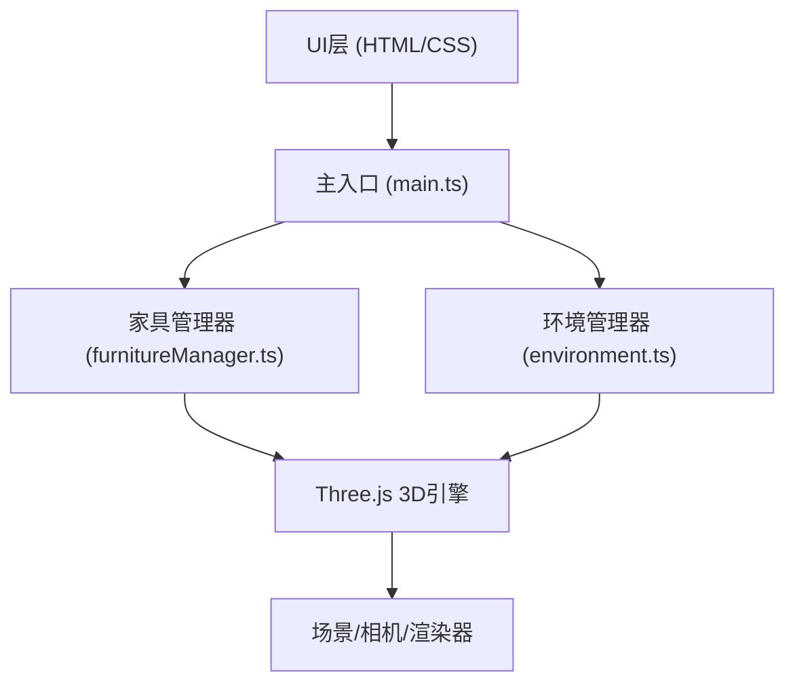

## 1. 架构设计

## 2. 技术说明

- 前端框架：原生 TypeScript + Three.js
- 构建工具：Vite
- 3D引擎：Three.js (three, @types/three）
- 类型系统：TypeScript 严格模式
- 样式：原生 CSS

## 3. 文件结构

| 文件路径 | 用途 |
|-----------|------|
| package.json | 项目依赖配置 |
| index.html | 入口页面 |
| vite.config.js | Vite 构建配置 |
| tsconfig.json | TypeScript 配置 |
| src/main.ts | 场景初始化、UI事件、主循环 |
| src/furnitureManager.ts | 家具类型定义、几何体生成、家具操作 |
| src/environment.ts | 墙壁、地板、灯光管理 |
| src/roomLayout.css | UI样式 |

## 4. 核心模块说明

### 4.1 furnitureManager.ts

- 家具类型：Table, Chair, Sofa, Bed, Bookshelf, Lamp
- 几何体：使用 Three.js 基础几何体组合
- 操作方法：createFurniture, moveFurniture, rotateFurniture, deleteFurniture
- 选中状态管理
- 拖拽、旋转、删除交互

### 4.2 environment.ts

- 墙壁颜色：6种预设颜色，渐变过渡动画
- 地板材质：瓷砖/木质/地毯，纹理平铺
- 灯光亮度：0.5-2.0 范围调节

### 4.3 main.ts

- Three.js 场景、相机、渲染器初始化
- OrbitControls 相机控制
- Raycaster 射线拾取
- UI 事件绑定
- 动画主循环（requestAnimationFrame）

## 5. 性能要求

- 目标帧率：60FPS
- 最大家具实例：20个
- 操作响应时间：<100ms
- 家具移动平滑插值：0.15
- 网格吸附单位：0.25米
