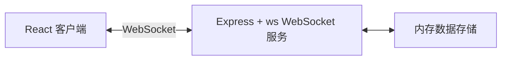
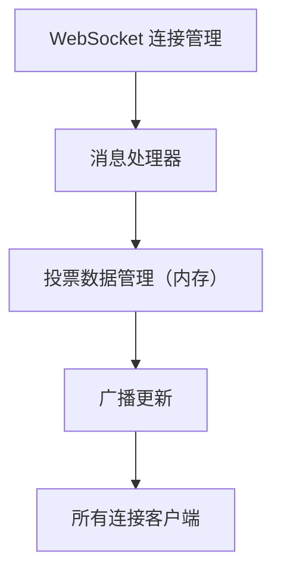
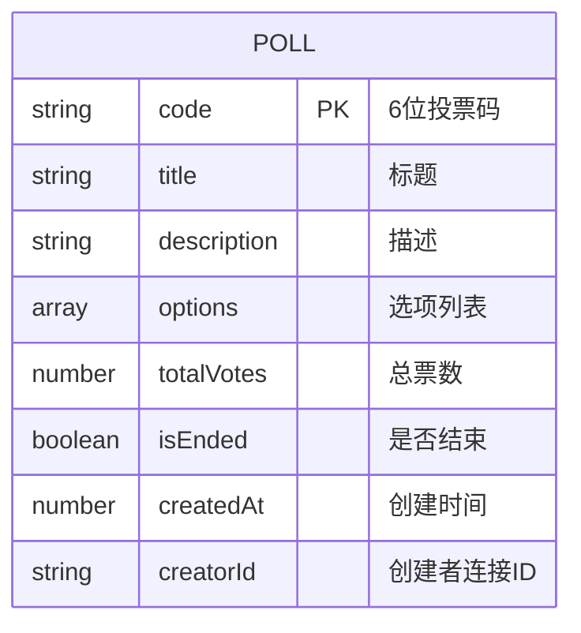

## 1. 架构设计



## 2. 技术说明

- 前端：React 18 + TypeScript + Vite
- 后端：Express + TypeScript + ws (WebSocket)
- 图表：Recharts
- 通信：WebSocket 实时双向通信
- 数据存储：内存存储（开发演示）

## 3. 项目结构

```
├── package.json          # 根目录，管理前后端依赖和启动脚本
├── index.html          # 入口页面
├── vite.config.js    # Vite 配置
├── tsconfig.json    # TypeScript 配置
├── server/
│   └── server.ts    # Express + WebSocket 服务端
└── client/
    └── src/
        ├── main.tsx    # React 入口
        ├── App.tsx    # 主应用
        └── VoteRoom.tsx  # 投票房间
```

## 4. WebSocket 消息定义

```typescript
// 客户端 -> 服务端
type ClientMessage =
  | { type: 'CREATE_POLL'; title: string; description: string; options: string[] }
  | { type: 'JOIN_POLL'; pollCode: string }
  | { type: 'VOTE'; pollCode: string; optionIndex: number }
  | { type: 'END_POLL'; pollCode: string };

// 服务端 -> 客户端
type ServerMessage =
  | { type: 'POLL_CREATED'; pollCode: string; poll: PollData }
  | { type: 'POLL_JOINED'; poll: PollData }
  | { type: 'POLL_NOT_FOUND' }
  | { type: 'VOTE_UPDATE'; poll: PollData }
  | { type: 'POLL_ENDED'; poll: PollData }
  | { type: 'ONLINE_COUNT'; count: number }
  | { type: 'NOTIFICATION'; message: string };

interface PollData {
  code: string;
  title: string;
  description: string;
  options: { text: string; votes: number }[];
  totalVotes: number;
  isEnded: boolean;
  createdAt: number;
  creatorId: string;
}
```

## 5. 服务端架构



## 6. 数据模型

### 6.1 数据模型定义


