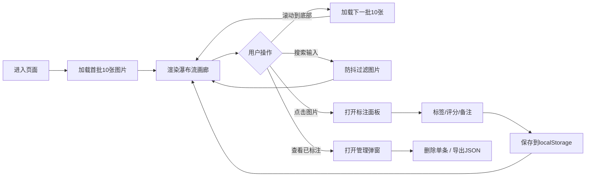

## 1. 产品概述

光影画廊是一款面向设计团队的沉浸式图片瀑布流与鉴赏标注工具，解决项目初期灵感素材收集与筛选效率低的问题。通过无限滚动瀑布流浏览、标签化标注与评分、本地持久化存储及JSON导出功能，帮助设计师快速沉淀和共享创意灵感。

## 2. 核心功能

### 2.1 功能模块
1. **主页面**：搜索栏、无限滚动瀑布流、已标注管理入口
2. **标注面板**：图片大图预览、标签选择、星级评分、备注输入
3. **标注管理弹窗**：已标注列表、单条删除、JSON导出

### 2.2 页面详情
| 页面名称 | 模块名称 | 功能描述 |
|-----------|-------------|---------------------|
| 主页面 | 顶部搜索栏 | 关键词实时过滤图片（防抖300ms），匹配标题/描述 |
| 主页面 | 瀑布流画廊 | 无限滚动加载、Masonry布局、骨架屏占位、淡入动画、懒加载 |
| 主页面 | 图片卡片 | 悬停遮罩显示标题描述、点击打开标注面板、随机列宽 |
| 主页面 | 底部操作栏 | 查看已标注按钮、导出JSON按钮 |
| 标注面板 | 大图预览 | 显示原图、从右侧滑入动画 |
| 标注面板 | 标签选择 | 6+预设彩色药丸标签（灵感/配色/构图等），支持多选 |
| 标注面板 | 星级评分 | 1-5星交互、悬停半填充预览 |
| 标注面板 | 备注输入 | 文本域、保存按钮 |
| 标注管理弹窗 | 缩略图列表 | 展示所有已标注、显示标签评分、支持删除单条 |
| 标注管理弹窗 | 导出功能 | 将所有标注以JSON格式下载到本地 |

## 3. 核心流程

用户打开页面 → 自动加载首批10张占位图并渲染瀑布流 → 用户滚动到底部自动加载下一批 → 点击图片卡片打开右侧标注面板 → 选择标签、评分、输入备注 → 保存到localStorage → 点击"查看已标注"浏览所有记录 → 删除或导出JSON文件

## 4. 用户界面设计

### 4.1 设计风格
- 深色科技感主题：背景#1a1a2e，卡片#16213e，主色调#0f3460，强调色#e94560
- 卡片底部带渐变阴影：box-shadow: 0 4px 15px rgba(233,69,96,0.2)
- 圆角彩色药丸标签按钮，选中填充色变化
- 毛玻璃搜索框：backdrop-filter: blur(10px)，圆角20px
- 所有交互使用缓动动画：cubic-bezier(0.25, 0.1, 0.25, 1)
- 字体：现代无衬线字体，标题中等字重

### 4.2 页面设计概述
| 页面名称 | 模块名称 | UI元素 |
|-----------|-------------|-------------|
| 主页面 | 搜索栏 | 左侧50%宽度、毛玻璃背景、圆角20px、搜索图标占位符 |
| 主页面 | 瀑布流 | 12px间距、响应式列数（桌面4列/平板2列/移动1列）、淡入动画 |
| 主页面 | 图片卡片 | 随机200-300px宽度、悬停上移4px放大阴影、底部渐变遮罩 |
| 主页面 | 底部操作栏 | 固定底部、居中按钮组 |
| 标注面板 | 容器 | 右侧滑入（translateX 0.2s ease-out）、深色半透明遮罩背景 |
| 标注面板 | 星级评分 | 点击高亮、悬停半填充预览 |
| 标注管理弹窗 | 列表 | 卡片式网格布局、每条显示缩略图+标签+评分+删除按钮 |

### 4.3 响应式
- 桌面（>=1024px）：四列瀑布流
- 平板（768-1023px）：两列瀑布流
- 移动端（<768px）：单列瀑布流
- 列数变化时瀑布流自动重排，平滑过渡
