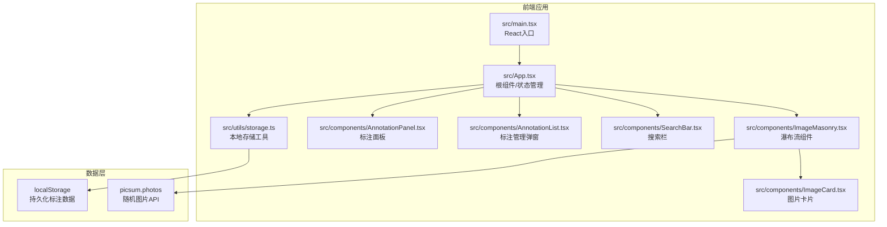

## 1. 架构设计



## 2. 技术描述
- 前端：React 18 + TypeScript + Vite
- 瀑布流布局：masonry-layout
- 状态管理：React Hooks (useState, useEffect, useCallback, useRef)
- 图标：lucide-react
- 数据存储：localStorage
- 图片来源：picsum.photos 随机占位图

## 3. 项目文件结构与调用关系

| 文件路径 | 职责描述 | 调用关系 |
|----------|----------|----------|
| package.json | 项目依赖与脚本配置 | 根配置文件 |
| index.html | 入口HTML页面 | 加载全局样式与应用容器 |
| vite.config.js | Vite构建配置（React插件、路径别名） | 构建工具配置 |
| tsconfig.json | TypeScript严格模式配置 | 编译器配置 |
| src/main.tsx | React应用入口，渲染`<App />` | 调用ReactDOM |
| src/App.tsx | 根组件：全局状态管理、图片加载、搜索过滤、无限滚动 | 调用ImageMasonry、AnnotationPanel、AnnotationList、SearchBar、storage工具 |
| src/components/ImageMasonry.tsx | 瀑布流布局：Masonry初始化、响应式列数、骨架屏、懒加载 | 接收图片列表props，渲染ImageCard |
| src/components/ImageCard.tsx | 图片卡片：缩略图、悬停遮罩、点击事件、淡入动画 | 接收单张图片props，触发选中回调 |
| src/components/AnnotationPanel.tsx | 标注面板：大图预览、标签多选、星级评分、备注、保存 | 接收选中图片ID，调用storage保存，触发onSave回调 |
| src/components/AnnotationList.tsx | 标注管理弹窗：列表展示、删除、导出JSON | 调用storage获取/删除/导出数据 |
| src/components/SearchBar.tsx | 搜索栏：输入防抖、实时过滤 | 触发搜索回调 |
| src/utils/storage.ts | 本地存储：保存/获取/删除标注、导出JSON | 被AnnotationPanel、AnnotationList、App调用 |
| src/types/index.ts | TypeScript类型定义 | 全局类型引用 |
| src/hooks/useInfiniteScroll.ts | 无限滚动自定义Hook | 被App组件使用 |
| src/hooks/useDebounce.ts | 防抖自定义Hook | 被SearchBar使用 |
| src/styles/global.css | 全局样式 | 入口引入 |

**数据流向**：
1. App → 加载图片URL列表 → ImageMasonry → ImageCard
2. ImageCard → 点击选中 → App → AnnotationPanel
3. AnnotationPanel → 用户操作标注 → storage.saveAnnotation() → localStorage
4. SearchBar → 输入关键词 → App → 过滤图片列表 → ImageMasonry
5. AnnotationList → storage.getAllAnnotations() → 展示列表；storage.exportAsJSON() → 下载文件

## 4. 数据模型

### 4.1 TypeScript类型定义

```typescript
interface ImageItem {
  id: string;
  url: string;
  thumbnail: string;
  title: string;
  description: string;
  width: number;
  height: number;
}

interface Annotation {
  imageId: string;
  imageUrl: string;
  tags: string[];
  rating: number;
  note: string;
  createdAt: string;
}

type PresetTag = {
  name: string;
  color: string;
};
```

### 4.2 localStorage存储结构

```json
{
  "annotations": {
    "image-id-123": {
      "imageId": "image-id-123",
      "imageUrl": "https://picsum.photos/...",
      "tags": ["灵感", "配色"],
      "rating": 4,
      "note": "适合登录页背景",
      "createdAt": "2026-06-08T10:30:00.000Z"
    }
  }
}
```

## 5. 性能优化方案

- **图片懒加载**：IntersectionObserver实现，未进入视口不请求
- **无限滚动**：滚动到底部加载下一批（每批10张）
- **防抖搜索**：300ms防抖，避免频繁重渲染
- **CSS动画**：transform/opacity动画，触发GPU加速
- **骨架屏**：图片加载中显示占位动画，提升感知性能
- **瀑布流重排优化**：窗口resize时防抖重新布局
