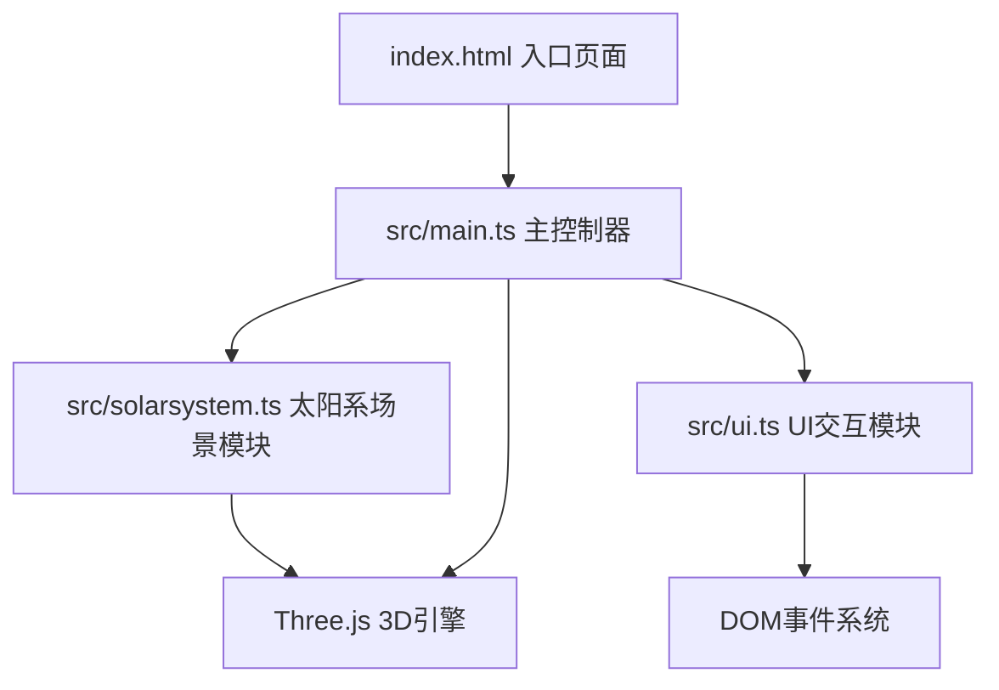
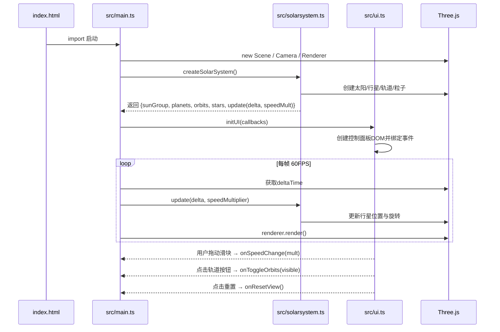

## 1. 架构设计



## 2. 技术选型说明

- **前端框架**：TypeScript (严格模式) + ES Modules，不使用React/Vue等框架，直接操作Three.js和DOM以获得最佳3D性能
- **3D引擎**：three@0.160 + @types/three，原生WebGL渲染
- **构建工具**：Vite@5，零配置ES模块热更新
- **包管理器**：npm
- **后端**：无后端，纯前端静态应用
- **数据存储**：无数据库，行星数据硬编码于solarsystem.ts中

## 3. 文件结构与调用关系

| 文件 | 职责 | 数据流向 |
|------|------|----------|
| `package.json` | 项目依赖与脚本定义 | three, @types/three, typescript, vite；启动脚本 npm run dev |
| `vite.config.js` | Vite构建配置 | 指向index.html入口 |
| `tsconfig.json` | TS编译配置 | 严格模式、ES模块、DOM类型支持 |
| `index.html` | 入口HTML | 全屏容器、加载main.ts、深空渐变背景样式 |
| `src/main.ts` | 主控制器 | 初始化Scene/Camera/Renderer → 调用solarsystem.ts创建星球 → 调用ui.ts绑定事件 → 启动requestAnimationFrame循环 → 响应ui回调更新速度/轨道可见性 |
| `src/solarsystem.ts` | 太阳系模型 | 定义行星数据数组 → createSun()创建太阳 → createPlanets()创建行星+轨道 → 导出行星组/轨道组/更新函数供main.ts调用 |
| `src/ui.ts` | UI交互层 | 动态创建控制面板DOM → 绑定滑块/按钮事件 → 通过回调通知main.ts → 管理行星信息面板显隐 |

## 4. 核心数据结构

### 4.1 行星数据定义 (solarsystem.ts内部)

```typescript
interface PlanetData {
  name: string;           // 行星名：水星/金星/地球/火星/木星/土星/天王星/海王星
  nameEn: string;         // 英文名称
  radius: number;         // 行星半径（单位），水星1 → 木星4
  color: number;          // 十六进制颜色值
  orbitRadius: number;    // 公转轨道半径 15-80递增
  orbitSpeed: number;     // 公转角速度基准系数（相对比例）
  rotationPeriod: number; // 自转速度系数（公转3倍）
  orbitalPeriod: number;  // 公转周期（天）
  distanceAU: number;     // 距太阳距离（AU）
  hasRing?: boolean;      // 是否有星环（土星）
  ringColor?: number;     // 星环颜色
}
```

### 4.2 UI回调接口

```typescript
interface UICallbacks {
  onSpeedChange: (multiplier: number) => void;
  onToggleOrbits: (visible: boolean) => void;
  onResetView: () => void;
}
```

## 5. 性能优化策略

1. **渲染循环**：单requestAnimationFrame，deltaTime计算保证帧率无关动画速度
2. **几何体复用**：行星球体共享同一SphereGeometry实例，仅材质不同
3. **粒子系统**：使用Points + BufferGeometry，500点单次绘制调用
4. **DOM最小化**：控制面板和信息面板各仅一次DOM创建，通过display切换
5. **事件节流**：鼠标移动事件使用阻尼插值而非逐帧跟随

## 6. 文件间调用关系图


