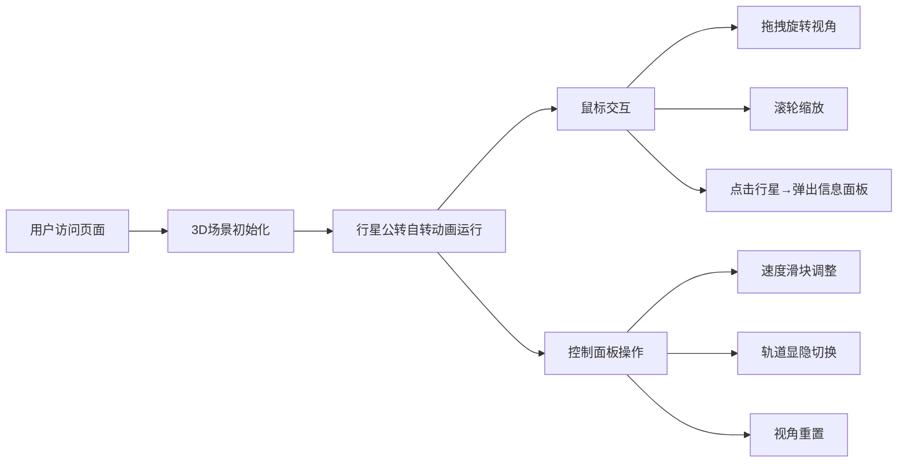

## 1. 产品概述

3D交互式太阳系模型是一款面向天文学爱好者和教育工作者的浏览器端可视化工具，通过真实比例缩放的3D场景直观展示八大行星的轨道运动、相对位置关系和物理特性差异。

- 核心价值：将抽象的天文数据转化为可交互的沉浸式3D体验，帮助用户理解行星公转周期、轨道倾角、大小对比等天文学概念
- 目标用户：天文爱好者、K12及高校科学教育工作者、科普内容创作者

## 2. 核心特性

### 2.1 用户角色

| 角色 | 访问方式 | 核心权限 |
|------|----------|----------|
| 普通用户 | 浏览器直接访问 | 完整3D场景浏览、行星交互、参数调节 |

### 2.2 功能模块

1. **3D场景主视图**：太阳+八大行星实时公转自转模拟、星空粒子背景、轨道线渲染
2. **控制面板**：速度调节滑块、轨道显隐切换、视角重置
3. **行星信息面板**：点击行星弹出详情卡片（名称、公转周期、距离、颜色、大小）
4. **鼠标交互系统**：视角旋转、缩放、行星拾取

### 2.3 页面详情

| 页面名称 | 模块名称 | 功能描述 |
|----------|----------|----------|
| 主场景页 | 3D太阳系场景 | 太阳自发光球体、八大行星按比例排布、公转自转动画、轨道圆环、星空背景 |
| 主场景页 | 控制面板 | 左上角毛玻璃面板，包含速度滑块(0.5x-2.0x)、轨道显隐按钮、重置视角按钮 |
| 主场景页 | 信息面板 | 点击行星后浮现的详情卡片，点击外部关闭，带淡入动画 |

## 3. 核心流程

用户打开页面 → 3D场景加载并自动开始动画 → 鼠标拖拽旋转视角/滚轮缩放 → 拖动速度滑块调整公转速度 → 点击行星查看信息 → 点击轨道按钮切换轨道显示 → 点击重置恢复初始视角

## 4. 用户界面设计

### 4.1 设计风格

- **主色调**：深空渐变背景（#000000 → #1a0033），行星使用鲜艳饱和色突出主体
- **辅助色**：控制面板蓝色渐变滑块轨道(#3b82f6 → #60a5fa)、毛玻璃半透明白色(#ffffff20)
- **字体**：系统无衬线字体栈 (system-ui, -apple-system, sans-serif)，白色文字
- **UI组件风格**：圆角12px、毛玻璃模糊(backdrop-filter: blur(12px))、细边框、柔和阴影
- **动效**：面板淡入(0.3s ease)、滑块平滑过渡、视角阻尼(0.9系数)

### 4.2 页面设计概述

| 页面名称 | 模块名称 | UI元素 |
|----------|----------|----------|
| 主场景页 | 3D场景 | 全屏Canvas、金色自发光太阳、彩色行星、半透明灰色轨道、500颗闪烁星空粒子 |
| 主场景页 | 控制面板 | 左上角固定定位、半透明毛玻璃背景、圆角边框、内边距16px、元素间距12px |
| 主场景页 | 信息面板 | 暗色半透明卡片(#111111cc)、圆角12px、行星色标圆点、键值对信息布局、淡入动画 |

### 4.3 响应式

- 桌面端优先设计，全屏3D场景自适应窗口大小
- 控制面板固定左上角，最小可用宽度320px
- 信息面板最大宽度320px，响应文字换行

### 4.4 3D场景指导

- **环境与氛围**：深空黑紫渐变背景 + 500颗Points粒子模拟闪烁星空，营造宇宙沉浸感
- **光照设置**：太阳自发光(MeshBasicMaterial + emissive)作为主光源，辅以AmbientLight(0.3强度)提供环境照明，PointLight放置在太阳位置提供行星光照
- **相机设置**：PerspectiveCamera(70° FOV)，初始位置(0, 60, 120)，目标点(0, 0, 0)，缩放范围10-200单位
- **构图与焦点**：太阳居中，行星按轨道半径递增向外排布，默认俯视45°角
- **交互与动画**：requestAnimationFrame驱动60FPS循环，公转速度按真实比例，自转速度为公转3倍，轨道旋转带阻尼系数0.9
- **后处理**：无后处理以保证性能，依赖Three.js原生渲染
- **资源与性能**：纯几何体构建无外部资源，粒子≤500，目标FPS 55-60，交互延迟<50ms
