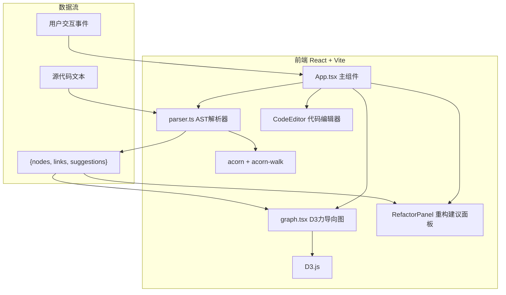

## 1. 架构设计



## 2. 技术描述

- **前端框架**：React 18 + TypeScript 5
- **构建工具**：Vite 5 + @vitejs/plugin-react
- **代码解析**：acorn（支持ES2020） + acorn-walk（AST遍历）
- **可视化**：D3.js v7 + @types/d3
- **样式方案**：原生CSS + CSS变量，Tailwind CSS（可选辅助）
- **无后端**：纯前端单页应用，所有逻辑在浏览器端执行

### 依赖清单

```json
{
  "react": "^18.2.0",
  "react-dom": "^18.2.0",
  "d3": "^7.8.0",
  "@types/d3": "^7.4.0",
  "acorn": "^8.11.0",
  "acorn-walk": "^8.3.0",
  "typescript": "^5.3.0",
  "vite": "^5.0.0",
  "@vitejs/plugin-react": "^4.2.0"
}
```

## 3. 路由定义

纯单页应用，无路由需求。

| 路由 | 用途 |
|------|------|
| / | 主应用页面（唯一入口） |

## 4. 核心数据结构

### 4.1 AST解析输出

```typescript
type NodeType = 'function' | 'variable' | 'branch' | 'loop' | 'call';

interface GraphNode {
  id: string;
  type: NodeType;
  name: string;
  startLine: number;
  endLine: number;
  snippet: string;
  depth?: number;
  complexity?: number;
}

interface GraphLink {
  source: string;
  target: string;
  type: 'call' | 'data' | 'control';
}

type SuggestionType = 'deep-nesting' | 'long-function' | 'duplicate-call';

interface RefactorSuggestion {
  id: string;
  type: SuggestionType;
  severity: 'warning' | 'error' | 'info';
  message: string;
  startLine: number;
  endLine: number;
  snippet: string;
}

interface ParseResult {
  nodes: GraphNode[];
  links: GraphLink[];
  suggestions: RefactorSuggestion[];
  error?: string;
}
```

## 5. 文件结构与调用关系

```
src/
├── main.ts              ← 入口文件，渲染App
├── App.tsx              ← 主组件：布局管理、状态协调
├── parser.ts            ← AST解析：代码→{nodes,links,suggestions}
├── graph.tsx            ← D3力导向图组件
├── styles/
│   └── index.css        ← 全局样式、CSS变量、主题
└── types/
    └── index.ts         ← 类型定义（GraphNode, GraphLink等）
```

### 数据流说明

1. `App.tsx` 持有 `sourceCode` state → 用户输入变化
2. `App.tsx` 调用 `parser.ts:parseCode(sourceCode)` → 返回 `ParseResult`
3. `ParseResult` 传递给 `graph.tsx` 渲染力导向图
4. `ParseResult.suggestions` 传递给建议面板渲染
5. 用户在 `graph.tsx` 中点击/悬浮节点 → 回调通知 `App.tsx` → 高亮代码区对应行

## 6. 性能保障策略

- AST解析使用 Web Worker 异步执行（可选优化），500行代码≤500ms
- D3力导向图使用 `d3.forceSimulation` 的 `alphaDecay` 控制迭代次数
- 节点DOM复用（D3 enter/update/exit模式），100节点保持60FPS
- 大代码量时自动降低力导向图模拟精度
- 使用 `requestAnimationFrame` 分批渲染DOM节点
