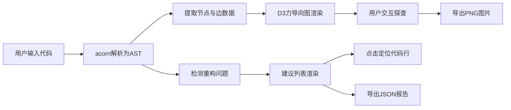

## 1. 产品概述

代码结构可视化与重构建议工具，面向前端开发者，帮助其快速理解JavaScript/TypeScript代码的控制流和数据依赖关系，并获得智能重构建议。

- 解决问题：可读性差的松耦合代码（如深层嵌套、长函数、重复逻辑）难以理解和维护
- 核心价值：通过AST解析和力导向图可视化，让代码结构一目了然，辅以自动化重构检测提升代码质量
- 目标用户：日常需要处理复杂代码的JavaScript/TypeScript开发者

## 2. 核心功能

### 2.1 用户角色

| 角色 | 注册方式 | 核心权限 |
|------|----------|----------|
| 开发者用户 | 无需注册，直接使用 | 输入代码、查看可视化图、获取重构建议、导出结果 |

### 2.2 功能模块

1. **代码输入区**：支持粘贴/输入JS/TS代码（ES2020语法），实时语法高亮，行号显示
2. **AST解析引擎**：基于acorn解析器，提取函数声明、变量定义、条件分支、循环和函数调用关系
3. **力导向图可视化**：D3.js实现交互式节点图，支持拖拽、缩放、悬浮高亮
4. **重构建议面板**：自动检测深层嵌套、长函数、重复逻辑，给出可点击定位的建议列表
5. **导出功能**：导出PNG高清图、导出JSON格式重构报告

### 2.3 页面详情

| 页面名称 | 模块名称 | 功能描述 |
|----------|----------|----------|
| 主应用 | 代码输入区 | 左侧40%宽度，Monaco风格代码编辑器，支持行号高亮和定位跳转 |
| 主应用 | 力导向图面板 | 右上60%宽度，D3力导向图，节点按类型着色，支持拖拽缩放和悬浮详情 |
| 主应用 | 重构建议面板 | 右下方滚动列表，展示三类警告，点击定位到对应代码行 |
| 主应用 | 顶部工具栏 | 导出PNG、导出JSON报告、清空重置等操作按钮 |

## 3. 核心流程

用户粘贴代码 → 系统自动解析为AST → 提取节点关系和重构警告 → 渲染力导向图和建议列表 → 用户交互探查（悬浮/拖拽/点击） → 按需导出结果

## 4. 用户界面设计

### 4.1 设计风格

- **主色调**：深色主题 #1e1e2e 背景，节点采用柔和发光效果
- **配色方案**：
  - 函数节点：蓝色 #4fc3f7（发光）
  - 变量节点：绿色 #81c784（发光）
  - 分支节点：橙色 #ffb74d（发光）
  - 连接边：半透明灰色 #66666680
  - 边框/分隔线：#3a3a4e
  - 面板边框：#2a2a3e
  - 气泡提示背景：#252535
- **动效**：所有过渡动画 0.3s ease 缓动
- **字体**：代码区使用等宽字体 (JetBrains Mono / Consolas)，UI使用现代无衬线字体

### 4.2 页面设计概述

| 页面名称 | 模块名称 | UI 元素 |
|----------|----------|---------|
| 主应用 | 整体布局 | 三栏式分区布局，1px 分隔线，圆角面板，柔和阴影 |
| 主应用 | 代码输入区 | 暗色代码编辑器风格，行号栏，语法高亮，滚动条定制 |
| 主应用 | 力导向图 | 圆形（函数）、矩形（变量）、菱形（分支）节点，有向箭头边，发光效果 |
| 主应用 | 重构建议 | 卡片式建议列表，图标+警告级别+描述+代码位置，可点击定位 |
| 主应用 | 顶部工具栏 | 图标按钮，悬浮提示，操作反馈 |

### 4.3 响应式设计

- **桌面端（≥768px）**：左侧40%代码输入，右侧60%上下分布力导向图和建议列表
- **移动端（<768px）**：纵向堆叠布局，输入区在上、图在中、建议在下，每个区域可折叠展开
- **触控优化**：增加触摸目标尺寸，支持双指缩放

### 4.4 视觉细节

- 节点悬浮时出现深色气泡提示（圆角8px，白色文字，阴影）
- 节点采用 `filter: drop-shadow()` 实现柔和发光
- 连接边带方向箭头指示数据流/调用关系
- 代码行高亮采用半透明色条覆盖
