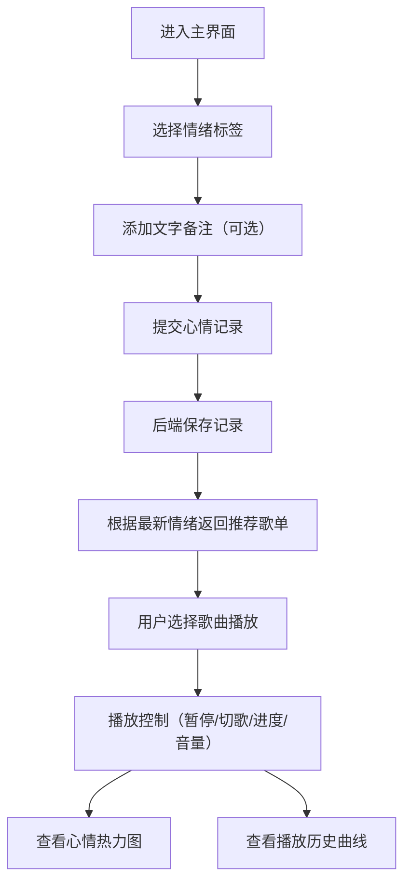

## 1. 产品概述

基于情绪标签的个性化音乐播放器与心情记录器，让用户通过记录日常情绪获取智能音乐推荐，实现情绪追踪与音乐疗愈。
- 目标用户：关注心理健康、喜欢音乐疗愈的日常用户
- 产品价值：将情绪记录与个性化音乐推荐结合，帮助用户觉察情绪状态并通过音乐调节心情

## 2. 核心功能

### 2.1 用户角色
| 角色 | 注册方式 | 核心权限 |
|------|---------|---------|
| 普通用户 | 无需注册，本地使用 | 记录心情、播放音乐、查看统计数据 |

### 2.2 功能模块
1. **主界面**：情绪输入区、音乐播放区、心情时间线、数据可视化区
2. **情绪记录模块**：8种情绪标签选择、文字备注、记录时间线
3. **音乐播放模块**：智能推荐歌单、播放控制、进度管理、音量调节、歌词同步
4. **数据可视化模块**：一周心情热力图、播放历史折线图

### 2.3 页面详情
| 页面名称 | 模块名称 | 功能描述 |
|---------|---------|---------|
| 主界面 | 情绪输入区 | 展示8种情绪标签按钮（快乐、平静、悲伤、愤怒、焦虑、惊喜、无聊、疲惫），每个标签带颜色和图标，支持文字备注 |
| 主界面 | 心情时间线 | 按日期分组展示心情记录，每条记录可删除 |
| 主界面 | 音乐播放器 | 根据最新情绪推荐歌单（≥20首），支持播放/暂停、上一首/下一首、进度条、音量调节、封面旋转动画、歌词同步滚动 |
| 主界面 | 一周心情热力图 | 7天×24小时网格，按心情标签着色，点击查看当日详情 |
| 主界面 | 播放历史曲线 | 最近7天每日播放次数折线图 |

## 3. 核心流程

用户进入主界面 → 选择当前情绪标签（可添加文字备注） → 系统记录心情并根据最新情绪推荐歌单 → 用户选择歌曲播放 → 查看心情热力图和播放统计

## 4. 用户界面设计

### 4.1 设计风格
- **主色调**：深蓝到紫罗兰径向渐变背景
- **卡片风格**：半透明毛玻璃效果（backdrop-filter: blur(12px)）
- **情绪标签配色**：快乐-金黄、悲伤-深蓝、平静-浅蓝、愤怒-赤红、焦虑-橙黄、惊喜-粉紫、无聊-灰绿、疲惫-深紫
- **按钮风格**：圆角胶囊形，悬停放大1.1倍并加微光闪烁动画
- **字体**：优雅无衬线字体，标题大号加粗，正文清晰易读
- **图标风格**：使用react-icons，与情绪标签一一对应
- **动画**：所有过渡0.3秒，封面3秒一圈旋转（ease-in-out），歌词高亮滚动

### 4.2 页面设计概述
| 页面名称 | 模块名称 | UI元素 |
|---------|---------|-------|
| 主界面 | 情绪输入区 | 8个彩色胶囊按钮（图标+文字）、备注输入框、提交按钮、悬停放大+微光动画 |
| 主界面 | 心情时间线 | 日期分组标题、记录卡片（情绪图标+标签+备注+时间）、删除按钮、毛玻璃卡片 |
| 主界面 | 音乐播放器 | 旋转封面（光晕效果）、歌名/歌手、播放控制按钮组、进度条、音量滑块、歌词滚动区 |
| 主界面 | 心情热力图 | 7×24彩色网格、悬停提示、点击弹出当日记录列表 |
| 主界面 | 播放历史图 | Recharts折线图、横轴日期、纵轴播放次数 |

### 4.3 响应式设计
- 桌面端：左右布局，左侧情绪输入+时间线，右侧播放器+数据可视化
- 平板端（≤768px）：上下布局，顺序为情绪输入→播放器→时间线→数据可视化
- 触控优化：按钮尺寸适合手指点击，交互区域不小于44px

## 4.4 性能要求
- 热力图渲染≤200ms
- 歌曲切换延迟<300ms
- 播放进度实时刷新不卡顿
