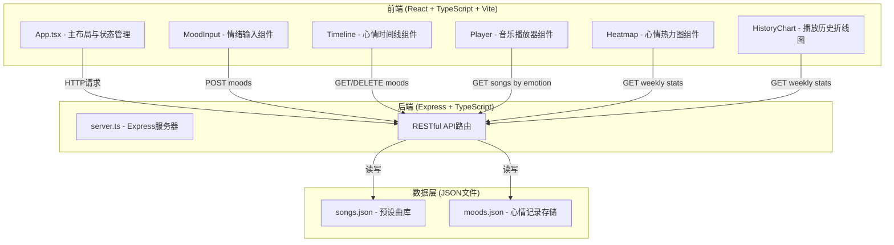
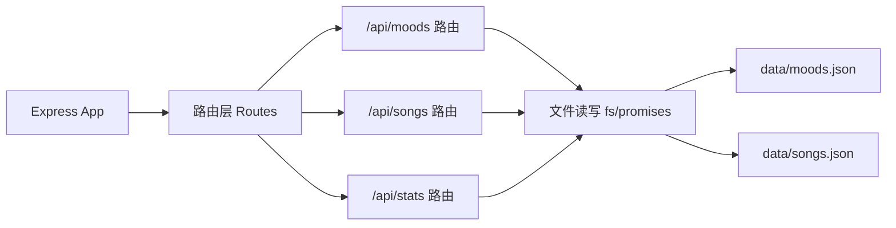
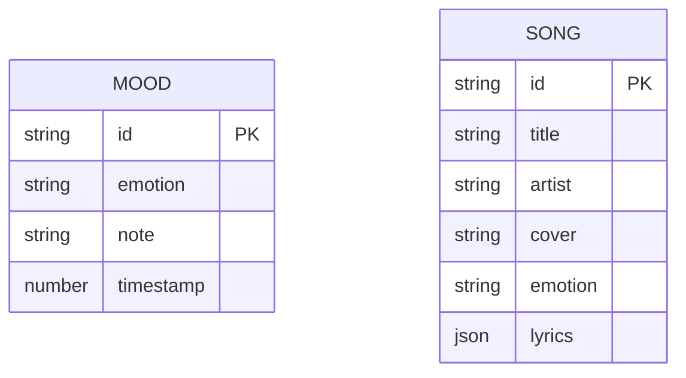

## 1. 架构设计



## 2. 技术栈说明

- **前端框架**：React 18 + TypeScript 5
- **构建工具**：Vite 5 + @vitejs/plugin-react
- **后端框架**：Express 4 + TypeScript + ts-node
- **图表库**：Recharts 2
- **图标库**：react-icons 5
- **数据存储**：本地JSON文件（songs.json, moods.json）
- **并发启动**：concurrently（同时启动前后端）
- **唯一ID**：uuid

## 3. 目录结构

```
auto33/
├── package.json
├── vite.config.ts
├── tsconfig.json
├── index.html
├── server/
│   ├── server.ts
│   └── data/
│       ├── songs.json
│       └── moods.json
└── src/
    ├── App.tsx
    ├── styles.css
    └── components/
        ├── MoodInput.tsx
        ├── Timeline.tsx
        ├── Player.tsx
        ├── Heatmap.tsx
        └── HistoryChart.tsx
```

## 4. API 接口定义

### 4.1 类型定义

```typescript
interface Mood {
  id: string;
  emotion: 'happy' | 'calm' | 'sad' | 'angry' | 'anxious' | 'surprised' | 'bored' | 'tired';
  note: string;
  timestamp: number;
}

interface LyricLine {
  time: number;
  text: string;
}

interface Song {
  id: string;
  title: string;
  artist: string;
  cover: string;
  emotion: string;
  lyrics: LyricLine[];
  audioUrl?: string;
}

interface WeeklyStats {
  heatmap: { date: string; hour: number; emotion: string; count: number }[];
  playHistory: { date: string; count: number }[];
}
```

### 4.2 接口列表

| 方法 | 路径 | 请求体 | 响应 | 说明 |
|-----|------|--------|------|-----|
| GET | /api/moods | - | Mood[] | 获取所有心情记录 |
| POST | /api/moods | { emotion, note } | Mood | 添加心情记录 |
| DELETE | /api/moods/:id | - | { success: boolean } | 删除指定心情记录 |
| GET | /api/songs/:emotion | - | Song[] | 根据情绪返回推荐歌曲列表（≥20首） |
| GET | /api/stats/weekly | - | WeeklyStats | 返回一周热力图数据和播放统计 |

## 5. 后端架构



## 6. 数据模型

### 6.1 ER图



### 6.2 初始数据

- **songs.json**：8种情绪各≥20首歌曲，共≥160首，每首包含id、title、artist、cover、emotion、lyrics数组
- **moods.json**：初始空数组 `[]`
