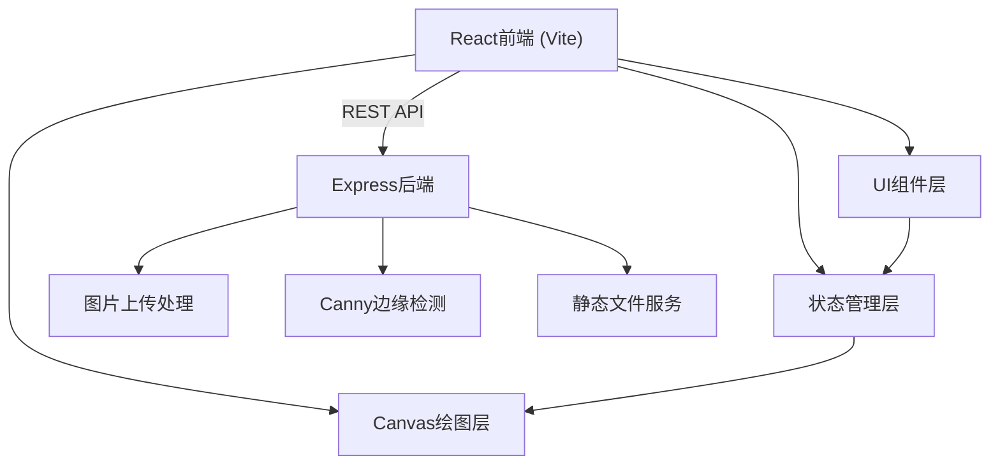
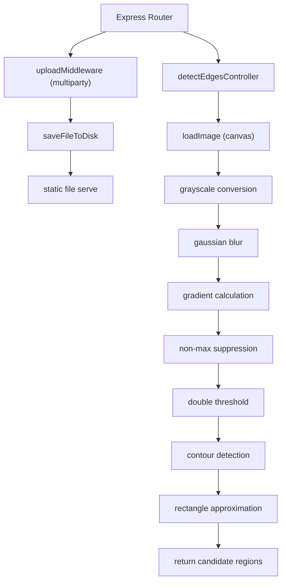
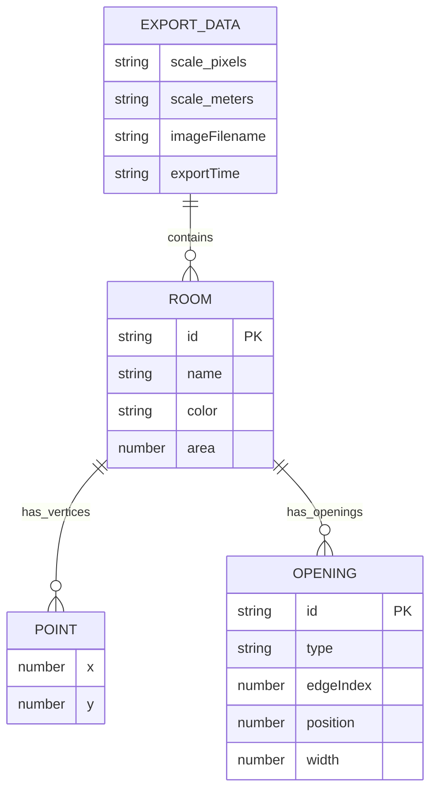

## 1. 架构设计



## 2. 技术描述
- 前端：React@18 + TypeScript + Vite
- 后端：Express@4 + TypeScript + multiparty文件上传 + canvas图片处理
- 通信：RESTful API
- 状态管理：React useState/useReducer
- 构建工具：Vite + concurrently（前后端同时启动）

## 3. 路由定义

| 路由 | 用途 |
|-------|---------|
| POST /api/upload | 上传平面图图片 |
| POST /api/detect-edges | 对上传图片执行Canny边缘检测，返回候选矩形区域 |
| GET /uploads/:filename | 静态文件访问上传的图片 |

## 4. API 定义

```typescript
// 顶点坐标
interface Point {
  x: number;
  y: number;
}

// 门窗类型
type OpeningType = 'single_door' | 'double_door' | 'sliding_window' | 'casement_window';

// 门窗数据
interface Opening {
  id: string;
  type: OpeningType;
  edgeIndex: number;
  position: number;
  width: number;
}

// 房间数据
interface Room {
  id: string;
  name: string;
  color: string;
  points: Point[];
  area: number;
  openings: Opening[];
}

// 比例尺
interface Scale {
  pixels: number;
  meters: number;
}

// 导出数据格式
interface ExportData {
  scale: Scale;
  rooms: Room[];
  imageFilename: string;
  exportTime: string;
}

// 候选检测区域
interface DetectedRegion {
  points: Point[];
  confidence: number;
}

// 请求响应
interface DetectEdgesResponse {
  success: boolean;
  regions: DetectedRegion[];
}

interface UploadResponse {
  success: boolean;
  filename: string;
  url: string;
  width: number;
  height: number;
}
```

## 5. 服务端架构



## 6. 数据模型

### 6.1 数据结构定义



### 6.2 文件结构
- `server.ts` - Express后端入口
- `src/App.tsx` - 根组件布局
- `src/FloorPlanCanvas.tsx` - Canvas绘图主组件
- `src/Sidebar.tsx` - 工具栏+属性面板
- `src/utils.ts` - 工具函数（Canny边缘检测、坐标换算、颜色分配、JSON导出）
