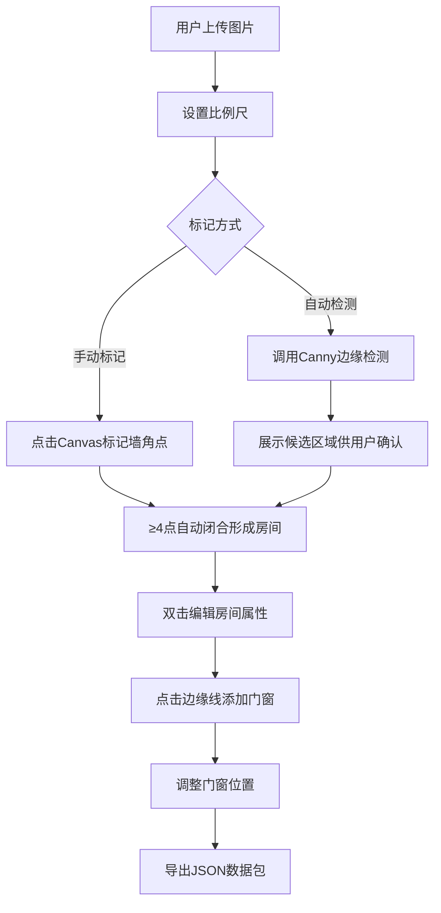

## 1. 产品概述

建筑平面图数字化工具，将纸质草图或照片快速转化为可编辑的数字房间布局。
- 解决家装设计师与房主初期沟通时，纸质草图无法快速数字化、可测量、可编辑的痛点
- 面向家装设计师、房产中介、房主用户，提供高效的平面图标记、测量、导出一体化方案

## 2. 核心功能

### 2.1 用户角色

| 角色 | 核心权限 |
|------|----------|
| 普通用户 | 上传图片、标记房间、添加门窗、设置比例尺、导出数据 |

### 2.2 功能模块
1. **主画布区域**：Canvas图片显示、房间多边形标记、门窗绘制、缩放平移
2. **左侧工具栏**：图片上传、比例尺设置、自动检测、数据导出
3. **右侧属性面板**：房间属性编辑（名称、颜色、面积）、门窗属性编辑
4. **后端服务**：图片上传处理、Canny边缘检测算法实现

### 2.3 页面详情

| 页面名称 | 模块名称 | 功能描述 |
|-----------|-------------|---------------------|
| 主页面 | 工具栏 | 上传图片(JPG/PNG, ≤10MB)、设置比例尺(像素/米换算)、自动检测边缘、导出JSON |
| 主页面 | Canvas绘图区 | 显示原图、鼠标标记墙角点(≥4点闭合)、半透明填充、十字准星、距离标注、填充动画 |
| 主页面 | 属性编辑面板 | 双击房间弹出面板，编辑房间名称、选择颜色、调整面积；门窗类型选择与位置拖动 |
| 主页面 | 门窗管理 | 点击边缘线添加门/窗，门用弧线、窗用双竖线，沿边缘线滑动调整位置 |

## 3. 核心流程

用户上传平面图 → 设置比例尺 → 手动标记房间顶点（或使用自动检测） → 标记形成闭合多边形 → 编辑房间属性 → 添加门窗 → 导出JSON数据

## 4. 用户界面设计

### 4.1 设计风格
- 主色调：#F5F5F5 浅色背景，#4A90D9 蓝色点缀
- 按钮：圆角设计 + 悬停阴影效果
- 字体：现代无衬线字体，标题加粗
- 布局：三栏式（左工具栏20% + 中Canvas70% + 右属性面板10%可展开）
- 图标：简洁线性图标风格

### 4.2 页面设计概览

| 页面名称 | 模块名称 | UI元素 |
|-----------|-------------|-------------|
| 主页面 | 工具栏 | 垂直排列按钮组、上传区域、比例尺输入框、导出按钮 |
| 主页面 | Canvas区 | 深色边框画布、十字准星光标、顶点圆点、半透明填充色块、房间名称标签 |
| 主页面 | 属性面板 | 收起/展开动画、淡入效果、表单输入、颜色选择器、门窗列表 |

### 4.3 响应式
- 桌面端优先，Canvas占70%宽度
- 缩放平移支持鼠标滚轮和拖拽
- 缩放时房间标签文字大小保持不变
- 标记和拖动操作响应延迟≤100ms，渲染帧率≥30FPS
