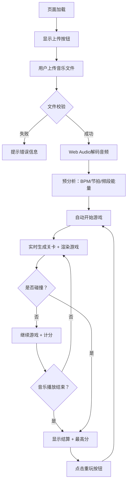

## 1. 产品概述

基于音高识别的2D音乐节奏跑酷游戏，玩家控制角色跟随音乐节拍跳跃躲避障碍物。游戏通过Web Audio API实时分析用户上传的音乐文件，根据频率分布动态生成关卡布局，提供沉浸式的音乐互动体验。

- 目标用户：音乐游戏爱好者、休闲玩家
- 核心价值：将音乐可视化与跑酷玩法结合，每首歌曲生成独特的游戏关卡

## 2. 核心功能

### 2.1 用户角色
| 角色 | 注册方式 | 核心权限 |
|------|----------|----------|
| 玩家 | 无需注册 | 上传音乐、进行游戏、查看本地最高分 |

### 2.2 功能模块
1. **文件上传模块**：支持MP3/WAV上传（≤10MB），文件校验与状态反馈
2. **音频分析引擎**：实时频率分析、节拍检测、BPM估算、频段能量计算
3. **关卡生成器**：根据音频数据动态生成平台、障碍物和加速段
4. **角色控制系统**：自动奔跑、跳跃（音高关联高度）、二段跳、碰撞检测
5. **游戏渲染系统**：赛博朋克风格Canvas渲染、粒子特效、霓虹发光效果
6. **得分与存档系统**：实时计分、音符收集、localStorage最高分持久化

### 2.3 页面详情
| 页面名称 | 模块名称 | 功能描述 |
|----------|----------|----------|
| 游戏主界面 | 文件上传区 | 拖拽/点击上传按钮，显示文件名与大小，校验格式和大小 |
| 游戏主界面 | Canvas游戏区 | 全屏自适应Canvas，渲染游戏场景、角色、障碍物、UI |
| 游戏主界面 | 游戏状态UI | 左上角得分显示、游戏结束覆盖层、重玩按钮 |
| 游戏主界面 | 背景系统 | 深紫-暗蓝渐变背景、动态流动网格线（速度随BPM同步） |

## 3. 核心流程

用户打开页面 → 上传MP3/WAV音乐文件 → 系统解码并预分析音频 → 自动开始游戏 → 角色随BPM自动奔跑 → 玩家按空格/点击跳跃躲避障碍 → 碰撞障碍物游戏结束 → 显示最终分数和最高分 → 可选择重玩

## 4. 用户界面设计

### 4.1 设计风格
- **主色调**：深紫 `#1a0a2e` → 暗蓝 `#0d1b3e` 渐变背景
- **强调色**：霓虹蓝 `#00f0ff`（角色/UI）、霓虹红 `#ff2d5f`（尖刺障碍）、霓虹橙 `#ff8c42`（移动挡板）、霓虹粉 `#ff6ec7`（地洞边缘）、霓虹金 `#ffd700`（音符收集物）
- **字体**：monospace等宽字体，数字和英文展示
- **视觉风格**：赛博朋克，发光描边、拖尾效果、动态网格、粒子特效
- **按钮风格**：圆角8px，霓虹蓝色发光边框，hover时亮度增强

### 4.2 页面设计概述
| 页面名称 | 模块名称 | UI元素 |
|----------|----------|--------|
| 游戏主界面 | 背景层 | 径向渐变（深紫→暗蓝），半透明流动网格线（透明度0.3），网格滚动速度与BPM同步 |
| 游戏主界面 | 角色 | 霓虹蓝色发光小人，身体+头部几何图形，30px渐隐拖尾，落地时0.1秒尘土粒子 |
| 游戏主界面 | 障碍物 | 尖刺：红色三角+底部闪烁警告；移动挡板：橙色矩形左右移动；地洞：80px宽缺口+边缘塌陷动画 |
| 游戏主界面 | 收集物 | 金色音符图标，轻微上下浮动动画 |
| 游戏主界面 | 得分UI | 左上角24px monospace白色发光文字，显示当前分数 |
| 游戏主界面 | 结束覆盖层 | 半透明黑色遮罩（0.5秒淡入），显示最终分数、最高分、重玩按钮 |
| 游戏主界面 | 上传UI | 居中显示上传按钮，霓虹蓝发光，支持拖拽 |

### 4.3 响应式
- 桌面优先设计，Canvas自动缩放填充视口
- 最小宽度320px，最大宽度1920px
- 触摸设备支持点击跳跃，鼠标/键盘支持空格键跳跃

## 5. 性能指标

| 指标 | 目标值 |
|------|--------|
| 帧率 | 稳定60FPS |
| 音频分析+关卡生成耗时 | ≤500ms |
| 碰撞检测单帧耗时 | ≤2ms |
| 同时存在粒子数 | ≤100个 |
| 文件大小限制 | ≤10MB |
