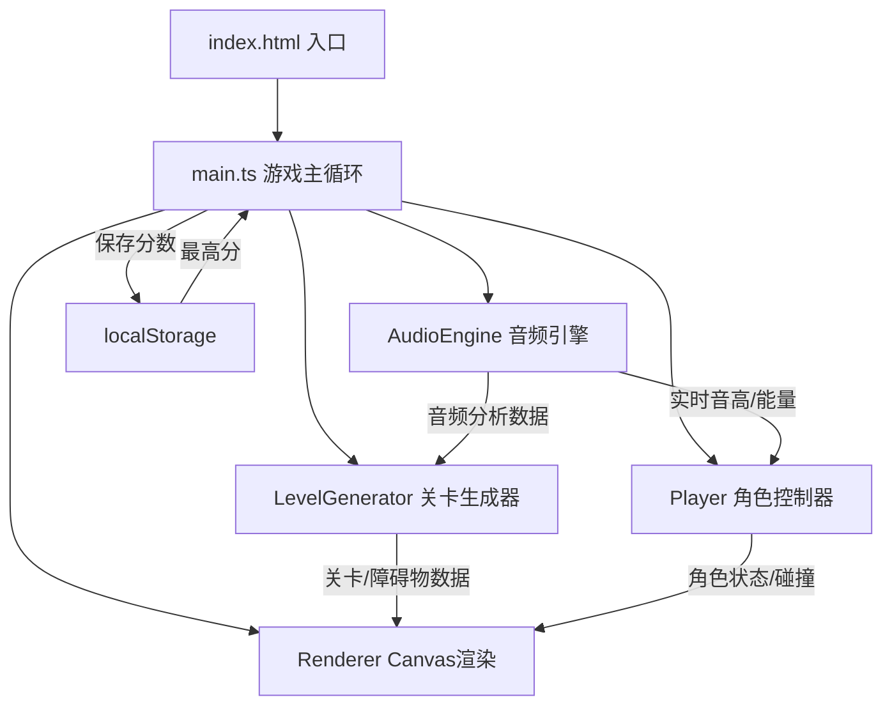
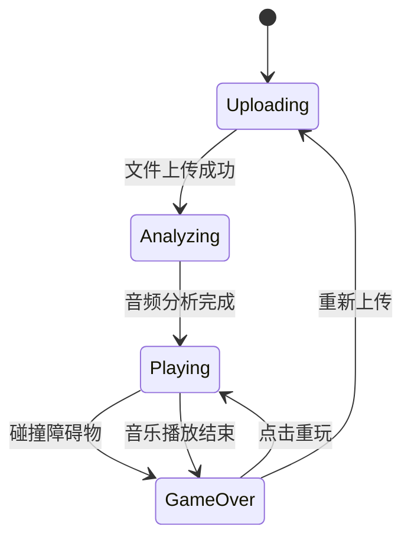

## 1. 架构设计



## 2. 技术说明

- **前端框架**：纯TypeScript + HTML5 Canvas（无React/Vue，按用户指定要求）
- **构建工具**：Vite 5.x
- **音频处理**：Web Audio API（AudioContext、AnalyserNode、OfflineAudioContext）
- **状态管理**：模块内局部状态，无需额外状态管理库
- **数据持久化**：localStorage（最高分存储）

## 3. 文件结构

| 文件路径 | 职责 |
|----------|------|
| `package.json` | 依赖配置（typescript、vite），启动脚本 |
| `index.html` | 入口页面，Canvas容器，上传UI |
| `vite.config.js` | Vite构建配置 |
| `tsconfig.json` | TypeScript严格模式配置，包含DOM类型 |
| `src/main.ts` | 游戏主循环、场景初始化、音频上下文管理、UI交互、状态机 |
| `src/audioEngine.ts` | 音频解码、BPM检测、频率分析、实时音高/能量输出 |
| `src/levelGenerator.ts` | 平台序列生成、障碍物布局、移动速度计算、音符收集物生成 |
| `src/player.ts` | 角色跳跃物理、二段跳、碰撞检测（AABB）、动画状态、拖尾 |

## 4. 核心数据结构

### 4.1 音频分析数据
```typescript
interface AudioAnalysisData {
  bpm: number;               // 估算BPM
  beatTimes: number[];       // 节拍点时间戳（秒，精度0.1s）
  energyHistory: number[];   // 每秒能量值
  averageEnergy: number;     // 平均能量
  bassEnergy: number[];      // 低音区能量 (20-250Hz)
  midEnergy: number[];       // 中音区能量 (250-2000Hz)
  highEnergy: number[];      // 高音区能量 (2000-20000Hz)
}

interface RealtimeAudioData {
  currentPitch: number;      // 当前音高频率 (Hz)
  currentEnergy: number;     // 当前能量值
  bassLevel: number;         // 0-1
  midLevel: number;          // 0-1
  highLevel: number;         // 0-1
  isBeat: boolean;           // 当前帧是否为节拍点
}
```

### 4.2 游戏对象
```typescript
interface Platform {
  x: number;
  y: number;
  width: number;
  height: number;
  type: 'ground' | 'jump';
}

interface Obstacle {
  x: number;
  y: number;
  width: number;
  height: number;
  type: 'spike' | 'mover' | 'pit';
  baseX?: number;            // 移动挡板基准位置
  movePhase?: number;        // 移动相位
  passed?: boolean;          // 是否已通过（计分用）
}

interface Note {
  x: number;
  y: number;
  collected: boolean;
  floatPhase: number;
}

interface Particle {
  x: number;
  y: number;
  vx: number;
  vy: number;
  life: number;
  maxLife: number;
  color: string;
  size: number;
}

interface PlayerState {
  x: number;
  y: number;
  vy: number;
  width: number;
  height: number;
  isGrounded: boolean;
  jumpCount: number;         // 0=未跳, 1=一段, 2=二段
  trail: { x: number; y: number; alpha: number }[];
  animationFrame: number;
}
```

## 5. 游戏状态机



## 6. 关键算法

### 6.1 BPM检测（简化版）
1. 对音频进行分帧（每帧1024样本，约23ms）
2. 计算每帧能量，得到能量包络
3. 对能量包络进行自相关分析，寻找周期性峰值
4. 峰值间隔即为BPM周期，转换为BPM值

### 6.2 频率分带能量
使用AnalyserNode.getByteFrequencyData()获取频域数据，按以下索引范围计算各频段平均能量：
- 低音（20-250Hz）：FFT bin索引 0-5（假设sampleRate=44100, fftSize=1024）
- 中音（250-2000Hz）：FFT bin索引 6-46
- 高音（2000-20000Hz）：FFT bin索引 47-512

### 6.3 碰撞检测
使用AABB（轴对齐包围盒）检测：
```typescript
function aabb(a, b) {
  return a.x < b.x + b.width && a.x + a.width > b.x &&
         a.y < b.y + b.height && a.y + a.height > b.y;
}
```
- 角色 vs 尖刺/移动挡板 → 死亡
- 角色 vs 地洞（y轴在地面以下且x在洞范围内）→ 死亡
- 角色 vs 音符 → 收集得分

### 6.4 关卡生成策略
- 根据音乐时间轴，每0.5秒生成一个关卡块
- 低音能量高 → 扩展地面平台
- 中音能量高 → 生成跳台（空中平台）
- 高音能量高 → 生成障碍物（按能量比例选择尖刺/移动挡板/地洞）
- 能量 > 平均能量 × 1.5 → 加速段（速度×1.5）或密集障碍物群

## 7. 性能优化

1. **对象池**：粒子和临时游戏对象使用对象池复用，避免频繁GC
2. **增量生成**：关卡按需生成，仅保留玩家前后3个屏幕范围内的数据
3. **Canvas优化**：使用分层Canvas（背景层+游戏层+UI层），背景网格离屏缓存
4. **碰撞检测优化**：使用空间分区（网格划分），仅检测邻近对象
5. **节流**：音频分析每帧执行一次，UI更新与requestAnimationFrame同步
