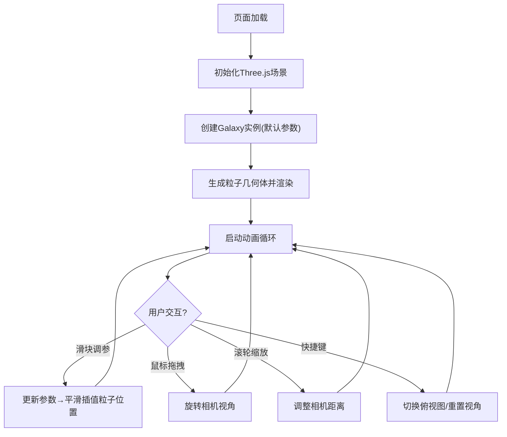

## 1. 产品概述

3D交互式粒子星系生成器是一个基于Web的实时3D可视化工具，通过Three.js渲染数千个粒子构成动态星系，支持用户调节参数实时生成不同形态的螺旋星系或椭圆星系。面向天文爱好者科普展示或作为网页动态背景元素使用。

- 主要用途：天文科普可视化、动态背景生成、交互式3D粒子艺术
- 目标用户：天文爱好者、前端开发者、设计师、教育工作者
- 产品价值：提供沉浸式3D星系交互体验，参数化生成多样化星系形态

## 2. 核心功能

### 2.1 功能模块

1. **3D星系渲染模块**：粒子生成、颜色渐变、空间分布、自转动画
2. **参数控制面板模块**：五大核心参数滑块实时调节
3. **视角交互模块**：鼠标拖拽旋转、滚轮缩放、快捷键视角切换
4. **UI视觉模块**：深空背景、静态星星、毛玻璃控制面板、响应式布局

### 2.2 功能详情

| 模块名称 | 功能描述 |
|-----------|-------------|
| 粒子星系渲染 | 生成≥2000个粒子，基于螺旋星系数学公式分布，中心暖黄到边缘蓝紫色渐变，绕Y轴0.2rad/s自转 |
| 参数控制 | 螺旋臂数(2-6)、旋臂紧密度(0.5-5.0)、粒子弥散度(0.0-1.0)、星系厚度(0.0-2.0)、自转速度(0.0-1.0)，参数平滑过渡0.3秒 |
| 视角控制 | 鼠标拖拽旋转(Y轴360°/X轴±90°)、滚轮缩放(5-80单位)、空格键俯视图、R键重置视角 |
| UI视觉 | 深空黑→暗蓝渐变背景、300个静态星星、毛玻璃参数面板(半透明+蓝色辉光)、自定义渐变滑块、0.2秒淡入淡出动画、移动端底部抽屉 |
| 性能优化 | 稳定60FPS，BufferGeometry高效渲染，粒子LOD策略 |

## 3. 核心流程

用户打开页面 → 初始化3D场景与默认星系参数 → 渲染动态旋转星系 → 用户通过滑块/鼠标/键盘交互 → 实时更新粒子分布与视角 → 持续渲染动画循环

## 4. 用户界面设计

### 4.1 设计风格

- **主色调**：深空黑(#000008) → 暗蓝(#0a0a2e)径向渐变背景
- **强调色**：暖黄(#ffd66b)中心色 → 蓝紫(#8b5cf6)边缘色，形成星系色环渐变
- **UI面板色**：半透明白色(rgba(255,255,255,0.08))+ backdrop-filter: blur(12px) 毛玻璃效果，边框1px rgba(100,180,255,0.2)蓝色辉光
- **滑块样式**：圆形手柄(6px白色内阴影+边框)，渐变轨道(左蓝右紫)
- **字体**：无衬线字体，标题14px semibold，参数值12px monospace
- **动画**：所有UI交互0.2秒opacity淡入淡出，滑块hover轻微放大

### 4.2 页面设计概览

| 区域 | 元素 | 设计说明 |
|-----------|-------------|-------------|
| 全屏Canvas | 3D星系渲染 | Three.js WebGLRenderer，透明背景叠在CSS渐变上 |
| 背景层 | 静态星星 | 300个随机分布的1-2px白色小点，低透明度不闪烁 |
| 右下角悬浮面板 | 参数控制区 | 毛玻璃卡片，圆角12px，内边距16px，最大宽度280px |
| 移动端 | 底部抽屉 | 屏幕底部横条，点击展开/折叠参数面板 |

### 4.3 响应式设计

- **桌面端**：右下角悬浮固定面板，宽280px
- **平板端**：面板宽度自适应，保持右下角位置
- **移动端**：面板转为底部抽屉，默认折叠显示标题条，点击展开全屏高度60%

### 4.4 3D场景设计

- **环境**：纯深空黑背景，无HDRI，自发光粒子
- **光照**：无需外部光源，粒子使用Additive Blending自发光渲染
- **相机**：PerspectiveCamera(60°, aspect, 0.1, 1000)，初始位置(0, 15, 40)
- **粒子材质**：PointsMaterial + AdditiveBlending + vertexColors，深度关闭写入
- **性能策略**：单BufferGeometry统一管理所有粒子，矩阵变换实现整体旋转
