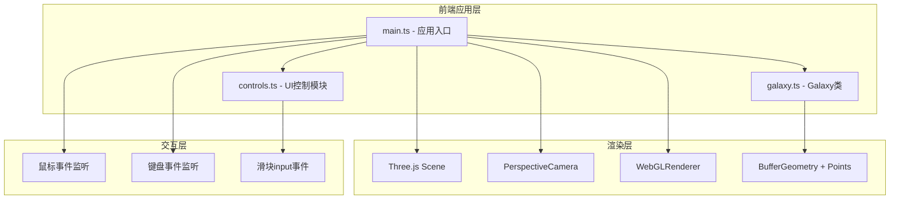

## 1. 架构设计



## 2. 技术选型说明

- **构建工具**：Vite 5.x - 原生ES模块，快速HMR，零配置TS支持
- **语言**：TypeScript 5.x - 严格模式(strict:true)，完整类型推导
- **3D引擎**：Three.js r160+ - 成熟WebGL封装，BufferGeometry高性能粒子渲染
- **类型声明**：@types/three - 完整的Three.js TS类型定义
- **样式方案**：原生CSS + CSS Variables - 无需额外CSS框架，减小包体积

## 3. 项目文件结构

```
auto36/
├── package.json           # 项目依赖与脚本
├── index.html             # 入口HTML(含#app容器与全局样式)
├── vite.config.js         # Vite构建配置
├── tsconfig.json          # TS严格模式配置
└── src/
    ├── main.ts            # Scene/Camera/Renderer初始化、动画循环、事件装配
    ├── galaxy.ts          # Galaxy类：粒子生成/更新/颜色/分布算法
    └── controls.ts        # UI面板创建、滑块生成、交互事件绑定
```

## 4. 核心数据定义

### 4.1 星系参数接口
```typescript
interface GalaxyParams {
  armCount: number;        // 螺旋臂数 2-6
  armTightness: number;    // 旋臂紧密度 0.5-5.0
  scatter: number;         // 粒子弥散度 0.0-1.0
  thickness: number;       // 星系厚度 0.0-2.0
  rotationSpeed: number;   // 自转速度系数 0.0-1.0
}
```

### 4.2 默认参数值
```typescript
const DEFAULT_PARAMS: GalaxyParams = {
  armCount: 4,
  armTightness: 1.5,
  scatter: 0.3,
  thickness: 0.6,
  rotationSpeed: 1.0,
};
```

## 5. 关键算法说明

### 5.1 螺旋星系粒子分布
- 每个粒子基于极坐标(r, θ)生成：θ = (i / total) × 2π × armCount + r × armTightness
- 笛卡尔坐标：x = r × cos(θ) + scatter×rand, z = r × sin(θ) + scatter×rand
- Y轴分布：y = (rand-0.5) × thickness × (1-r/R) 中心厚边缘薄

### 5.2 颜色渐变算法
- 按粒子到中心的半径归一化 t ∈ [0,1]
- 从暖色HSL(45°,100%,70%)到冷色HSL(260°,80%,60%)线性插值
- 使用HSL色彩空间插值比RGB更平滑自然

### 5.3 参数平滑过渡
- 保存上一帧粒子位置数组与目标位置数组
- 每帧按lerp比例 factor = 1 - exp(-dt / 0.3) 插值
- 避免参数突变造成的视觉跳变

### 5.4 相机控制算法
- 球坐标相机：camera.position = (sin(azimuth)×cos(polar)×distance, sin(polar)×distance, cos(azimuth)×cos(polar)×distance)
- azimuth范围[0, 2π]，polar范围[-π/2, π/2]，distance范围[5, 80]
- 鼠标水平移动→azimuth，垂直移动→polar，滚轮→distance
