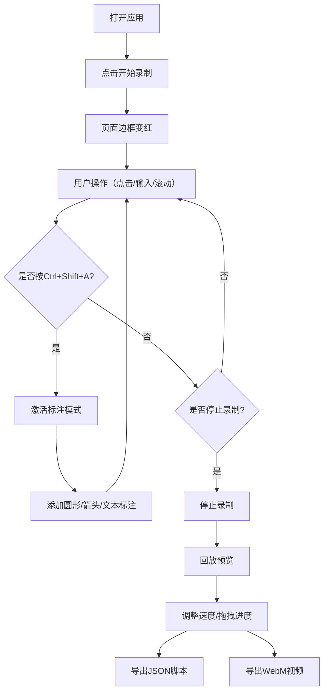

## 1. 产品概述

交互式网页操作录制与回放工具，专为设计师和产品经理在评审交互方案时设计，无需手动录制演示视频，直接在网页上录制所有操作、标注和声音，生成可播放的演示视频或JSON动作脚本。

- 主要用途：录制网页内的鼠标点击、输入、滚动等操作，叠加实时标注和语音解说，生成演示内容
- 解决的问题：设计师和产品经理在评审交互方案时需要手动录制演示视频的痛点
- 目标用户：设计师、产品经理、前端开发人员
- 市场价值：提高交互方案评审效率，降低沟通成本，使交互演示更加直观和专业

## 2. 核心功能

### 2.1 用户角色

| 角色 | 注册方式 | 核心权限 |
|------|----------|----------|
| 普通用户 | 无需注册，直接使用 | 录制操作、添加标注、回放内容、导出视频和脚本 |

### 2.2 功能模块

1. **录制控制面板**：录制/暂停/停止按钮、录制状态指示、录制计时器
2. **标注工具栏**：圆形标注、箭头标注、文本标注工具、快捷键激活
3. **操作预览区**：实时显示录制画面、回放内容、鼠标轨迹、标注覆盖层
4. **回放控制面板**：播放/暂停、速度调节（1x/1.5x/2x）、进度条拖拽跳转
5. **导出功能**：导出JSON动作脚本、导出WebM视频文件

### 2.3 页面详情

| 页面名称 | 模块名称 | 功能描述 |
|----------|----------|----------|
| 主应用页 | 录制控制面板 | 管理录制状态，显示录制计时，闪烁红点提示录制进行中 |
| 主应用页 | 标注工具栏 | 切换标注模式，选择标注类型（圆形、箭头、文本），调整透明度 |
| 主应用页 | 操作预览区 | 左侧60%宽度区域，显示实时录制画面或回放内容，带圆角和阴影 |
| 主应用页 | 回放控制面板 | 播放/暂停按钮、速度选择下拉框、进度条跳转、鼠标轨迹点显示 |
| 主应用页 | 导出按钮 | 导出JSON动作脚本文件、导出WebM视频文件（1280x720，30fps） |

## 3. 核心流程

用户打开应用 → 点击开始录制（页面边框渐变为红色） → 在目标区域内进行操作（点击、输入、滚动） → 按 Ctrl+Shift+A 激活标注模式 → 在画面上添加圆形/箭头/文本标注 → 点击停止录制 → 使用回放功能预览（可调整播放速度、拖拽进度） → 导出为JSON脚本或WebM视频

## 4. 用户界面设计

### 4.1 设计风格

- 主色调：深色背景 #1e1e2e，面板色 #2a2a3e，高亮色 #7c3aed，分隔线 #4a4a5e
- 按钮风格：圆角矩形按钮，带悬浮提示（tooltip），悬停时有轻微缩放和颜色加深效果
- 字体：使用现代无衬线字体，标题使用中等字重，正文使用常规字重
- 布局风格：左侧操作预览区（60%宽度）+ 右侧控制工具栏（35%宽度），flexbox布局，2px浅色分隔线
- 图标风格：使用 lucide-react 图标库，简洁线性风格

### 4.2 页面设计概览

| 页面名称 | 模块名称 | UI元素 |
|----------|----------|--------|
| 主应用页 | 操作预览区 | 深色圆角卡片，带轻微阴影，10px圆角，canvas覆盖层用于标注绘制 |
| 主应用页 | 控制工具栏 | 固定定位，不随页面滚动，包含录制按钮组、标注工具、速度选择、导出按钮 |
| 主应用页 | 录制状态指示 | 右上角闪烁红点（CSS keyframes动画，每秒闪烁一次） |
| 主应用页 | 进度条 | 回放时显示，下方显示鼠标位置轨迹小圆点（透明度0.6） |
| 主应用页 | 标注效果 | 圆形标注红色半径10px闪烁动画，箭头标注绿色线宽2px箭头8px |

### 4.3 响应式

- 桌面端优先设计（desktop-first）
- 屏幕宽度小于768px时：左右布局变为上下堆叠排列
- 操作预览区和控制工具栏都变为100%宽度
- 触摸设备优化：按钮尺寸增大，确保可点击区域充足

### 4.4 视觉反馈与动画

- 开始录制：整个页面边框渐变为红色（0.3秒过渡动画）
- 停止录制：页面边框恢复原色（0.3秒过渡动画）
- 添加标注：轻微缩放动画（0.95→1.0，0.15秒）
- 按钮悬停：背景色加深，轻微上浮动效
- 点击回放高亮：黄色半透明闪光效果，持续0.2秒
- 录制红点：每秒闪烁一次（CSS @keyframes blink）
