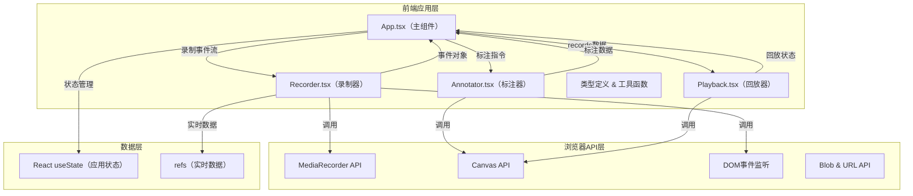

## 1. 架构设计



## 2. 技术描述

- 前端：React@18 + TypeScript@5 + Vite@5
- 初始化工具：vite-init
- 后端：无（纯前端应用）
- 数据库：无（数据导出为文件）
- 核心依赖：
  - react、react-dom：UI框架
  - typescript：类型系统
  - vite：构建工具
  - @vitejs/plugin-react：Vite React插件
  - media-recorder-ponyfill：MediaRecorder兼容填充
  - uuid：生成唯一ID
  - lucide-react：图标库

## 3. 路由定义

| 路由 | 用途 |
|------|------|
| / | 主应用页面（单页应用，无多路由） |

## 4. 数据模型

### 4.1 核心类型定义

```typescript
// 事件基础类型
interface RecordedEvent {
  id: string;
  type: 'click' | 'input' | 'scroll' | 'mousemove';
  timestamp: number; // 相对录制开始的毫秒数
  x: number; // 页面X坐标
  y: number; // 页面Y坐标
}

// 点击事件
interface ClickEvent extends RecordedEvent {
  type: 'click';
  offsetX: number;
  offsetY: number;
  selector: string; // 目标元素CSS选择器
}

// 输入事件
interface InputEvent extends RecordedEvent {
  type: 'input';
  selector: string;
  value: string;
}

// 滚动事件
interface ScrollEvent extends RecordedEvent {
  type: 'scroll';
  scrollTop: number;
  scrollLeft: number;
  target: 'window' | string; // 选择器
}

// 鼠标移动事件
interface MouseMoveEvent extends RecordedEvent {
  type: 'mousemove';
}

// 标注类型
type AnnotationType = 'circle' | 'arrow' | 'text';

interface BaseAnnotation {
  id: string;
  type: AnnotationType;
  timestamp: number;
}

interface CircleAnnotation extends BaseAnnotation {
  type: 'circle';
  x: number;
  y: number;
  radius: number;
  color: string;
}

interface ArrowAnnotation extends BaseAnnotation {
  type: 'arrow';
  startX: number;
  startY: number;
  endX: number;
  endY: number;
  color: string;
  lineWidth: number;
  arrowSize: number;
}

interface TextAnnotation extends BaseAnnotation {
  type: 'text';
  x: number;
  y: number;
  text: string;
  color: string;
  fontSize: number;
}

type Annotation = CircleAnnotation | ArrowAnnotation | TextAnnotation;

// 录制数据
interface RecordingData {
  events: (ClickEvent | InputEvent | ScrollEvent | MouseMoveEvent)[];
  annotations: Annotation[];
  startTime: number;
  endTime: number;
}

// 应用状态
type RecordingStatus = 'idle' | 'recording' | 'paused' | 'stopped';
type PlaybackSpeed = 1 | 1.5 | 2;
type AnnotationMode = 'none' | 'circle' | 'arrow' | 'text';
```

### 4.2 数据流向

1. **录制阶段数据流**：
   - 用户DOM操作 → Recorder事件监听器 → 格式化事件对象（含时间戳）→ App的records状态
   - 用户标注操作 → Annotator组件 → 生成标注对象（含时间戳）→ App的annotations状态
   - MediaRecorder捕获画面 → 视频Blob数据 → App状态存储

2. **回放阶段数据流**：
   - Playback组件从App读取records和annotations → 按时间戳排序
   - 播放计时器 → 根据当前时间戳匹配对应事件 → 模拟DOM操作/渲染标注
   - 进度条更新 → 用户拖拽 → 跳转到对应时间戳

## 5. 文件结构

```
auto38/
├── .trae/documents/
│   ├── prd.md
│   └── technical-architecture.md
├── index.html
├── package.json
├── vite.config.js
├── tsconfig.json
└── src/
    ├── App.tsx          # 主组件，状态管理，布局
    ├── Recorder.tsx     # 录制核心组件
    ├── Annotator.tsx    # 标注组件
    ├── Playback.tsx     # 回放组件
    ├── types.ts         # 类型定义
    └── utils.ts         # 工具函数
```

## 6. 性能优化

- 事件节流：mousemove事件使用requestAnimationFrame节流，避免频繁记录
- 内存管理：录制完成后及时释放MediaRecorder资源和Blob URL
- Canvas优化：使用离屏canvas预渲染标注，回放时只重绘变化区域
- 帧率控制：MediaRecorder固定30fps，避免过高占用
- 分辨率限制：视频录制限制1280x720，超出则等比缩放
