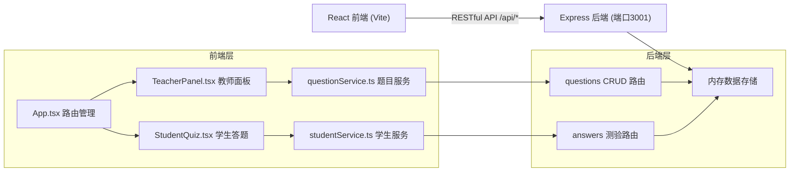
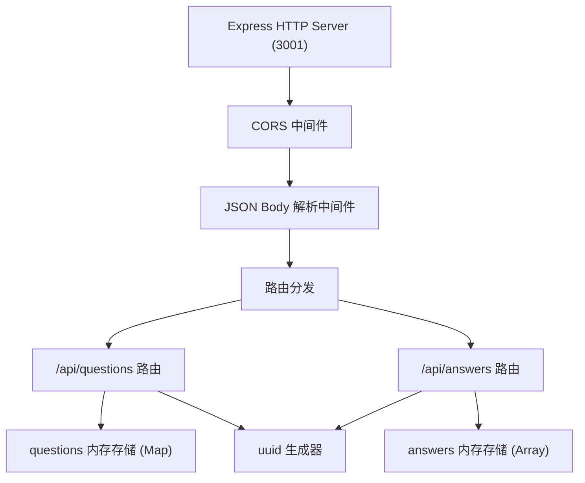
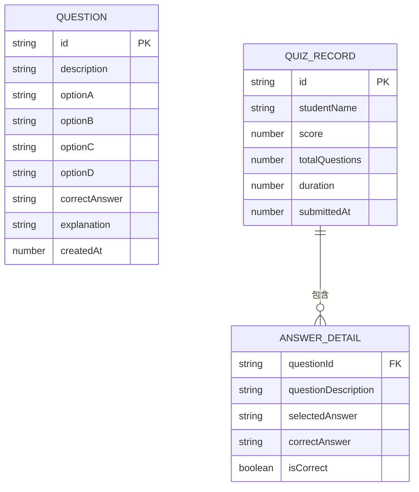

## 1. 架构设计



## 2. 技术栈描述

- **前端**：React 18 + TypeScript + Vite
- **后端**：Express 4 + TypeScript (tsx)
- **数据存储**：内存存储（JavaScript Map/Array，重启后重置）
- **API 通信**：RESTful API，开发环境通过 Vite 代理 /api -> http://localhost:3001
- **UI 库**：Lucide React（图标）、自定义 CSS 动画
- **Markdown 渲染**：react-markdown

## 3. 路由定义

### 3.1 前端路由

| 路由 | 用途 |
|------|------|
| / | 登录首页（角色选择 + 学生登录） |
| /teacher | 教师管理面板 |
| /student | 学生答题界面 |

### 3.2 后端 API 路由

| 方法 | 路由 | 用途 |
|------|------|------|
| GET | /api/questions | 获取所有题目列表 |
| POST | /api/questions | 创建新题目 |
| PUT | /api/questions/:id | 更新题目 |
| DELETE | /api/questions/:id | 删除题目 |
| GET | /api/questions/random?count=5 | 随机抽取指定数量不重复题目 |
| GET | /api/answers | 获取所有答题历史记录 |
| POST | /api/answers | 提交一次答题记录 |
| GET | /api/answers/:studentName | 获取指定学生的答题历史 |

## 4. API 数据定义

### 4.1 TypeScript 类型定义

```typescript
interface Question {
  id: string;
  description: string;
  options: {
    A: string;
    B: string;
    C: string;
    D: string;
  };
  correctAnswer: 'A' | 'B' | 'C' | 'D';
  explanation: string;
  createdAt: number;
}

interface AnswerDetail {
  questionId: string;
  questionDescription: string;
  selectedAnswer: 'A' | 'B' | 'C' | 'D' | null;
  correctAnswer: 'A' | 'B' | 'C' | 'D';
  isCorrect: boolean;
}

interface QuizRecord {
  id: string;
  studentName: string;
  answers: AnswerDetail[];
  score: number;
  totalQuestions: number;
  duration: number;
  submittedAt: number;
}
```

### 4.2 请求响应示例

**POST /api/questions**
```
Request:
{
  "description": "下列哪个是 JavaScript 的数据类型？",
  "options": { "A": "String", "B": "Integer", "C": "Float", "D": "Character" },
  "correctAnswer": "A",
  "explanation": "JavaScript 基本数据类型包括 String、Number、Boolean、Null、Undefined、Symbol、BigInt"
}

Response (201):
{
  "id": "uuid-string",
  "description": "...",
  "options": { ... },
  "correctAnswer": "A",
  "explanation": "...",
  "createdAt": 1234567890
}
```

**GET /api/questions/random?count=5**
```
Response (200):
[
  { "id": "...", "description": "...", "options": {...}, "correctAnswer": "A", "explanation": "..." },
  ...共5道
]
```

**POST /api/answers**
```
Request:
{
  "studentName": "张三",
  "answers": [
    { "questionId": "...", "selectedAnswer": "A", "correctAnswer": "A", "isCorrect": true },
    ...
  ],
  "score": 4,
  "totalQuestions": 5,
  "duration": 95
}

Response (201):
{ "id": "uuid-string", "submittedAt": 1234567890, ... }
```

## 5. 服务端架构图



## 6. 数据模型

### 6.1 数据模型 ER 图



### 6.2 内存存储结构

```typescript
// 内存数据存储结构
interface MemoryStore {
  questions: Map<string, Question>;
  quizRecords: QuizRecord[];
}

// 初始化为空
const store: MemoryStore = {
  questions: new Map(),
  quizRecords: [],
};
```

## 7. 项目文件结构

```
.
├── package.json
├── vite.config.js
├── tsconfig.json
├── index.html
├── server/
│   └── src/
│       └── index.ts          # Express 服务端，端口 3001
└── src/
    ├── main.tsx              # React 入口
    ├── App.tsx               # 主应用 + 路由
    ├── services/
    │   ├── questionService.ts   # 题目 API 封装
    │   └── studentService.ts    # 学生答题 API 封装
    └── components/
        ├── TeacherPanel.tsx     # 教师面板
        └── StudentQuiz.tsx      # 学生答题界面
```

## 8. 文件调用关系与数据流向

```
用户操作
  ↓
TeacherPanel.tsx / StudentQuiz.tsx
  ↓ (调用)
questionService.ts / studentService.ts
  ↓ (fetch)
/api/questions /api/answers
  ↓
Express server/src/index.ts
  ↓ (读写)
内存 Map / Array
```

- [App.tsx](file:///c:/Users/Administrator/Desktop/VersionFast/tasks/auto42/src/App.tsx) 管理路由 `/teacher` 和 `/student`，并渲染对应组件
- [questionService.ts](file:///c:/Users/Administrator/Desktop/VersionFast/tasks/auto42/src/services/questionService.ts) 被 TeacherPanel 调用，封装对 `/api/questions` 的 CRUD 请求
- [studentService.ts](file:///c:/Users/Administrator/Desktop/VersionFast/tasks/auto42/src/services/studentService.ts) 被 StudentQuiz 调用，封装随机抽题、提交答案、查看历史等请求
- [index.ts](file:///c:/Users/Administrator/Desktop/VersionFast/tasks/auto42/server/src/index.ts) Express 后端，独立运行在 3001 端口，与 React 端通过 REST API 通信

## 9. 性能约束实现

| 约束 | 实现方案 |
|------|----------|
| 随机抽题响应 < 200ms | 内存中使用 Fisher-Yates 洗牌算法选取前 N 个，避免数据库 IO |
| 批量提交响应 < 500ms | 内存存储直接写入，单条记录写入 O(1) |
| 前端操作延迟 < 100ms | 使用 React 状态本地更新，避免不必要的 API 等待，动画使用 CSS transition |
