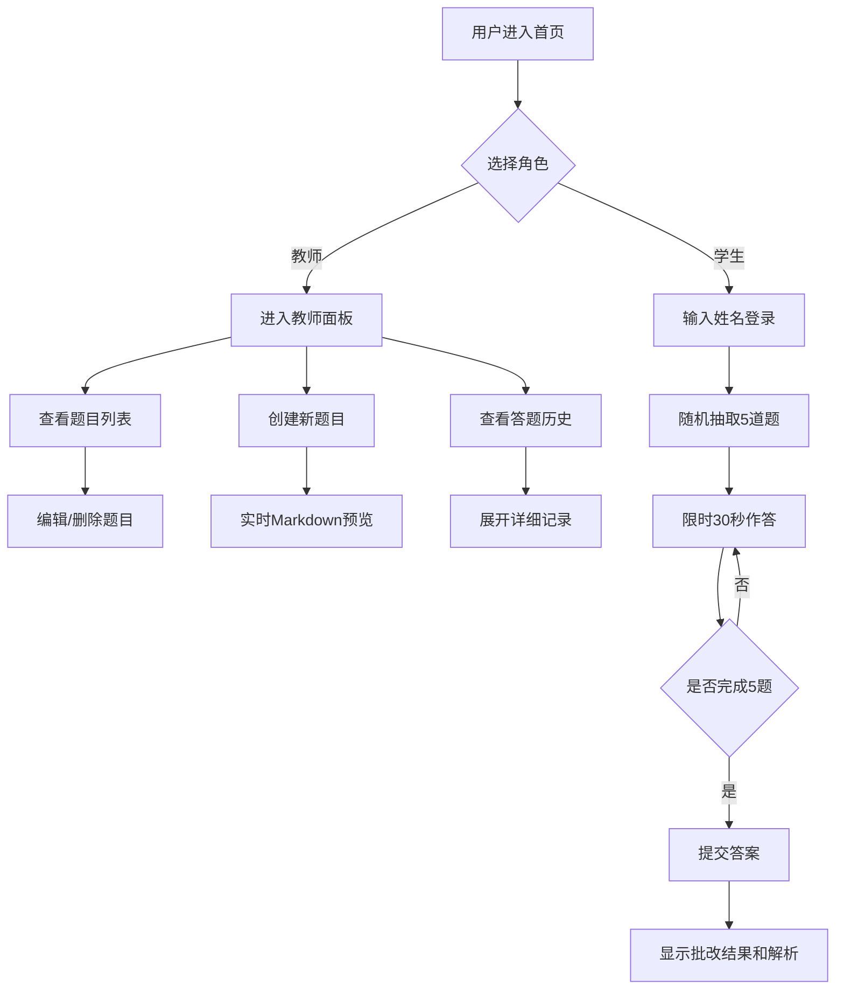

## 1. 产品概述

智能题库管理与在线测验应用，为在线教育场景提供轻量级的题目管理与测验解决方案。
- 解决问题：教师快速创建含图片、公式的选择题题库，学生在线答题并实时获得批改反馈
- 目标用户：教师（题库管理者）、学生（答题者）
- 产品价值：轻量化、可交互、即开即用的在线测验工具，无需复杂部署

## 2. 核心功能

### 2.1 用户角色

| 角色 | 登录方式 | 核心权限 |
|------|----------|----------|
| 教师 | 角色切换 | 创建/编辑/删除题目，查看全体学生答题历史统计 |
| 学生 | 输入姓名登录 | 随机抽取题目作答，查看个人答题结果 |

### 2.2 功能模块

1. **登录首页**：角色切换（教师/学生）、学生姓名输入、登录面板居中展示
2. **教师面板**：题目列表（卡片展示）、题目创建表单（含实时预览）、题目编辑浮层、学生答题历史表格
3. **学生答题**：随机抽题（5道）、倒计时作答、选项点击选择、答题结果统计展示

### 2.3 页面详情

| 页面名称 | 模块名称 | 功能描述 |
|----------|----------|----------|
| 登录首页 | 角色切换栏 | 顶部导航，教师/学生切换按钮 |
| 登录首页 | 登录面板 | 居中模糊背景卡片，学生姓名输入框及登录按钮 |
| 教师面板 | 题目创建表单 | Markdown题目描述输入、四选项输入、正确答案选择、解析输入、实时预览 |
| 教师面板 | 题目卡片列表 | 卡片展示题目前20字、选项缩略、正确答案标记、删除/修改按钮 |
| 教师面板 | 编辑浮层 | 弹出层编辑题目内容，原地替换保存 |
| 教师面板 | 答题历史表格 | 学生姓名、答题时间、得分、用时，点击展开详细记录 |
| 学生答题 | 题目展示区 | 题目渲染（Markdown）、选项按钮、倒计时显示、涟漪动画 |
| 学生答题 | 结果统计页 | 每题对错状态、正确答案、解析展示、总分/用时汇总 |

## 3. 核心流程

### 3.1 教师流程
教师进入首页 → 切换到教师角色 → 查看题目列表 → 创建/编辑/删除题目 → 查看学生答题历史 → 展开单条历史查看详情

### 3.2 学生流程
学生进入首页 → 输入姓名 → 开始答题 → 随机抽取5道题 → 依次作答（每题限时30秒）→ 提交后查看答题结果和解析

## 4. 用户界面设计

### 4.1 设计风格
- **主色调**：深蓝 `#1a2332`（背景）、亮橙 `#f97316`（强调色/按钮）
- **辅助色**：`#2d3b4e`（卡片/预览背景）、绿色（正确）、红色（错误）
- **字体**：无衬线现代字体，清晰易读
- **布局风格**：卡片式布局，顶部导航栏
- **图标风格**：Lucide React 线性图标
- **动效**：卡片悬停上浮（translateY(-4px)，0.2s过渡）、选项点击涟漪扩散、Toast提示淡入淡出

### 4.2 页面设计概览

| 页面名称 | 模块名称 | UI元素 |
|----------|----------|--------|
| 登录首页 | 角色切换栏 | 顶部导航、教师/学生切换按钮、亮橙激活态 |
| 登录首页 | 登录面板 | 模糊背景渐变、居中卡片、圆角输入框、橙色登录按钮 |
| 教师面板 | 题目创建表单 | 左侧输入区域、右侧实时预览（浅色背景圆角容器）、橙色提交按钮 |
| 教师面板 | 题目卡片列表 | 卡片悬停上浮、题目前20字、选项缩略、正确答案高亮、编辑/删除图标按钮 |
| 教师面板 | 编辑浮层 | 半透明遮罩、居中编辑表单、原地替换保存 |
| 教师面板 | 答题历史表格 | 斑马纹表格、点击展开动画、详情缩进展示 |
| 学生答题 | 题目展示区 | Markdown渲染（图片最大宽300px）、选项按钮（涟漪动画）、右上角倒计时（绿到红渐变） |
| 学生答题 | 结果统计页 | 每题对错图标（绿色对勾/红色叉叉）、正确答案高亮、解析展示、底部总分和用时 |

### 4.3 响应式设计
- **大屏（>=1024px）**：题目卡片两列布局
- **平板（768-1023px）**：题目卡片单列布局
- **手机（<768px）**：全宽布局，增加适当内边距，表单单列堆叠

### 4.4 交互反馈
- **加载状态**：带图标的Toast提示
- **成功状态**：绿色对勾Toast提示（1.5s自动消失）
- **错误状态**：红色叉叉Toast提示（1.5s自动消失）
