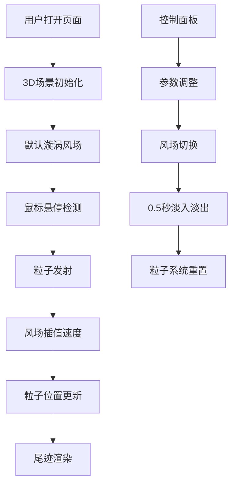

## 1. 产品概述

基于3D交互式风场可视化与粒子路径追踪应用，用于展示风速场数据可视化和粒子运动模拟。

- 主要用途：气象数据展示、游戏特效原型验证、流体力学教学演示
- 目标用户：气象数据分析师、游戏特效设计师、教育工作者
- 产品价值：通过直观的3D粒子可视化，帮助用户理解复杂风场流动规律

## 2. 核心功能

### 2.1 功能模块

1. **3D风场场景**：20x20x10三维速度场网格，支持三种预设风场模式
2. **粒子系统**：粒子发射、生命周期管理、尾迹渲染、速度颜色映射
3. **交互控制面板**：风场模式切换、粒子参数调整
4. **网格辅助线**：三维网格线框可视化

### 2.2 功能详情

| 模块名称 | 功能描述 |
|-----------|----------|
| 风场网格 | 20x20x10网格，每个格点存储三维速度矢量 |
| 风场模式切换 | 顺时针漩涡、随机湍流、水平层流三种模式，切换时0.5秒淡入淡出动画 |
| 粒子发射 | 鼠标悬停位置自动发射粒子，默认30粒子/秒 |
| 粒子运动 | 沿流线路径运动，使用三线性插值获取速度 |
| 粒子尾迹 | 半透明尾迹线，保留最近20个点，线宽随生命值渐变 |
| 粒子颜色 | 蓝色(低速)→青色→黄色→红色(高速)渐变映射 |
| 生命长度滑块 | 2-10秒可调，步长0.5秒 |
| 发射速率滑块 | 10-100粒子/秒，步长5 |
| 速度倍率滑块 | 0.5x-2.0x可调 |
| 网格辅助线 | 半透明蓝色线框，可切换显示隐藏 |
| 响应式布局 | 自适应窗口大小，控制面板固定300px宽右侧 |

## 3. 核心流程

用户进入页面 → 3D场景初始化（默认漩涡风场）→ 鼠标悬停发射粒子 → 查看粒子沿风场运动 → 可调整控制面板参数 → 实时观察效果变化 → 切换风场模式 → 场景重置粒子重新计算

## 4. 用户界面设计

### 4.1 设计风格
- 深色科技风格，半透明控制面板
- 主色调：深蓝(#0a1628)，强调色：青色(#00d4ff)和红色(#ff3b3b)
- 圆角控制面板，现代简洁
- 深色半透明玻璃拟态风格
- 自定义滑块样式，渐变进度条

### 4.2 页面设计概述

| 页面 | 模块名称 | UI元素 |
|-----|----------|--------|
| 主页面 | 3D场景区域 | 全屏Canvas，粒子流动画，鼠标交互 |
| 主页面 | 右侧控制面板 | 下拉菜单(风场模式)、三个滑块(生命/速率/倍率)、网格开关 |

### 4.3 响应式设计
- 桌面优先设计
- 1920x1080和1440x900分辨率自适应
- 控制面板固定300px宽度，始终居右
- 3D场景自适应剩余空间

### 4.4 3D场景设计
- 环境：深色背景，轻微雾效增强深度感
- 光照：环境光 + 方向光，突出粒子立体感
- 相机：PerspectiveCamera，OrbitControls自由视角
- 后期处理：粒子发光效果
- 性能：粒子数量≤2000，目标帧率60FPS，最低≥45FPS
