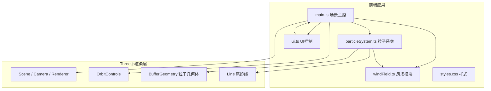
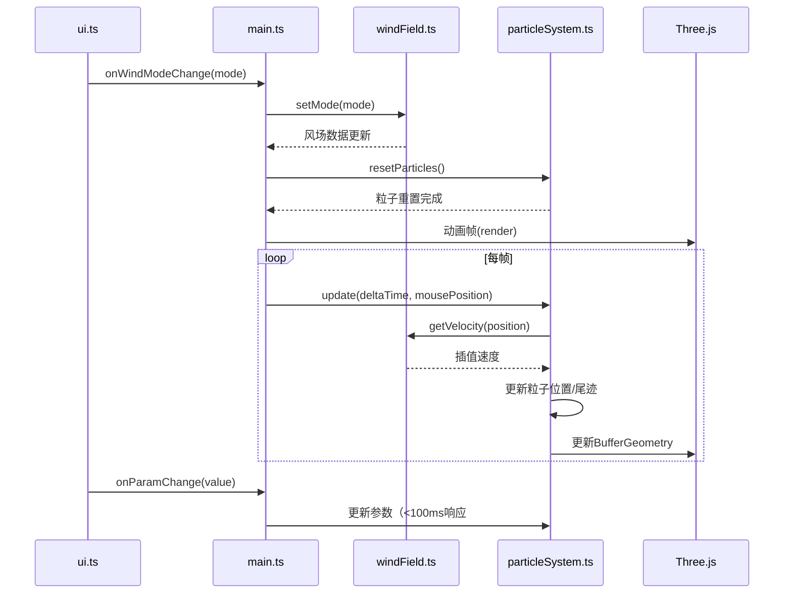

## 1. 架构设计



## 2. 技术描述

- 前端框架：TypeScript + Vite
- 3D渲染：Three.js
- 初始化工具：Vite
- 后端：无（纯前端应用）

### 技术栈详情：
- three: ^0.160.0
- @types/three: ^0.160.0
- typescript: ^5.3.0
- vite: ^5.0.0

## 3. 文件结构设计

| 文件路径 | 职责说明 |
|----------|----------|
| package.json | 项目依赖与脚本配置 |
| index.html | 入口HTML，加载Canvas全屏 |
| vite.config.js | Vite配置，ES模块 |
| tsconfig.json | TypeScript严格模式配置 |
| src/main.ts | 场景初始化、OrbitControls、动画循环、粒子系统主控 |
| src/windField.ts | 风场网格生成与三线性插值 |
| src/particleSystem.ts | 粒子发射、生命周期、尾迹更新、几何体渲染 |
| src/ui.ts | HTML控制面板创建与事件绑定 |
| src/styles.css | 控制面板样式与滑块自定义 |

## 4. 核心数据结构

### 4.1 风场数据

```typescript
type WindFieldMode = 'vortex' | 'turbulence' | 'laminar'

interface WindField {
  gridSize: { x: number; y: number; z: number }
  data: Float32Array  // x,y,z分量交错存储
  getVelocity(point: Vector3): Vector3
  setMode(mode: WindFieldMode): void
}
```

### 4.2 粒子数据

```typescript
interface Particle {
  position: Vector3
  velocity: Vector3
  life: number
  maxLife: number
  trail: Vector3[]
}
```

### 4.3 UI参数

```typescript
interface UISettings {
  windMode: WindFieldMode
  particleLife: number
  emissionRate: number
  speedMultiplier: number
  showGrid: boolean
}
```

## 5. 模块数据流


