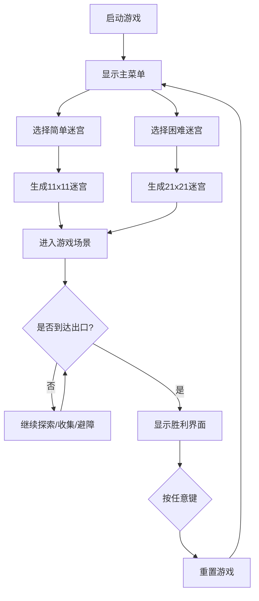

## 1. 产品概述

一款基于2D光线投射技术的迷宫探索网页游戏，玩家在随机生成的黑暗迷宫中利用手电筒光照视野寻找出口。游戏融合了探索、收集、规避陷阱等元素，提供简单和困难两种难度模式。

- 目标用户：喜欢休闲探索类小游戏的玩家
- 核心价值：在有限视野下探索未知迷宫的紧张感与成就感

## 2. 核心特性

### 2.1 功能模块
1. **主菜单**：难度选择界面（简单/困难）
2. **游戏场景**：随机迷宫、玩家角色、手电筒光锥、金币、陷阱、出口光点
3. **UI界面**：分数显示、计时器、屏幕抖动/闪烁特效
4. **胜利界面**：用时、分数展示，按键重玩

### 2.2 页面详情
| 页面名称 | 模块名称 | 功能描述 |
|---------|---------|---------|
| 主菜单 | 难度选择按钮 | 悬停缩放动画，点击进入对应难度游戏 |
| 游戏场景 | 迷宫渲染 | 基于光线投射的2D渲染，距离衰减光照效果 |
| 游戏场景 | 玩家控制 | WASD移动，Shift聚焦手电筒 |
| 游戏场景 | 道具系统 | 金币拾取加分、陷阱触发扣分 |
| 游戏场景 | 出口判定 | 到达闪烁金色光点触发胜利 |
| UI界面 | 状态显示 | 左上角分数、右上角计时器 |
| 胜利界面 | 结算展示 | 半透明遮罩，显示用时和分数 |

## 3. 核心流程

玩家进入游戏 → 选择难度（简单11x11 / 困难21x21）→ 随机生成迷宫 → 玩家使用WASD移动探索 → 收集金币加分 / 触碰陷阱扣分 → 使用Shift聚焦手电筒 → 到达出口 → 显示胜利界面 → 按任意键重新开始

## 4. 用户界面设计

### 4.1 设计风格
- **主色调**：深色主题，背景#1a1a2e，墙壁#0f3460，地面#16213e
- **点缀色**：金色（出口/金币）、红色（陷阱）、白色（玩家/文字）
- **字体**：像素风格 monospace
- **按钮**：悬停缩放1.1倍，过渡0.2秒
- **特效**：屏幕抖动（撞墙0.1秒）、红色闪烁（陷阱0.2秒）、出口光点闪烁（0.5秒周期）

### 4.2 页面设计概览
| 页面名称 | 模块名称 | UI元素 |
|---------|---------|--------|
| 主菜单 | 容器 | 深灰色背景，垂直居中布局 |
| 主菜单 | 按钮 | 两个难度按钮，白色边框，悬停缩放动画 |
| 游戏场景 | Canvas | 全屏，光线投射渲染迷宫 |
| 游戏场景 | 玩家 | 白色三角形，指向面向方向，大小15px |
| 游戏场景 | 手电筒 | 扇形光锥，60度/8格，聚焦30度/12格 |
| 游戏场景 | 金币 | 黄色圆形，半径6px |
| 游戏场景 | 陷阱 | 红色菱形 |
| UI界面 | 分数 | 左上角，白色带黑色描边 |
| UI界面 | 计时器 | 右上角，MM:SS格式 |
| 胜利界面 | 遮罩 | 半透明黑色覆盖全屏 |
| 胜利界面 | 文字 | 中央"你赢了！"大字，下方用时和分数 |

### 4.3 响应式
- 桌面端：全屏Canvas游戏
- 自适应窗口大小，保持纵横比
