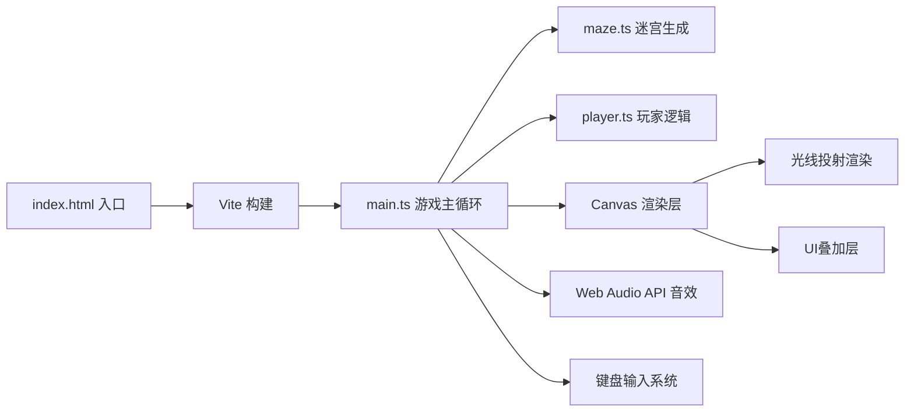

## 1. 架构设计

纯前端Canvas游戏架构，无后端依赖。

## 2. 技术说明

- **前端框架**：无框架，原生 TypeScript + HTML5 Canvas
- **构建工具**：Vite 5.x
- **编程语言**：TypeScript 5.x（严格模式）
- **渲染技术**：2D光线投射（Ray Casting），DDA算法进行网格碰撞检测
- **音效**：Web Audio API 动态生成音调

## 3. 项目结构

| 文件路径 | 职责 |
|---------|------|
| `package.json` | 项目依赖（typescript、vite）及启动脚本 |
| `index.html` | 入口HTML，包含全屏Canvas |
| `vite.config.js` | Vite构建配置 |
| `tsconfig.json` | TypeScript严格模式配置，包含DOM类型 |
| `src/main.ts` | 游戏主循环、初始化场景、光线投射渲染、UI绘制、音效、输入处理 |
| `src/maze.ts` | 递归回溯法迷宫生成算法、出口位置、网格数据 |
| `src/player.ts` | 玩家位置/方向/移动速度、手电筒光锥参数、碰撞检测 |

## 4. 核心算法

### 4.1 迷宫生成
- **算法**：递归回溯法（Recursive Backtracking）
- **数据结构**：二维数组存储墙壁信息
- **入口**：左上角(0,0)
- **出口**：右下角(rows-1, cols-1)

### 4.2 光线投射
- **算法**：DDA（Digital Differential Analyzer）射线网格碰撞检测
- **射线数量**：60条/帧，覆盖光锥扇形区域
- **性能目标**：每帧计算时间 < 5ms，维持60FPS

### 4.3 光照渲染
- 使用Canvas径向渐变 + globalCompositeOperation实现光锥效果
- 距离衰减：从中心白色线性过渡到边缘黑色
- 透明度：0.9 → 0.2 线性递减

## 5. 游戏参数

| 参数 | 正常值 | 聚焦模式(Shift) |
|------|-------|----------------|
| 光锥角度 | 60度 | 30度 |
| 光锥距离 | 8格 | 12格 |
| 移动速度 | 3格/秒 | 3格/秒 |

| 道具 | 数量 | 效果 |
|------|------|------|
| 金币 | 5个 | +10分，拾取音效 |
| 陷阱 | 3个 | -10分，屏幕红闪0.2秒，触发后消失 |
