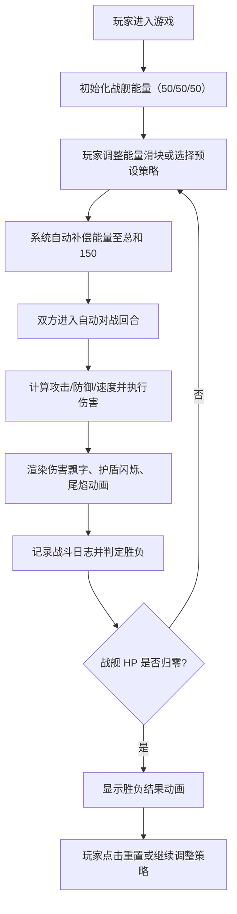

## 1. 产品概述

一款浏览器端实时 2D 宇宙战舰能量分配与护盾优先级策略对抗游戏。玩家通过动态调节武器、护盾、引擎三大能量槽位的分配比例，与 AI 战舰进行回合制自动对战，直观观察不同能量策略对战斗结果的影响。

- 核心价值：为快节奏策略对决提供直观的能量管理可视化工具
- 目标用户：策略游戏爱好者、战术模拟训练用户

## 2. 核心功能

### 2.1 功能模块

1. **战舰能量系统**：三大能量槽（武器/护盾/引擎）动态分配
2. **AI 对战系统**：回合制自动战斗与伤害计算
3. **实时战斗可视化**：伤害飘字、护盾闪烁、引擎尾焰动画
4. **历史对局记录**：时间轴形式的战斗日志与胜负判定
5. **预设策略模式**：一键应用均分、攻击优先、防御优先策略

### 2.2 页面详情

| 页面名称 | 模块名称 | 功能描述 |
|----------|----------|----------|
| 主游戏界面 | 玩家战舰区 | 战舰侧视 Canvas 绘制、能量槽滑块（拖拽调整）、数值标签、亮度反馈 |
| 主游戏界面 | AI 战舰区 | AI 战舰显示、能量分配可视化、尾焰/护盾/伤害动画 |
| 主游戏界面 | 战斗日志区 | 时间轴形式显示最近 20 条战斗记录、胜负动画、重置按钮 |
| 主游戏界面 | 策略预设栏 | 三种预设策略按钮（均分/攻击优先/防御优先）、缓动动画应用 |

## 3. 核心流程

## 4. 用户界面设计

### 4.1 设计风格

- **主色调**：深色科幻风格，背景色 `#0D111A`，主强调色蓝光 `#4A9EFF`
- **能量槽颜色**：武器红 `#FF3B3B`、护盾蓝 `#3B8BFF`、引擎绿 `#3BFF6B`
- **字体颜色**：浅灰 `#E0E0E0`，伤害数字白色加粗
- **按钮样式**：圆角矩形（border-radius: 8px），悬停缩放 1.05 倍，transition 0.2s
- **霓虹发光效果**：战舰与 UI 元素 box-shadow: 0 0 6px rgba(74,158,255,0.6)
- **胜负指示**：胜利绿色 `#4CAF50` + 上升箭头，失败红色 `#F44336` + 下降箭头

### 4.2 页面设计概述

| 页面名称 | 模块名称 | UI 元素 |
|----------|----------|----------|
| 主游戏界面 | 玩家战舰区 | Canvas 多边形战舰、三个发光滑块（圆点 12px）、数值标签 13px、尾焰粒子效果 |
| 主游戏界面 | AI 战舰区 | Canvas 多边形战舰、护盾半透明蓝色罩、能量状态指示 |
| 主游戏界面 | 战斗日志区 | 时间轴垂直线、圆点标记、对战记录文本、胜负动画 |
| 主游戏界面 | 策略预设栏 | 三个圆角按钮、缓动动画过渡效果 |

### 4.3 响应式设计

- 桌面优先，最小宽度 320px，最大宽度 1200px
- 移动端支持触摸拖拽能量滑块
- 布局在窄屏下自动垂直排列

### 4.4 动画与视觉细节

- 能量滑块实时光晕效果，数值越高亮度 +30%
- 伤害数字：白色加粗字体，向上飘动 + 淡出，持续 0.6s
- 护盾受击：战舰轮廓白色闪烁（0.15s 间隔，持续 0.5s）
- 护盾罩闪烁频率随受击频率增加
- 引擎尾焰长度与引擎能量值正比
- 预设策略应用：ease-out 缓动 0.5s 过渡至目标值
