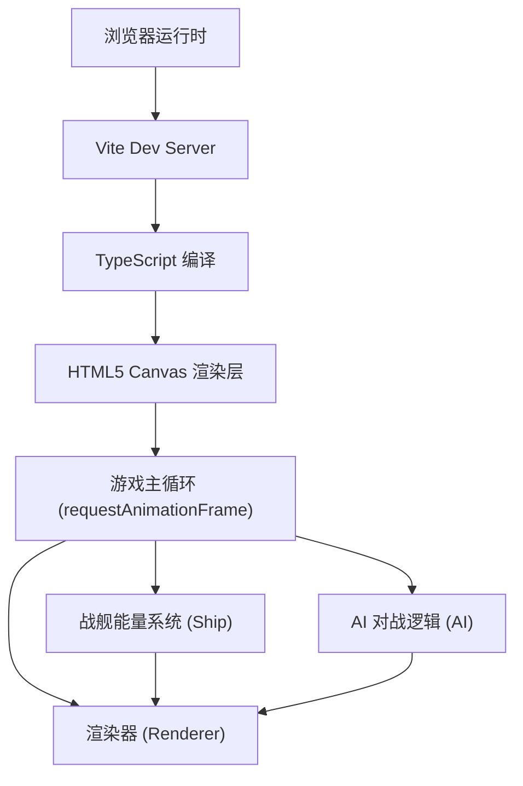

## 1. 架构设计



## 2. 技术选型

- **前端框架**：纯 TypeScript（无 UI 框架），直接操作 DOM + Canvas
- **构建工具**：Vite
- **渲染技术**：HTML5 Canvas 2D Context
- **动画系统**：requestAnimationFrame 驱动 60FPS 主循环
- **状态管理**：模块化类封装（Ship / AI / Renderer）

## 3. 文件结构

| 文件路径 | 用途说明 |
|----------|----------|
| `package.json` | 项目依赖（typescript、vite）与启动脚本 `npm run dev` |
| `index.html` | 入口页面，全屏深色背景容器 |
| `vite.config.js` | Vite 构建配置 |
| `tsconfig.json` | TypeScript 严格模式配置，包含 DOM 类型 |
| `src/main.ts` | 游戏主入口，初始化场景、UI 交互、能量系统、AI 调度、渲染循环 |
| `src/ship.ts` | 战舰类：能量槽数据、护盾减伤公式、攻击力/速度计算、状态更新 |
| `src/ai.ts` | AI 策略类：固定策略逻辑、对战回合调度、伤害计算、日志格式化 |
| `src/renderer.ts` | Canvas 渲染器：绘制战舰、能量槽滑块、伤害飘字、护盾闪烁、尾焰、日志时间轴 |

## 4. 核心数据模型

### 4.1 战舰能量槽约束

```typescript
interface EnergySlots {
  weapon: number;  // 武器能量，范围 [10, 80]
  shield: number;  // 护盾能量，范围 [10, 80]
  engine: number;  // 引擎能量，范围 [10, 80]
}
// 约束: weapon + shield + engine === 150
```

### 4.2 战斗计算公式

| 参数 | 公式 |
|------|------|
| 攻击力 | `weaponEnergy`（每点武器能量 = 1 点攻击） |
| 护盾减伤系数 | `shield / (shield + 20)` |
| 实际伤害 | `attack * (1 - shield / (shield + 20))` |
| 攻击间隔 | `1.5 - 0.02 * engineEnergy`（秒） |

### 4.3 AI 初始策略

- 护盾 40%（60 点）
- 武器 30%（45 点）
- 引擎 30%（45 点）

## 5. 预设策略配置

| 策略名称 | 武器 | 护盾 | 引擎 | 总和 |
|----------|------|------|------|------|
| 均分 | 50 | 50 | 50 | 150 |
| 攻击优先 | 70 | 20 | 60 | 150 |
| 防御优先 | 20 | 80 | 50 | 150 |

## 6. 性能约束

- 动画帧率：60FPS（requestAnimationFrame）
- 单帧计算量 ≤ 0.8ms
- 滑块响应延迟 < 16ms
- 战斗日志最大保留 20 条
