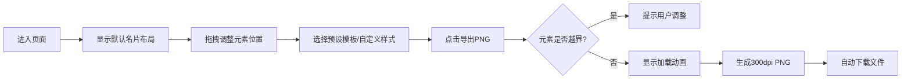

## 1. 产品概述

个性化数字名片生成器是一款基于拖拽排版的在线名片设计工具，用户可以通过自由拖拽卡片元素（头像、姓名、职位、联系方式、社交链接、个人简介）自定义名片布局，并一键导出为高清PNG图片。

- **目标用户**：需要快速制作个性化数字名片的职场人士、自由职业者、创业者
- **核心价值**：零设计门槛，通过直观的拖拽操作快速生成专业美观的数字名片

## 2. 核心功能

### 2.1 功能模块

1. **画布编辑区**：名片实时预览、元素拖拽定位、边界约束
2. **侧边工具栏**：预设模板切换、背景色选择、字体大小调整、边距调节、导出功能
3. **图片导出模块**：高清PNG生成（300dpi）、边界检查、加载动画、自动下载

### 2.2 页面详情

| 页面名称 | 模块名称 | 功能描述 |
|-----------|-------------|---------------------|
| 主页面 | 画布编辑区 | 600x400像素固定画布，显示5个可拖拽元素，支持实时位置更新 |
| 主页面 | 模板切换面板 | 5套预设模板（专业、活泼、暗黑、简约、复古），0.3秒淡入淡出切换 |
| 主页面 | 样式调整面板 | 背景色选择器（10种预设）、全局字体大小（12-36px，步长4px）、边距滑块（0-30px） |
| 主页面 | 导出面板 | 导出PNG按钮、边界越界检测、加载动画、自动下载 |

## 3. 核心流程

用户进入页面 → 默认显示名片布局 → 拖拽调整元素位置 → 选择预设模板或自定义样式 → 点击导出按钮 → 系统检测元素边界 → 生成PNG图片 → 自动下载

## 4. 用户界面设计

### 4.1 设计风格

- **主色调**：浅色主题 #FAFAFA，画布边框 #E0E0E0，拖拽高亮 #4A9EFF
- **按钮样式**：圆角矩形 8px，悬停背景 #E3F2FD，点击缩放 0.95
- **字体**：姓名黑体 28px，职位 14px 灰色，联系方式 12px 灰色
- **布局风格**：宽屏三栏布局（画布居中+右侧工具栏280px），窄屏底部折叠面板
- **视觉效果**：画布投影 0 4px 12px rgba(0,0,0,0.08)，拖拽时虚线蓝色边框

### 4.2 页面设计概述

| 页面名称 | 模块名称 | UI 元素 |
|-----------|-------------|-------------|
| 主页面 | 画布编辑区 | 600x400 虚线边框卡片，阴影，可拖拽元素块，圆形头像占位 |
| 主页面 | 工具栏 | 模板缩略图网格、色盘选择器、字体下拉菜单、边距滑块、主操作按钮 |
| 主页面 | 导出加载态 | 居中旋转圆圈加载动画，半透明遮罩 |

### 4.3 响应式设计

- **宽屏（>1024px）**：画布水平居中，右侧固定工具栏 280px
- **中屏（768-1024px）**：画布自适应缩放，工具栏保持右侧
- **窄屏（<768px）**：工具栏折叠为底部可展开面板，画布缩放到屏幕宽度
