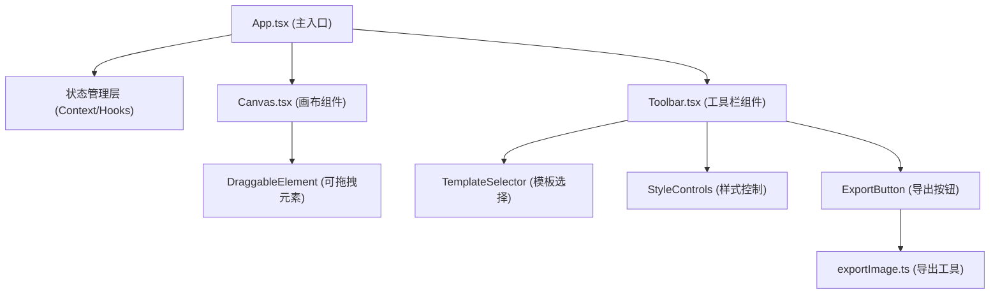

## 1. 架构设计



## 2. 技术描述

- **前端框架**：React 18 + TypeScript
- **构建工具**：Vite 5 + @vitejs/plugin-react
- **类型系统**：TypeScript 严格模式
- **拖拽实现**：原生 HTML5 Drag & Drop API + React 状态管理
- **图片导出**：html2canvas
- **图标库**：lucide-react

## 3. 项目文件结构

| 文件路径 | 作用 |
|---------|------|
| `package.json` | 项目依赖和脚本配置 |
| `index.html` | 应用入口 HTML |
| `vite.config.js` | Vite 构建配置 |
| `tsconfig.json` | TypeScript 编译配置 |
| `src/App.tsx` | 主组件，状态管理，Context 提供 |
| `src/components/Canvas.tsx` | 画布区域，渲染可拖拽元素 |
| `src/components/Toolbar.tsx` | 侧边工具栏，模板/样式/导出控制 |
| `src/utils/exportImage.ts` | html2canvas 高清导出函数 |
| `src/types/index.ts` | TypeScript 类型定义 |
| `src/styles/global.css` | 全局样式和动画 |

## 4. 数据模型

### 4.1 名片元素类型

```typescript
interface CardElement {
  id: string;
  type: 'avatar' | 'name' | 'position' | 'contact' | 'social' | 'bio';
  x: number;
  y: number;
  width: number;
  height: number;
  content: string;
  fontSize?: number;
  color?: string;
}

interface Template {
  id: string;
  name: string;
  backgroundColor: string;
  textColor: string;
  accentColor: string;
  elementPositions: Record<string, { x: number; y: number }>;
  spacing: number;
}

interface CardState {
  elements: CardElement[];
  backgroundColor: string;
  fontSize: number;
  margin: number;
  activeTemplate: string;
}
```

## 5. 核心实现要点

### 5.1 拖拽系统
- 使用原生 `onDragStart` / `onDragOver` / `onDrop` 事件
- 拖拽时通过 CSS 设置 `cursor: grabbing` 和蓝色虚线边框
- 位置计算基于画布坐标系（600x400 内）
- 实时 `console.log` 输出元素坐标

### 5.2 模板切换动画
- 使用 CSS `opacity` + `transition: opacity 0.3s ease`
- 切换时先淡出 0.15s，更新数据后淡入 0.15s

### 5.3 高清导出
- html2canvas `scale` 参数设为 4（300dpi ≈ 96dpi × 3.125，取 4 保证清晰度）
- 导出前遍历所有元素检测 `x + width > 600` 或 `y + height > 400`
- 加载动画使用 CSS `@keyframes spin`，持续 1-2 秒

### 5.4 响应式布局
- CSS Media Queries：`@media (max-width: 1024px)` 和 `@media (max-width: 768px)`
- 窄屏画布使用 `transform: scale()` 等比缩放
- 底部面板使用 `max-height` + `transition` 折叠动画
