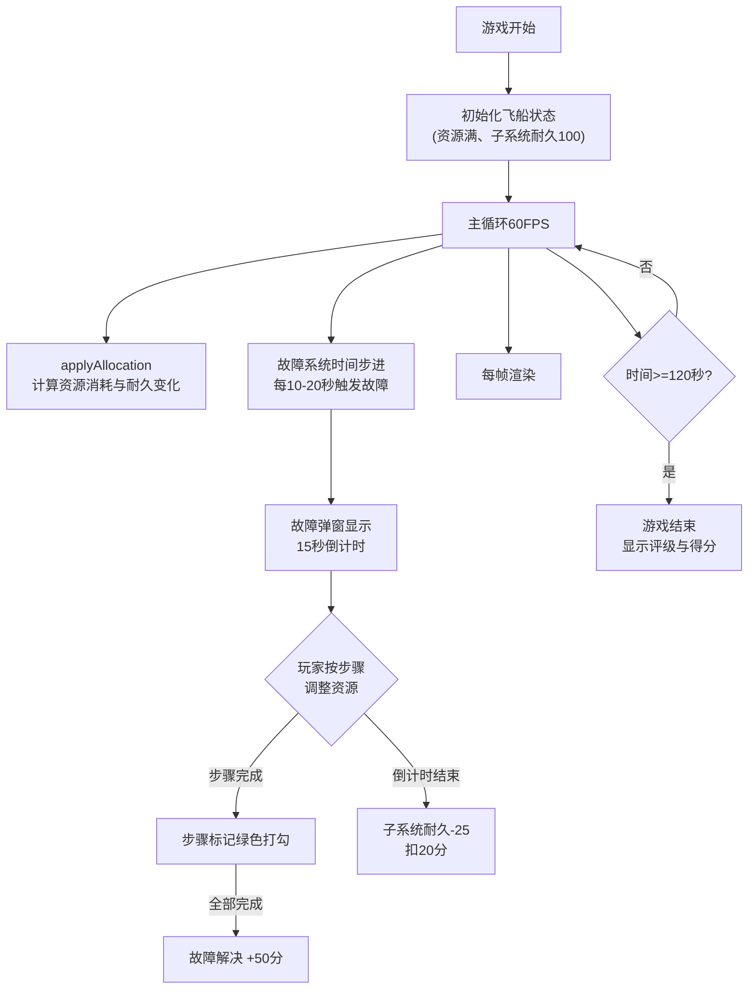

## 1. 产品概述

2D飞船资源管理与故障模拟器是一款科幻风格的太空管理模拟游戏，玩家通过分配电力、氧气、燃料三项资源到维生、引擎、武器三个子系统，应对周期性随机故障，在120秒内尽可能获得高分。

- 主要用途：直观模拟并测试不同资源分配策略的有效性
- 目标用户：游戏玩家、策略模拟器爱好者

## 2. 核心特性

### 2.1 功能模块

1. **飞船状态系统**：管理三个子系统（维生、引擎、武器）耐久度和三个资源池（电力、氧气、燃料）
2. **资源分配系统**：通过垂直滑块调整资源分配比例，自动校正总和为100%
3. **故障生成系统**：每10-20秒随机触发故障，包含多步骤解决条件
4. **渲染引擎**：Canvas绘制飞船俯视图、资源条、故障弹窗、粒子特效
5. **计分系统**：存活时间计分、故障解决奖惩、最终评级判定

### 2.2 页面详情

| 页面名称 | 模块名称 | 功能描述 |
|----------|----------|----------|
| 主游戏界面 | 飞船俯视图 | 多边形船体、彩色子系统区块（反映耐久度）、粒子特效 |
| 主游戏界面 | 资源控制滑块 | 三个垂直滑块（电力/氧气/燃料），拖拽调整分配比例 |
| 主游戏界面 | 实时状态面板 | 飞船名称、子系统耐久度、资源池、得分、剩余时间 |
| 主游戏界面 | 故障通知弹窗 | 半透明弹窗、故障描述、步骤进度、倒计时 |
| 游戏结束界面 | 得分与评级 | 最终得分、评级（S/A/B/C）、粒子烟花特效 |

## 3. 核心流程

## 4. 用户界面设计

### 4.1 设计风格

- **主色调**：深空蓝黑背景 #0D0D1A
- **子系统颜色**：维生 #33B5E5（蓝）、引擎 #FF8800（橙）、武器 #FF4444（红）
- **资源条渐变**：红 #FF4444 → 黄 #FFBB33 → 绿 #00C853
- **故障弹窗**：背景 #1A1A2E 透明度0.85，边框渐变 #00FFFF 到 #FF00FF
- **字体**：等宽字体 monospace，白色带10%透明度阴影
- **整体风格**：赛博朋克科幻风、霓虹发光效果、深色主题

### 4.2 布局结构

| 区域 | 宽度占比 | 内容 |
|------|----------|------|
| 左栏 | 60% | 飞船俯视图Canvas |
| 中栏 | 20% | 资源控制垂直滑块 |
| 右栏 | 20% | 实时状态面板 |

### 4.3 响应式适配

- **屏幕宽度 > 1024px**：三栏布局（60% / 20% / 20%）
- **屏幕宽度 768-1024px**：飞船占60%，控制滑块移至下方，状态面板占40%
- **屏幕宽度 < 768px**：所有元素垂直堆叠，调整字体大小

### 4.4 动画效果

- 故障弹窗：0.3秒缩放进入（0.5x→1x ease-out），0.2秒缩小消失
- 耐久度低闪烁：每秒2次
- 交互反馈：偏移2px、持续0.1秒的震动动画
- 游戏结束评级：金色大字体 + 粒子烟花特效
