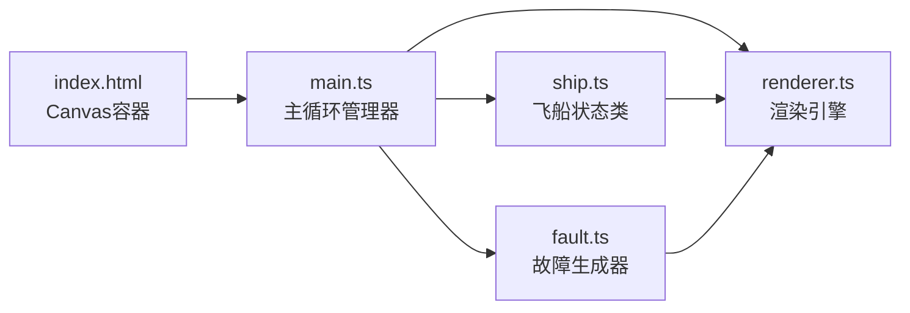

## 1. 架构设计



**数据流向说明：**
- `main.ts` 接收用户输入（滑块拖拽），将分配指令传递给 `ship.ts`
- `main.ts` 每帧调用 `ship.ts.applyAllocation()` 更新资源消耗和耐久度
- `main.ts` 将时间步进传递给 `fault.ts`，由其检测故障触发和解决条件
- `renderer.ts` 从 `main.ts` 获取飞船状态和故障列表，执行Canvas绘制

## 2. 技术选型

| 技术 | 用途 | 版本 |
|------|------|------|
| TypeScript | 类型安全的开发语言 | 最新稳定版 |
| Vite | 构建工具与开发服务器 | 最新稳定版 |
| HTML5 Canvas | 2D图形渲染 | 原生API |

## 3. 文件结构

```
├── package.json              # 项目配置（typescript、vite依赖）
├── index.html                # 入口页面（全屏Canvas容器）
├── vite.config.js            # Vite构建配置
├── tsconfig.json             # TypeScript配置（严格模式、DOM类型）
└── src/
    ├── main.ts               # 主循环管理器（60FPS调度）
    ├── ship.ts               # 飞船状态类（资源/子系统管理）
    ├── fault.ts              # 故障生成器（随机故障、步骤验证）
    └── renderer.ts           # 渲染引擎（Canvas绘制）
```

## 4. 核心数据结构与类型定义

```typescript
// 资源类型
type ResourceType = 'power' | 'oxygen' | 'fuel';

// 子系统类型
type SubsystemType = 'life' | 'engine' | 'weapon';

// 资源分配比例
interface Allocation {
  power: number;    // 0-100
  oxygen: number;   // 0-100
  fuel: number;     // 0-100
}

// 飞船状态
interface ShipState {
  resources: {
    power: number;   // 0-200
    oxygen: number;  // 0-200
    fuel: number;    // 0-200
  };
  subsystems: {
    life: number;    // 0-100 耐久度
    engine: number;  // 0-100 耐久度
    weapon: number;  // 0-100 耐久度
  };
  allocation: Allocation;
}

// 故障类型
type FaultType = 'pipe_leak' | 'energy_overload' | 'circuit_short';

// 故障步骤
interface FaultStep {
  description: string;
  check: (allocation: Allocation) => boolean;
  completed: boolean;
}

// 故障
interface Fault {
  id: string;
  type: FaultType;
  name: string;
  description: string;
  targetSubsystem: SubsystemType;
  steps: FaultStep[];
  currentStep: number;
  timeRemaining: number;  // 剩余秒数
  totalTime: number;      // 总时长15秒
  appearTime: number;     // 出现时间戳（用于动画）
  closing: boolean;       // 是否正在关闭
}
```

## 5. 性能约束

- **主循环**：稳定60FPS（每帧约16.67ms）
- **故障系统检测**：每帧 ≤ 0.5ms
- **Canvas渲染**：每帧 ≤ 8ms
- **实现策略**：
  - 使用 `requestAnimationFrame` 驱动主循环
  - 粒子对象池复用，避免频繁GC
  - 最小化每帧内存分配
  - 故障检测采用增量时间累加，避免每帧复杂计算
