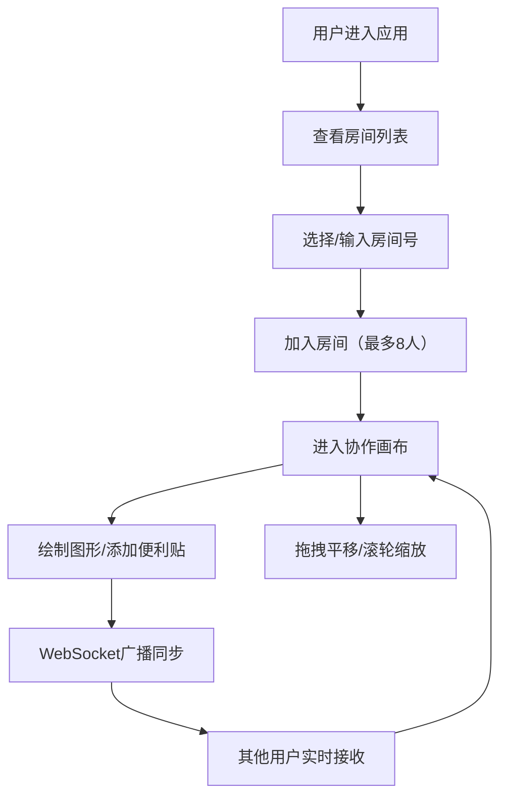

## 1. 产品概述
微型团队协作白板应用，面向远程会议和头脑风暴场景，支持多人在共享画布上实时绘图、贴便利贴和标注讨论热点。
- 核心价值：提供轻量级、低延迟的实时协作绘图体验，解决远程团队头脑风暴效率低下的问题
- 目标用户：远程办公团队、产品经理、设计师、敏捷开发团队

## 2. 核心特性

### 2.1 用户角色
| 角色 | 注册方式 | 核心权限 |
|------|----------|----------|
| 普通用户 | 无需注册，输入房间号即可加入 | 进入房间、绘制图形、添加/编辑便利贴、查看他人实时笔迹 |

### 2.2 功能模块
1. **房间系统**：房间列表、加入房间、房间用户管理
2. **画布绘制**：画笔工具、颜色选择、粗细调节、实时同步
3. **便利贴系统**：创建贴纸、拖拽定位、双击编辑、多尺寸多颜色
4. **画布交互**：无限滚动平移、滚轮缩放、惯性动画

### 2.3 页面详情
| 页面名称 | 模块名称 | 功能描述 |
|----------|----------|----------|
| 主应用页 | 顶部工具栏 | 画笔颜色选择（10色）、粗细调节（2-20px）、便利贴工具、房间信息显示 |
| 主应用页 | 左侧房间列表 | 可折叠面板（240px宽），显示4个预设房间，显示在线人数 |
| 主应用页 | 中央画布 | Canvas绘图区域，支持无限滚动和缩放，实时显示所有用户笔迹和便利贴 |
| 主应用页 | 便利贴层 | 半透明贴纸，支持拖拽和双击编辑，按添加时间排序 |
| 主应用页 | 状态标签 | 右下角显示当前房间号和在线用户数 |

## 3. 核心流程
用户进入应用后，可以看到左侧房间列表，选择一个房间或输入房间号加入。加入后即可在画布上绘制，选择不同颜色和粗细的画笔，或添加便利贴。所有操作通过WebSocket实时同步给房间内其他用户。画布支持拖拽平移（带惯性）和滚轮缩放。

## 4. 用户界面设计

### 4.1 设计风格
- **主色调**：深灰色 #1C1C1E 背景，搭配亮色点缀
- **主题**：暗色主题，毛玻璃效果工具栏（blur(12px)）
- **画笔颜色**：红#FF3B30、橙#FF9500、黄#FFCC00、绿#34C759、蓝#007AFF、紫#AF52DE、粉#FF2D55、灰#8E8E93、棕#A2845E、白#FFFFFF
- **便利贴颜色**：淡黄#FFF9C4、淡绿#E8F5E9、淡蓝#E3F2FD、淡紫#F3E5F5（半透明）
- **布局**：固定顶部工具栏（48px高）+ 左侧可折叠房间列表（240px宽）+ 中央画布 + 右下角状态标签
- **交互**：微动画过渡，缩放平滑过渡0.3s，惯性动画0.3s

### 4.2 页面设计概览
| 页面名称 | 模块名称 | UI元素 |
|----------|----------|--------|
| 主应用页 | 顶部工具栏 | 毛玻璃背景，颜色选择圆点，粗细滑块，便利贴按钮 |
| 主应用页 | 房间列表 | 暗色面板，房间卡片，在线人数指示，折叠按钮 |
| 主应用页 | 画布区 | 全屏Canvas，网格背景，可拖拽，可缩放 |
| 主应用页 | 便利贴 | 圆角半透明卡片，柔和颜色，可拖拽，双击进入编辑模式 |
| 主应用页 | 状态标签 | 小尺寸标签，显示房间号和用户头像/人数 |

### 4.3 响应式
桌面端优先设计，核心功能在桌面端完整呈现。画布区域自适应窗口大小。

### 4.4 性能要求
- 同时绘制帧率稳定在30fps以上
- 画布操作响应时间低于100ms
- 实时同步延迟不超过200ms
