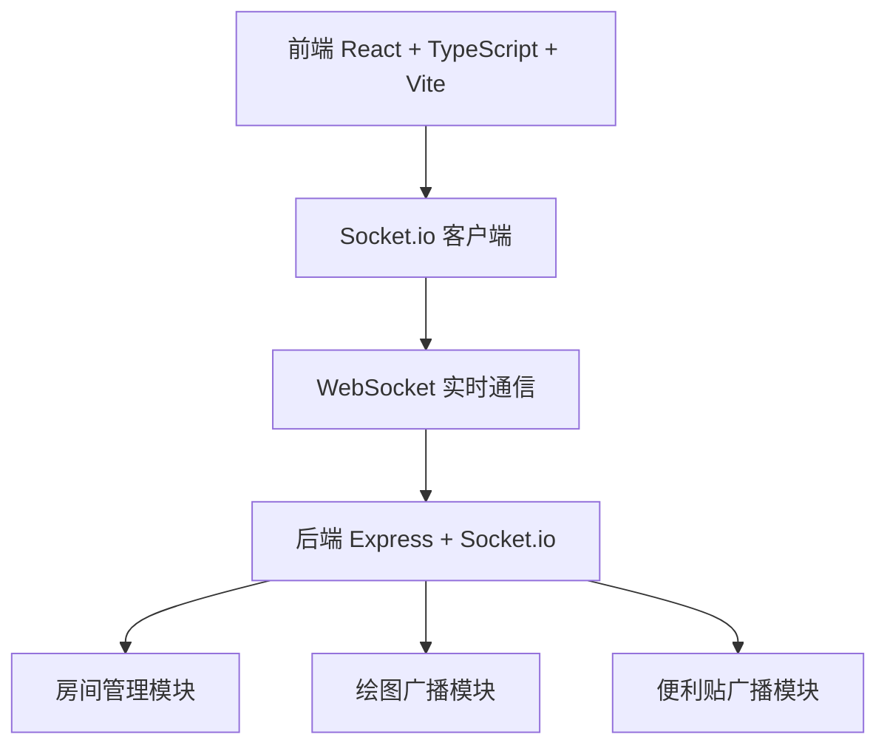

## 1. 架构设计



## 2. 技术说明
- **前端**：React@18 + TypeScript + Vite
- **后端**：Express@4 + Socket.io
- **实时通信**：Socket.io（WebSocket）
- **构建工具**：Vite
- **状态管理**：React Hooks（useState/useRef/useEffect），轻量场景无需额外状态管理库
- **绘图技术**：HTML5 Canvas 2D API
- **端口**：后端 3001，前端 Vite 开发服务器 5173

## 3. 路由定义
| 路由 | 用途 |
|------|------|
| / | 主应用页面，包含白板、工具栏、房间列表 |

## 4. WebSocket 事件定义

### 客户端 → 服务端
| 事件名 | 数据结构 | 说明 |
|--------|----------|------|
| join-room | { roomId: string } | 加入房间 |
| leave-room | { roomId: string } | 离开房间 |
| draw-start | { roomId, userId, x, y, color, size } | 开始绘制 |
| draw-move | { roomId, userId, x, y, color, size } | 绘制中 |
| draw-end | { roomId, userId } | 结束绘制 |
| sticky-add | { roomId, sticky: StickyNote } | 添加便利贴 |
| sticky-update | { roomId, sticky: StickyNote } | 更新便利贴（位置/内容） |
| sticky-delete | { roomId, stickyId: string } | 删除便利贴 |

### 服务端 → 客户端
| 事件名 | 数据结构 | 说明 |
|--------|----------|------|
| room-joined | { roomId, users: User[], stickies: StickyNote[], drawings: DrawingPath[] } | 成功加入房间 |
| user-joined | { user: User } | 新用户加入 |
| user-left | { userId: string } | 用户离开 |
| draw-start | { userId, x, y, color, size } | 广播开始绘制 |
| draw-move | { userId, x, y, color, size } | 广播绘制中 |
| draw-end | { userId } | 广播结束绘制 |
| sticky-added | { sticky: StickyNote } | 广播添加便利贴 |
| sticky-updated | { sticky: StickyNote } | 广播更新便利贴 |
| sticky-deleted | { stickyId: string } | 广播删除便利贴 |
| room-full | { } | 房间已满（最多8人） |

## 5. 数据模型

### 5.1 类型定义

```typescript
interface User {
  id: string;
  name: string;
  color: string;
  roomId: string;
}

interface Point {
  x: number;
  y: number;
}

interface DrawingPath {
  id: string;
  userId: string;
  color: string;
  size: number;
  points: Point[];
}

type StickySize = 'small' | 'medium' | 'large';

interface StickyNote {
  id: string;
  userId: string;
  x: number;
  y: number;
  width: number;
  height: number;
  backgroundColor: string;
  text: string;
  createdAt: number;
}

interface Room {
  id: string;
  name: string;
  users: User[];
  maxUsers: number;
  drawings: DrawingPath[];
  stickies: StickyNote[];
}
```

### 5.2 房间配置
```typescript
const DEFAULT_ROOMS = [
  { id: 'room-1', name: '创意空间', maxUsers: 8 },
  { id: 'room-2', name: '产品讨论', maxUsers: 8 },
  { id: 'room-3', name: '设计评审', maxUsers: 8 },
  { id: 'room-4', name: '技术方案', maxUsers: 8 },
];
```

### 5.3 颜色配置
```typescript
const BRUSH_COLORS = [
  '#FF3B30', '#FF9500', '#FFCC00', '#34C759', '#007AFF',
  '#AF52DE', '#FF2D55', '#8E8E93', '#A2845E', '#FFFFFF'
];

const STICKY_COLORS = [
  '#FFF9C4', '#E8F5E9', '#E3F2FD', '#F3E5F5'
];

const STICKY_SIZES = {
  small: { width: 100, height: 80 },
  medium: { width: 150, height: 120 },
  large: { width: 200, height: 160 }
};
```

## 6. 项目文件结构

```
auto55/
├── package.json
├── index.html
├── vite.config.js
├── tsconfig.json
└── src/
    ├── server.ts              # Express + Socket.io 后端
    ├── client/
    │   ├── App.tsx            # 应用入口
    │   ├── Whiteboard.tsx     # 白板组件（Canvas绘制、缩放平移）
    │   └── StickyNotes.tsx    # 便利贴管理组件
    └── shared/
        └── types.ts           # 共享类型定义
```
