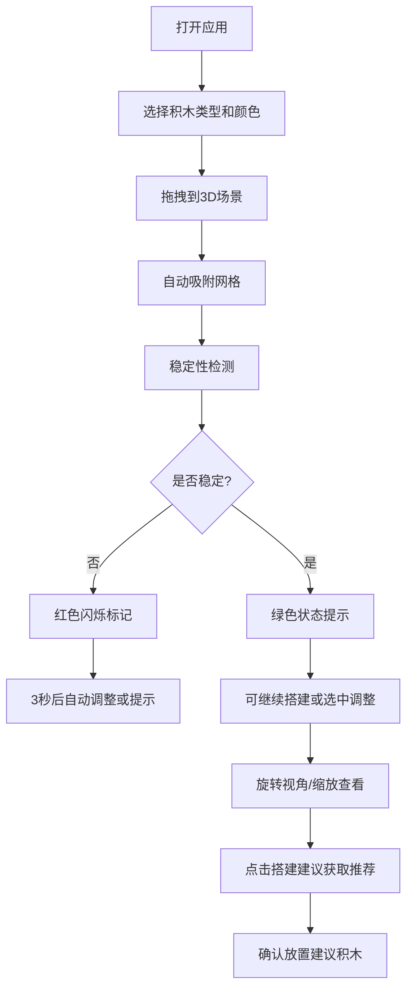

## 1. 产品概述

乐高积木3D拼装模拟器 - 一个运行在浏览器中的交互式乐高积木搭建工具，解决乐高爱好者和教育工作者在缺乏实体积木时无法直观尝试不同积木组合、搭建创意模型并检查结构稳定性的问题。

- 目标用户：乐高爱好者、教育工作者、学生
- 核心价值：零成本、无空间限制的虚拟乐高搭建体验，实时结构稳定性反馈

## 2. 核心功能

### 2.1 用户角色
本产品为单用户工具，无需注册登录，直接使用。

### 2.2 功能模块
1. **积木面板**：左侧展示8种基础积木类型，支持颜色选择和拖拽放置
2. **3D搭建区域**：中央3D场景，支持视角旋转、缩放、网格吸附
3. **积木操作**：选中后可进行上移、下移、旋转、删除操作
4. **稳定性检测**：实时计算每块积木的支撑接触面积，标记不稳定结构
5. **搭建建议**：AI推荐下一步可放置的积木类型和位置
6. **状态面板**：显示积木数量、结构状态、稳定性评分、撤销/重做

### 2.3 页面详情
| 页面名称 | 模块名称 | 功能描述 |
|----------|----------|----------|
| 主页面 | 积木面板 | 8种积木类型卡片，支持3D缩略图旋转预览，6种颜色切换，拖拽放置 |
| 主页面 | 3D搭建区 | Three.js渲染场景，网格地板，视角旋转/缩放，积木吸附网格 |
| 主页面 | 积木操作栏 | 选中积木后显示上移、下移、旋转、删除按钮 |
| 主页面 | 状态面板 | 积木数量统计、结构状态指示、稳定性评分、撤销/重做按钮 |
| 主页面 | 搭建建议 | 半透明预览积木，确认放置功能 |

## 3. 核心流程

用户从左侧积木面板选择积木类型和颜色，拖拽到中央3D场景的网格位置；系统自动吸附对齐并检测稳定性；用户可旋转查看、选中调整积木；系统实时反馈结构稳定性并提供搭建建议。

## 4. 用户界面设计

### 4.1 设计风格
- **主色调**：深灰背景 #1E1E2E，亮蓝高亮 #4A9EFF，金色交互 #FFD700
- **文字颜色**：浅灰 #E0E0E0
- **按钮风格**：圆角卡片式，悬停有微放大和发光效果
- **布局**：三栏式布局（左20% / 中70% / 右10%），移动端上下布局
- **动效**：拖拽弹性动画（弹簧效果，阻尼0.6），选中高亮动画0.2秒，不稳定闪烁2次/秒

### 4.2 页面设计概述
| 页面名称 | 模块名称 | UI元素 |
|----------|----------|----------|
| 主页面 | 积木面板 | 卡片式3D缩略图，颜色选择圆点，拖拽弹性动画，悬停发光 |
| 主页面 | 3D搭建区 | 半透明网格地板（浅灰1px线宽，1单位间距），积木金色高亮选中效果 |
| 主页面 | 操作按钮 | 蓝色圆角图标按钮，悬停放大1.1倍，0.2秒过渡 |
| 主页面 | 状态面板 | 深色卡片背景，绿色/红色状态指示，百分比评分显示 |
| 主页面 | 搭建建议 | 青色#00FFFF半透明（0.4）预览积木，确认/取消按钮 |

### 4.3 响应式
- Desktop端：三栏布局（左20% / 中70% / 右10%）
- 移动端（<768px）：上下布局，积木面板变为顶部可折叠工具栏，搭建区域占据主要空间
- 所有过渡动画：0.3秒平滑过渡

### 4.4 3D场景指导
- **环境**：深灰背景#1E1E2E，无HDRI，简洁风格
- **灯光**：环境光+方向光组合，确保积木色彩真实还原，边缘有柔和阴影
- **相机**：PerspectiveCamera，初始视角45度俯视角，支持Y轴360度旋转，X轴-30度到60度俯仰
- **材质**：标准PBR材质，轻微光泽度，选中时金色#FFD700发光边缘
- **网格地板**：浅灰色半透明网格线，1px线宽，1单位间距，辅助积木对齐
- **性能**：帧率稳定30fps+，单次操作响应<100ms，最多支持200块积木
