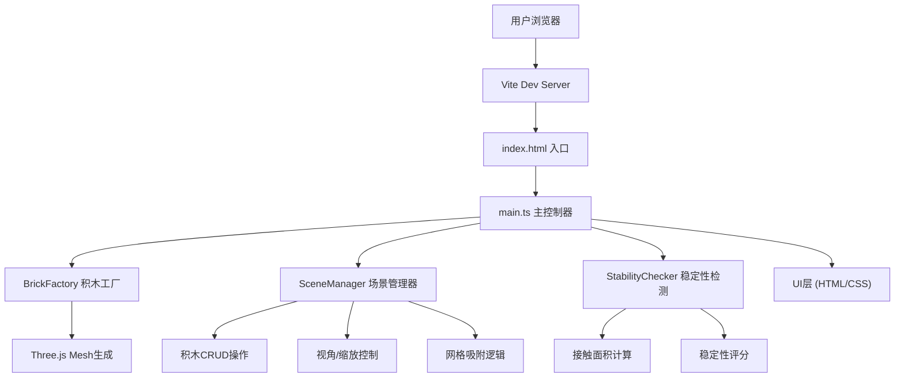

## 1. 架构设计



## 2. 技术描述
- **前端框架**：原生 TypeScript（无React/Vue，用户明确要求）
- **3D引擎**：Three.js + @types/three
- **构建工具**：Vite
- **语言**：TypeScript 严格模式
- **后端**：无（纯前端应用）
- **数据库**：无（本地状态管理）

## 3. 文件组织

| 文件路径 | 用途 |
|----------|------|
| package.json | 依赖：three, @types/three, typescript, vite；启动脚本：npm run dev |
| index.html | 入口页面，Canvas渲染容器，基础样式 |
| vite.config.js | Vite配置，严格模式，输出目录dist |
| tsconfig.json | TypeScript配置，严格模式，DOM+ESNext，moduleResolution: bundler |
| src/main.ts | 主入口，协调各模块，UI事件绑定，拖拽逻辑 |
| src/BrickFactory.ts | 积木工厂，生成8种积木3D模型及元数据 |
| src/SceneManager.ts | 场景管理，积木CRUD，视角控制，网格吸附 |
| src/StabilityChecker.ts | 稳定性检测，接触面积计算，评分算法 |

## 4. 核心数据模型

### 4.1 Brick 积木数据
```typescript
interface BrickData {
  id: string;
  type: BrickType;
  color: string;
  position: { x: number; y: number; z: number };
  rotation: number; // 0, 90, 180, 270
  width: number;  // X方向颗粒数
  depth: number;  // Z方向颗粒数
  height: number; // Y方向颗粒数
  isStable: boolean;
}

type BrickType = 
  | 'brick_2x4'      // 标准2x4砖块
  | 'brick_2x2'      // 2x2砖块
  | 'plate_1x2'      // 1x2板
  | 'round_1x1'      // 1x1圆形砖
  | 'slope'          // 斜面砖
  | 'arch'           // 拱形砖
  | 'baseplate'      // 带颗粒平底板
  | 'corner';        // 转角砖
```

### 4.2 场景状态
```typescript
interface SceneState {
  bricks: BrickData[];
  selectedBrickId: string | null;
  cameraAngle: { x: number; y: number };
  zoom: number;
  stabilityScore: number;
  unstableBrickIds: string[];
  history: { past: SceneState[]; future: SceneState[] };
}
```

## 5. 稳定性检测算法

**核心逻辑**：计算每块积木底部与下方支撑面（其他积木顶部或地面）的接触面积百分比

1. 获取积木底部矩形的世界坐标包围盒
2. 查找所有Y坐标低于当前积木且顶部Y坐标与当前积木底部Y坐标之差 < 0.1的积木
3. 计算底部矩形与每个支撑积木顶部矩形的重叠面积之和
4. 接触面积百分比 = 总重叠面积 / 积木底部面积
5. 若百分比 < 50%，标记为不稳定
6. 整体稳定性评分 = (稳定积木数 / 总积木数) × 100，取整

**性能约束**：单次检测 < 50ms，采用空间网格加速邻近查询

## 6. 积木模板定义

| 类型 | 尺寸(宽×深×高) | 几何体 |
|------|----------------|--------|
| brick_2x4 | 2×4×1 | BoxGeometry + 顶部颗粒凸起 |
| brick_2x2 | 2×2×1 | BoxGeometry + 4个顶部颗粒 |
| plate_1x2 | 1×2×0.33 | 薄BoxGeometry |
| round_1x1 | 1×1×1 | CylinderGeometry |
| slope | 2×2×1 | 组合几何体（Box + 三角楔形） |
| arch | 2×4×1 | BoxGeometry + 底部中间挖空 |
| baseplate | 8×8×0.33 | 大薄板 + 网格颗粒 |
| corner | 2×2×1 | L形组合几何体 |

**颜色选项**：红#E53935、蓝#1E88E5、绿#43A047、黄#FDD835、白#FAFAFA、灰#757575

## 7. 交互规范

- **拖拽放置**：HTML5 Drag API + Raycaster拾取3D坐标，吸附到1单位网格
- **视角旋转**：鼠标左键拖拽空场景区域，Y轴360°，X轴限制-30°~60°
- **缩放**：鼠标滚轮，限制在合理范围
- **选中**：点击积木，边缘金色发光（#FFD700），0.2秒过渡
- **积木操作**：上移(Y+1)、下移(Y-1，限制≥0)、旋转(90°增量)、删除
- **不稳定标记**：红色半透明闪烁，频率2Hz，3秒后自动调整或提示
- **搭建建议**：基于对称性和稳定性分析，推荐位置显示青色半透明预览（#00FFFF，alpha 0.4）
